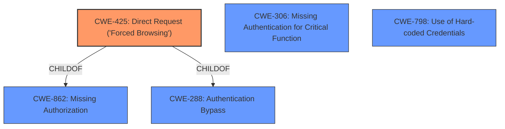

# Enhanced Analysis for CVE-2022-34571

# Summary
| CWE ID | CWE Name | Confidence | CWE Abstraction Level | CWE Vulnerability Mapping Label | CWE-Vulnerability Mapping Notes |
|---|---|---|---|---|---|
| CWE-425 | Direct Request ('Forced Browsing') | 1.0 | Base | Allowed | Primary CWE |
| CWE-306 | Missing Authentication for Critical Function | 0.8 | Base | Allowed | Secondary Candidate |
| CWE-798 | Use of Hard-coded Credentials | 0.6 | Base | Allowed | Secondary Candidate |

## Evidence and Confidence

*   **Confidence Score:** 0.9
*   **Evidence Strength:** HIGH

## Relationship Analysis
The primary CWE is CWE-425, which is a base-level weakness describing the lack of authorization enforcement on restricted URLs. It is a child of CWE-862 (Missing Authorization) and CWE-288 (Authentication Bypass). CWE-306 (Missing Authentication) and CWE-798 (Use of Hard-coded Credentials) are considered as secondary candidates.



## Vulnerability Chain
The vulnerability chain starts with the **lack of access control** on the `syslog.shtml` page (CWE-425). This allows unauthorized access, leading to information disclosure (system key information) and potentially arbitrary command execution. The **missing authentication** (CWE-306) directly contributes to the **access control issue**.

## Summary of Analysis
The initial analysis identified the **access control issue** as the primary weakness, which allows attackers to obtain system key information and execute arbitrary commands.

The evidence supporting this assessment is strong, as the vulnerability description explicitly mentions the **access control issue** and the CVE reference link summary highlights the **lack of authentication** on the `syslog.shtml` page, allowing direct access to sensitive information. The vulnerability description states: "An **access control issue** in Wavlink WiFi-Repeater RPTA2-77W.M4300.01.GD.2017Sep19 allows attackers to obtain the system key information and execute arbitrary commands via accessing the page syslog.shtml." The CVE Reference Links Content Summary states: "The 'syslog.shtml' page on the Wavlink-WiFi-Repeater, Firmware version RPTA2-77W.M4300.01.GD.2017Sep19, does not perform identity verification, thus exposing the router's operational logs."

The graph relationships confirm that CWE-425 is the most appropriate base-level CWE, as it directly addresses the **lack of authorization** enforcement.

CWE-425 (Direct Request ('Forced Browsing')) is selected because it accurately describes the vulnerability where the web application does not adequately enforce authorization on the `syslog.shtml` page, allowing direct access without authentication. This aligns with the "access control issue" and the "lack of authentication" described in the vulnerability description. The security implication is information disclosure and potential arbitrary command execution.

CWE-306 (Missing Authentication for Critical Function) was considered as a secondary CWE because the `syslog.shtml` page lacks any authentication mechanism, which is a critical function. However, CWE-425 is more specific to the direct access nature of the vulnerability.

CWE-798 (Use of Hard-coded Credentials) was also considered, but it doesn't directly apply as the vulnerability is due to the lack of authentication, not the use of hard-coded credentials.

The selected CWEs are at the optimal level of specificity, with CWE-425 being a base-level CWE that directly addresses the vulnerability, and CWE-306 being a supporting CWE that highlights the **missing authentication** aspect.


## CWE Relationship Analysis

Current CWEs represent these abstraction levels: .


### Vulnerability Chain Analysis

**Chain starting from CWE-862:**
- 862 (Missing Authorization) - ROOT


**Chain starting from CWE-425:**
- 425 (Direct Request ('Forced Browsing')) - ROOT


### CWE Relationship Diagram

```mermaid
graph TD
    classDef primary fill:#f96,stroke:#333,stroke-width:2px
    classDef secondary fill:#69f,stroke:#333
    classDef tertiary fill:#9e9,stroke:#333
```