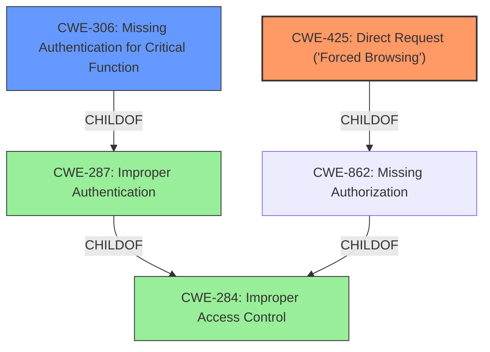

# Analysis Report for CVE-2022-34573

# Vulnerability Analysis Report: CVE-2022-34573

## Description


## Analysis (with Relationship Data)

# Summary
| CWE ID | CWE Name | Confidence | CWE Abstraction Level | CWE Vulnerability Mapping Label | CWE-Vulnerability Mapping Notes |
|---|---|---|---|---|---|
| CWE-425 | Direct Request ('Forced Browsing') | 0.9 | Base | Allowed | Primary CWE: The vulnerability allows direct access to a restricted page without proper authorization. |
| CWE-306 | Missing Authentication for Critical Function | 0.7 | Base | Allowed | Secondary CWE: The `mb_wifibasic.shtml` page lacks any authentication mechanism, making it directly accessible. |

## Evidence and Confidence

*   **Confidence Score:** 0.8
*   **Evidence Strength:** HIGH

## Relationship Analysis
The primary weakness is the **missing access control**, which leads to the exposure of sensitive device configuration settings. CWE-425 (Direct Request) directly reflects this scenario, where restricted URLs are accessible without proper authorization. CWE-306 (Missing Authentication) supplements this by highlighting the absence of any authentication mechanism for a critical function (configuring device settings).



## Vulnerability Chain
The vulnerability chain starts with a **missing access control** on the `mb_wifibasic.shtml` page (CWE-425). This **missing authentication** (CWE-306) allows unauthorized access, leading to the potential for attackers to arbitrarily configure device settings and potentially gain unauthorized access to the WiFi network.

## Summary of Analysis
The initial assessment identified the vulnerability as primarily related to **missing access control**. The provided evidence strongly supports this, especially the "CVE Reference Links Content Summary" which explicitly states the **lack of access control** on the `mb_wifibasic.shtml` page.

The relationship graph highlights that CWE-425 and CWE-306 are both related to the broader category of **improper access control** (CWE-284), but are more specific and therefore more appropriate.

CWE-425 (Direct Request) is the most specific and accurate representation of the vulnerability. The vulnerability description states that "attackers can arbitrarily configure device settings via accessing the page mb_wifibasic.shtml," which aligns perfectly with CWE-425's description of inadequate enforcement of authorization on restricted URLs.

CWE-306 (Missing Authentication for Critical Function) is also relevant, as the `mb_wifibasic.shtml` page lacks any authentication mechanism. This absence of authentication allows unauthorized users to directly access and modify critical device settings.

These CWEs are at the optimal level of specificity, as they directly address the root cause of the vulnerability ( **missing access control** ) and its immediate consequence (unauthorized access to critical functions).

Relevant CWE Information:

# Enhanced Context (25 CWEs)

## CWE-807: Reliance on Untrusted Inputs in a Security Decision
**Abstraction Level**: Base
**Similarity Score**: 0.80

This CWE was not selected because the vulnerability is more about a **missing access control** rather than a reliance on untrusted inputs.

## CWE-1391: Use of Weak Credentials
**Abstraction Level**: Class
**Similarity Score**: 0.80

This CWE was not selected because the issue is not about weak credentials, but the **absence of any authentication**.

## CWE-798: Use of Hard-coded Credentials
**Abstraction Level**: Base
**Similarity Score**: 0.79

This CWE was not selected because the vulnerability doesn't involve hard-coded credentials. It is about **missing authentication**.

## CWE-345: Insufficient Verification of Data Authenticity
**Abstraction Level**: Class
**Similarity Score**: 0.79

This CWE was not selected because the vulnerability is not related to data authenticity verification.

## CWE-303: Incorrect Implementation of Authentication Algorithm
**Abstraction Level**: Base
**Similarity Score**: 0.79

This CWE was not selected because there is no authentication algorithm implemented, let alone incorrectly implemented.

## CWE-319: Cleartext Transmission of Sensitive Information
**Abstraction Level**: Base
**Similarity Score**: 0.78

This CWE was not selected because the vulnerability is not primarily about cleartext transmission, but rather the **lack of access control** that allows unauthorized access to sensitive information.

## CWE-330: Use of Insufficiently Random Values
**Abstraction Level**: Class
**Similarity Score**: 0.78

This CWE was not selected because the vulnerability is unrelated to random number generation.

## CWE-294: Authentication Bypass by Capture-replay
**Abstraction Level**: Base
**Similarity Score**: 0.78

This CWE was not selected because the vulnerability is not about bypassing existing authentication through capture-replay, but rather the **absence of authentication**.

## CWE-41: Improper Resolution of Path Equivalence
**Abstraction Level**: Base
**Similarity Score**: 0.78

This CWE was not selected because the vulnerability is unrelated to path equivalence issues.

## CWE-668: Exposure of Resource to Wrong Sphere
**Abstraction Level**: Class
**Similarity Score**: 0.78

This CWE was not selected because it is a high-level class and CWE-425 is a better fit as a base class.

## CWE-425: Direct Request ('Forced Browsing')
**Abstraction Level**: Base
**Similarity Score**: 6326.46

This CWE **was selected** because the vulnerability allows direct access to a restricted page without proper authorization. This is the primary weakness.

## CWE-184: Incomplete List of Disallowed Inputs
**Abstraction Level**: Base
**Similarity Score**: 6244.95

This CWE was not selected because the vulnerability is not related to input validation or filtering.

## CWE-863: Incorrect Authorization
**Abstraction Level**: Class
**Similarity Score**: 6019.17

This CWE was not selected because it is less specific than CWE-425 and CWE-306. The vulnerability involves **missing authorization**, not an incorrect authorization.

## CWE-306: Missing Authentication for Critical Function
**Abstraction Level**: Base
**Similarity Score**: 5955.01

This CWE **was selected** because the `mb_wifibasic.shtml` page lacks any authentication mechanism, making it directly accessible.

## CWE-22: Improper Limitation of a Pathname to a Restricted Directory ('Path Traversal')
**Abstraction Level**: Base
**Similarity Score**: 5947.83

This CWE was not selected because the vulnerability is not related to path traversal.

## CWE-78: Improper Neutralization of Special Elements used in an OS Command ('OS Command Injection')
**Abstraction Level**: base
**Similarity Score**: 5.03

This CWE was not selected because the vulnerability is not related to OS command injection.

## CWE-471: Modification of Assumed-Immutable Data (MAID)
**Abstraction Level**: base
**Similarity Score**: 4.33

This CWE was not selected because the vulnerability is not related to modification of assumed-immutable data.

## CWE-434: Unrestricted Upload of File with Dangerous Type
**Abstraction Level**: base
**Similarity Score**: 4.33

This CWE was not selected because the vulnerability is not related to file uploads.

## CWE-22: Improper Limitation of a Pathname to a Restricted Directory ('Path Traversal')
**Abstraction Level**: base
**Similarity Score**: 4.33

This CWE was not selected because the vulnerability is not related to path traversal.

## CWE-79: Improper Neutralization of Input During Web Page Generation ('Cross-site Scripting')
**Abstraction Level**: base
**Similarity Score**: 4.33

This CWE was not selected because the vulnerability is not related to cross-site scripting.

## CWE-98: Improper Control of Filename for Include/Require Statement in PHP Program ('PHP Remote File Inclusion')
**Abstraction Level**: variant
**Similarity Score**: 3.89

This CWE was not selected because the vulnerability is not related to PHP remote file inclusion.

## CWE-426: Untrusted Search Path
**Abstraction Level**: base
**Similarity Score**: 3.64

This CWE was not selected because the


## CWE Relationship Analysis

Current CWEs represent these abstraction levels: .


### Vulnerability Chain Analysis

**Chain starting from CWE-41:**
- 41 (Improper Resolution of Path Equivalence) - ROOT


**Chain starting from CWE-807:**
- 807 (Reliance on Untrusted Inputs in a Security Decision) - ROOT


### CWE Relationship Diagram

```mermaid
graph TD
    classDef primary fill:#f96,stroke:#333,stroke-width:2px
    classDef secondary fill:#69f,stroke:#333
    classDef tertiary fill:#9e9,stroke:#333
```


*Report generated on 2025-03-30 11:27:37*
