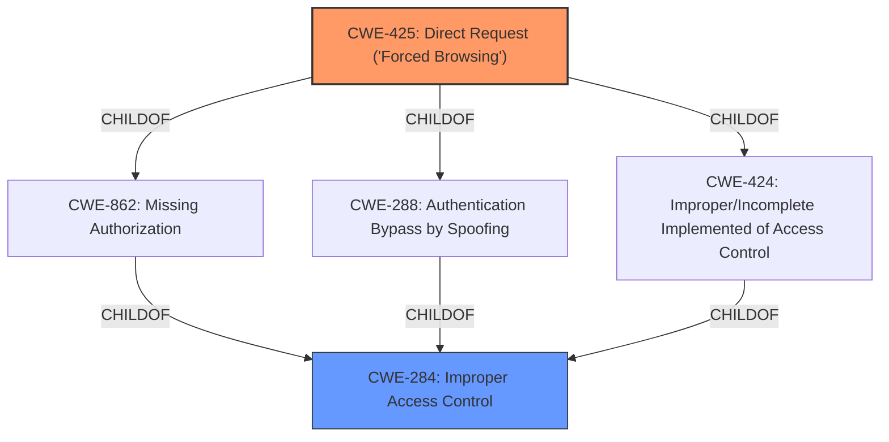

# Analysis for CVE-2022-34574

# Summary
| CWE ID  | CWE Name                                                                                       | Confidence | CWE Abstraction Level | CWE Vulnerability Mapping Label | CWE-Vulnerability Mapping Notes |
| :-------- | :--------------------------------------------------------------------------------------------- | :---------- | :---------------------- | :------------------------------ | :------------------------------ |
| CWE-425   | Direct Request ('Forced Browsing')                                                           | 0.95       | Base                    | Primary                         | Allowed                       |
| CWE-284 | Improper Access Control | 0.60 | Pillar | Secondary                         | Discouraged                       |

## Evidence and Confidence

*   **Confidence Score:** 0.9
*   **Evidence Strength:** HIGH

## Relationship Analysis
The primary relationship that influenced my decision was the hierarchical relationship. CWE-425 is a child of CWE-284 and provides a more specific representation of the vulnerability. The relationship `CanPrecede` was not relevant in this case. The base level of abstraction of CWE-425 makes it a good fit for this vulnerability.

## Vulnerability Chain
The chain of events in this vulnerability starts with an **access control issue**, leading to the exposure of a sensitive file (`Tftpd32.ini`). This file contains key information, which can be obtained by attackers through a direct HTTP request. Therefore, the root cause is the **improper access control**, and the impact is the exposure of sensitive information.

## Summary of Analysis
The initial analysis identified an **access control issue** that allows attackers to obtain key information by accessing the `Tftpd32.ini` file. The retriever results suggested CWE-425, CWE-259 and CWE-284.

The evidence from the vulnerability description supports the selection of CWE-425: "The web application does not adequately enforce appropriate authorization on all restricted URLs, scripts, or files." The vulnerability allows direct access to the `Tftpd32.ini` file without any authorization, which aligns perfectly with CWE-425.
The vulnerability stems from a **lack of proper access controls** on the `Tftpd32.ini` configuration file. The primary weakness is that the `Tftpd32.ini` file is publicly accessible without authentication or authorization.

CWE-284 (Improper Access Control) is a high-level *Pillar* that is too general. CWE-425 is a *Base* level CWE and a child of CWE-284, which makes it a more specific and appropriate choice.

I considered CWE-259 (Use of Hard-coded Password) because the exposed `Tftpd32.ini` file might contain hard-coded passwords. However, the primary issue is the **lack of access control** that allows access to the file in the first place, not the presence of hard-coded credentials. Thus, CWE-259 is not the primary weakness, although it could be a secondary concern if the file contains such passwords.

Therefore, CWE-425 is the most appropriate CWE because it accurately captures the root cause of the vulnerability, which is the **lack of proper authorization** for accessing the `Tftpd32.ini` file directly.

Relevant CWE Information:

## Enhanced Context (25 CWEs)

### CWE-425: Direct Request ('Forced Browsing')
**Abstraction Level**: Base
**Similarity Score**: 6339.50
**Source**: sparse

**Description**:
The web application does not adequately enforce appropriate authorization on all restricted URLs, scripts, or files.

**Mapping Guidance**:
- Usage: Allowed
- Rationale: This CWE entry is at the Base level of abstraction, which is a preferred level of abstraction for mapping to the root causes of vulnerabilities.

### CWE-284: Improper Access Control
**Abstraction Level**: Pillar
**Similarity Score**: 0.132
**Source**: sparse

**Description**:
The product does not restrict or incorrectly restricts access to a resource from an unauthorized actor.

**Mapping Guidance**:
- Usage: Discouraged
- Rationale: CWE-284 is extremely high-level, a Pillar. Its name, "Improper Access Control," is often misused in low-information vulnerability reports [REF-1287] or by active use of the OWASP Top Ten, such as "A01:2021-Broken Access Control". It is not useful for trend analysis.