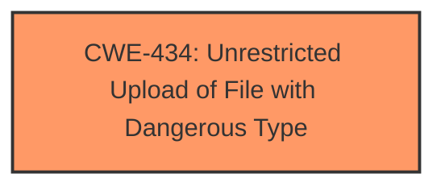

# Raw Analyzer Response for CVE-2022-3458

# Summary
| CWE ID | CWE Name | Confidence | CWE Abstraction Level | CWE Vulnerability Mapping Label | CWE-Vulnerability Mapping Notes |
|---|---|---|---|---|---|
| CWE-434 | Unrestricted Upload of File with Dangerous Type | 1 | Base | Allowed | Primary CWE |

## Evidence and Confidence

*   **Confidence Score:** 1
*   **Evidence Strength:** HIGH

## Relationship Analysis
The primary relationship influencing this decision is the direct match of the vulnerability description to the CWE-434 description. Specifically, the vulnerability involves an **unrestricted upload** of a file, which aligns perfectly with CWE-434's description: "The product allows the upload or transfer of dangerous file types that are automatically processed within its environment." There aren't any complex hierarchical or chain relationships apparent in this specific case, as the description points directly to the root cause.

## Vulnerability Chain
The vulnerability chain for this description is straightforward:
  1.  **Root Cause:** **Unrestricted upload** of a file via `/employeeview.php` due to **missing** or **improper** file type validation.
  2.  **Impact:** Potential for remote code execution or other malicious activities.
There are no missing links, as the description clearly identifies the initial weakness and the potential impact.

## Summary of Analysis
Initially, the vulnerability description clearly states the presence of an **unrestricted upload** vulnerability. The "CVE Reference Links Content Summary" section further confirms this by stating, "Unrestricted file upload vulnerability in the `/employeeview.php` file." It also notes, "The application allows the upload of dangerous file types that can be automatically processed, leading to potential code execution. Specifically, this is classified as CWE-434 (Unrestricted Upload of File with Dangerous Type)."

The Retriever Results also list CWE-434 as the top match. The description for CWE-434 aligns perfectly with the vulnerability.

Based on the strong evidence and direct alignment, I confidently assign CWE-434 as the primary CWE. It is at the Base level of abstraction, which is most appropriate for describing the root cause.

CWEs considered but not used:
* CWE-89 (Improper Neutralization of Special Elements used in an SQL Command ('SQL Injection')): While SQL injection is a common vulnerability, there's no evidence in the description suggesting SQL-related issues.
* CWE-79 (Improper Neutralization of Input During Web Page Generation ('Cross-site Scripting')): Similar to SQL injection, there's no indication of XSS in the provided information.
* CWE-306 (Missing Authentication for Critical Function): While authentication issues could exist, the primary weakness described is the **unrestricted file upload**.
* CWE-73 (External Control of File Name or Path): While related to file operations, CWE-434 directly addresses the dangerous file type issue, making it more specific.
* CWE-98 (Improper Control of Filename for Include/Require Statement in PHP Program ('PHP Remote File Inclusion')): There is no evidence to suggest that this is a PHP Remote File Inclusion vulnerability.