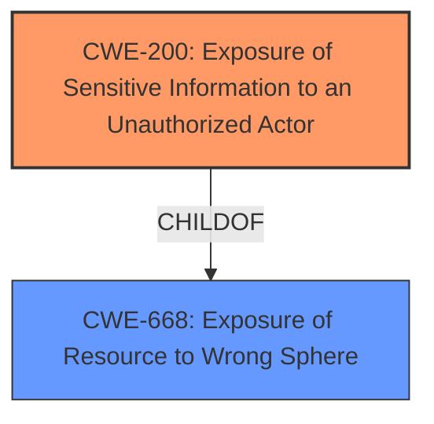

# Raw Analyzer Response for CVE-2022-34659

# Summary
| CWE ID | CWE Name | Confidence | CWE Abstraction Level | CWE Vulnerability Mapping Label | CWE-Vulnerability Mapping Notes |
|---|---|---|---|---|---|
| CWE-200 | Exposure of Sensitive Information to an Unauthorized Actor | 0.9 | Class | Primary | Allowed-with-Review |
| CWE-668 | Exposure of Resource to Wrong Sphere | 0.7 | Class | Secondary | Discouraged |

## Evidence and Confidence

*   **Confidence Score:** 0.8
*   **Evidence Strength:** HIGH

## Relationship Analysis
The primary CWE, CWE-200, is a child of CWE-668, indicating a hierarchical relationship. CWE-200 is a class-level CWE, while there might be more specific CWEs available. However, based on the provided information, CWE-200 sufficiently describes the vulnerability. CWE-668 is a higher-level class that describes exposing a resource to the wrong control sphere.

## Vulnerability Chain
The vulnerability chain starts with the **Power-on-Demand public license server** being used, leading to the exposure of user, host, and display names. The chain is: **Power-on-Demand public license server** -> Information Disclosure (user, host, display names) -> Attacker retrieves information.

## Summary of Analysis
The initial analysis focused on the vulnerability description, which clearly states an information disclosure issue where user, host, and display names are exposed when using the **Power-on-Demand public license server**. The "CVE Reference Links Content Summary" confirms this, stating the root cause is the software exposing sensitive information and the weakness is an information disclosure vulnerability.

The Retriever Results listed CWE-200 as the top candidate, which aligns with the description of the vulnerability.

CWE-200 is chosen because the vulnerability involves the software "explicitly inserts sensitive information into resources or messages that are intentionally made accessible to unauthorized actors." The evidence supporting this is from the "CVE Reference Links Content Summary" section: "**Root cause of vulnerability:** The Simcenter STAR-CCM+ software, when using the Power-on-Demand public license server, exposes sensitive information."

While CWE-200 is a Class, it is appropriate because there isn't enough information to determine a more specific Base or Variant CWE.

CWE-668 was considered, as CWE-200 is a child of CWE-668. However, CWE-668 is discouraged because it's a high-level and often misused. Since the vulnerability is specifically about exposing sensitive information, CWE-200 is more appropriate.

Relevant CWE Information:

# Enhanced Context (25 CWEs)

## CWE-668: Exposure of Resource to Wrong Sphere
**Abstraction Level**: Class
**Similarity Score**: 0.78
**Source**: dense

**Description**:
The product exposes a resource to the wrong control sphere, providing unintended actors with inappropriate access to the resource.

**Mapping Guidance**:
- Usage: Discouraged
- Rationale: CWE-668 is high-level and is often misused as a catch-all when lower-level CWE IDs might be applicable. It is sometimes used for low-information vulnerability reports [REF-1287]. It is a level-1 Class (i.e., a child of a Pillar). It is not useful for trend analysis.

## CWE-200: Exposure of Sensitive Information to an Unauthorized Actor
**Abstraction Level**: Class
**Similarity Score**: 7481.07
**Source**: sparse

**Description**:
The product exposes sensitive information to an actor that is not explicitly authorized to have access to that information.

**Mapping Guidance**:
- Usage: Discouraged
- Rationale: CWE-200 is commonly misused to represent the loss of confidentiality in a vulnerability, but confidentiality loss is a technical impact - not a root cause error. As of CWE 4.9, over 400 CWE entries can lead to a loss of confidentiality. Other options are often available. [REF-1287].

### Summary of Analysis
The vulnerability description and CVE reference summary indicate that the Simcenter STAR-CCM+ software exposes sensitive information (user, host, and display names) when the **Power-on-Demand public license server** is used. This allows an attacker to retrieve this information.

CWE-200 is the most appropriate primary CWE because it directly addresses the exposure of sensitive information to an unauthorized actor. Although CWE-200 is a class-level CWE and is "Discouraged", the description fits well with the vulnerability. The weakness here is directly related to the mishandling of the information itself.

CWE-668 was considered as a secondary CWE, as it describes the exposure of a resource to the wrong control sphere. However, CWE-668 is too general and is often misused. The primary issue is the exposure of sensitive information, making CWE-200 a better fit.