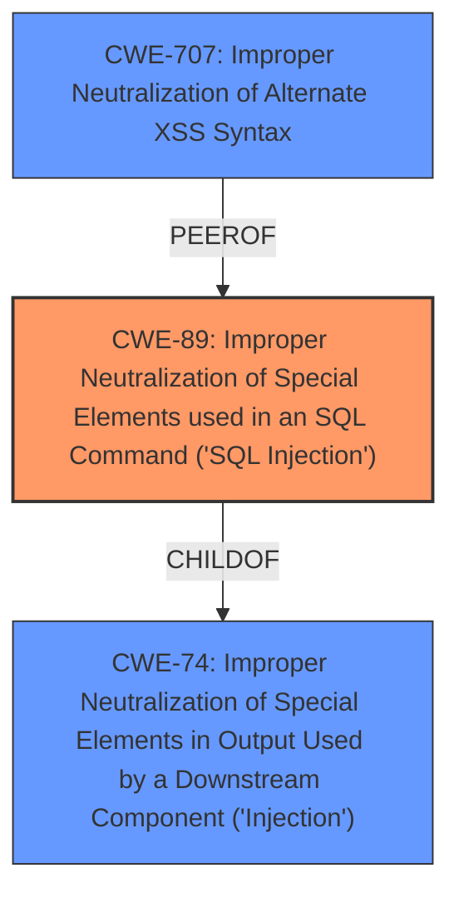

# Analysis Report for CVE-2022-3472

# Vulnerability Analysis Report: CVE-2022-3472

## Description


## Analysis (with Relationship Data)

# Summary
| CWE ID | CWE Name | Confidence | CWE Abstraction Level | CWE Vulnerability Mapping Label | CWE-Vulnerability Mapping Notes |
|---|---|---|---|---|---|
| CWE-89 | Improper Neutralization of Special Elements used in an SQL Command ('SQL Injection') | 1.0 | Base | Allowed | Primary CWE: The application constructs SQL queries using user-supplied input without proper sanitization. |
| CWE-74 | Improper Neutralization of Special Elements in Output Used by a Downstream Component ('Injection') | 0.6 | Class | Discouraged | Secondary Candidate: Considered due to the injection nature of the vulnerability, but CWE-89 is more specific. |
| CWE-707 | Improper Neutralization of Alternate XSS Syntax | 0.4 | Variant | Allowed | Secondary Candidate: Considered, but not directly applicable as the primary issue is SQL Injection, not XSS. |

## Evidence and Confidence

*   **Confidence Score:** 1.0
*   **Evidence Strength:** HIGH

## Relationship Analysis
The primary CWE is CWE-89, which is a base-level CWE that directly addresses the **improper neutralization** of SQL special elements. CWE-89 is a child of CWE-74 (Improper Neutralization of Special Elements in Output Used by a Downstream Component ('Injection')). While CWE-74 could broadly apply, CWE-89 provides a more specific classification. CWE-707 could be considered as a possible secondary CWE if the **SQL injection** was somehow caused by **improper sanitization** of alternate XSS syntax.



## Vulnerability Chain
The vulnerability chain starts with the **insufficient input sanitization** of the `cityedit` parameter in `city.php`. This leads to the construction of a malicious SQL query, resulting in **SQL injection**. The chain is: **Insufficient Input Sanitization** -> **SQL Injection**.

## Summary of Analysis
The analysis is based on the provided vulnerability description and CVE reference links. The root cause of the vulnerability is the application's failure to properly sanitize user-supplied input (`cityedit` parameter) before using it in an SQL query. This directly corresponds to CWE-89 (Improper Neutralization of Special Elements used in an SQL Command ('SQL Injection')).

The vulnerability description states: "The manipulation of the argument cityedit leads to **sql injection**." The CVE Reference Links Content Summary confirms: "The application constructs SQL queries using user-supplied input without **proper sanitization**, specifically via the `cityedit` parameter in the `city.php` file."

CWE-89 is a base-level CWE, which is the preferred level of abstraction. The mapping guidance for CWE-89 states: "This CWE entry is at the Base level of abstraction, which is a preferred level of abstraction for mapping to the root causes of vulnerabilities."

Other CWEs like CWE-74 (Improper Neutralization of Special Elements in Output Used by a Downstream Component ('Injection')) and CWE-707 (Improper Neutralization of Alternate XSS Syntax) were considered. However, CWE-89 is a more precise match for the **SQL injection** vulnerability.

Relevant CWE Information:
*   CWE-89: Improper Neutralization of Special Elements used in an SQL Command ('SQL Injection')
    *   The product constructs all or part of an SQL command using externally-influenced input from an upstream component, but it does not neutralize or incorrectly neutralizes special elements that could modify the intended SQL command when it is sent to a downstream component.
    *   Usage: Allowed
*   CWE-74: Improper Neutralization of Special Elements in Output Used by a Downstream Component ('Injection')
    *   The product constructs all or part of a command, data structure, or record using externally-influenced input from an upstream component, but it does not neutralize or incorrectly neutralizes special elements that could modify how it is parsed or interpreted when it is sent to a downstream component.
    *   Usage: Discouraged


## CWE Relationship Analysis

Current CWEs represent these abstraction levels: .


### Vulnerability Chain Analysis

**Chain starting from CWE-89:**
- 89 (Improper Neutralization of Special Elements used in an SQL Command ('SQL Injection')) - ROOT


**Chain starting from CWE-74:**
- 74 (Improper Neutralization of Special Elements in Output Used by a Downstream Component ('Injection')) - ROOT


### CWE Relationship Diagram

```mermaid
graph TD
    classDef primary fill:#f96,stroke:#333,stroke-width:2px
    classDef secondary fill:#69f,stroke:#333
    classDef tertiary fill:#9e9,stroke:#333
```


*Report generated on 2025-03-30 22:31:33*
