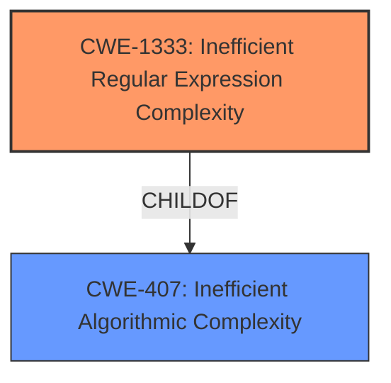

# Raw Analyzer Response for CVE-2022-34749

# Summary
| CWE ID  | CWE Name                                                                                                  | Confidence | CWE Abstraction Level | CWE Vulnerability Mapping Label | CWE-Vulnerability Mapping Notes |
| :-------- | :---------------------------------------------------------------------------------------------------------- | :----------- | :---------------------- | :------------------------------ | :-------------------------------- |
| CWE-1333 | Inefficient Regular Expression Complexity                                                               | 1          | Base                    | Primary                         | Allowed                           |
| CWE-407 | Inefficient Algorithmic Complexity                                                                        | 0.7          | Class                   | Secondary                       | Allowed-with-Review             |

## Evidence and Confidence

*   **Confidence Score:** 0.9
*   **Evidence Strength:** HIGH

## Relationship Analysis
The primary relationship is that CWE-1333 (Inefficient Regular Expression Complexity) is a child of CWE-407 (Inefficient Algorithmic Complexity). This means that CWE-1333 is a specific type of inefficient algorithmic complexity that arises from the use of regular expressions. Since the vulnerability description specifically mentions catastrophic backtracking due to regular expressions, CWE-1333 is a more precise fit than its parent CWE-407.

## Vulnerability Chain
The vulnerability chain starts with the **inefficient regular expression**, which leads to **catastrophic backtracking**, ultimately resulting in excessive CPU usage and a denial-of-service condition.

## Summary of Analysis
The initial assessment strongly points to CWE-1333 as the primary weakness, given the explicit mention of "catastrophic backtracking" in the vulnerability description and the "CVE Reference Links Content Summary". The vulnerability stems from using regular expressions, which can lead to excessive backtracking and CPU consumption.

>Vulnerability Description Key Phrases
> - **rootcause:** **catastrophic backtracking**

>CVE Reference Links Content Summary
> - The vulnerability is tracked under CWE-1333, which refers to Catastrophic Backtracking.

CWE-1333 is a Base level CWE, which is the preferred level of abstraction. It accurately describes the root cause of the vulnerability, which is the inefficient regular expression complexity.

CWE-407 was also considered but ultimately classified as a secondary candidate. Although the vulnerability does involve inefficient algorithmic complexity, CWE-1333 provides a more precise description of the issue, as it specifically relates to regular expressions.

The selected CWEs are at the optimal level of specificity, as they accurately reflect the root cause of the vulnerability while remaining appropriately abstract.

Relevant CWE Information:

# Enhanced Context (25 CWEs)
The following CWEs were identified as potentially relevant to this vulnerability:

## CWE-405: Asymmetric Resource Consumption (Amplification)
**Abstraction Level**: Class
**Similarity Score**: 0.78
**Source**: dense

**Description**:
The product does not properly control situations in which an adversary can cause the product to consume or produce excessive resources without requiring the adversary to invest equivalent work or otherwise prove authorization, i.e., the adversary's influence is "asymmetric."

**Mapping Guidance**:
- Usage: Allowed-with-Review
- Rationale: This CWE entry is a Class and might have Base-level children that would be more appropriate

## CWE-1333: Inefficient Regular Expression Complexity
**Abstraction:** Base
**Similarity Score**: 5617.36
**Source**: sparse

**Description**:
The product uses a regular expression with an inefficient, possibly exponential worst-case computational complexity that consumes excessive CPU cycles.

**Mapping Guidance**:
- Usage: Allowed
- Rationale: This CWE entry is at the Base level of abstraction, which is a preferred level of abstraction for mapping to the root causes of vulnerabilities.
#