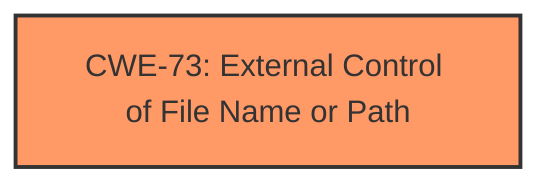

# Analysis for CVE-2022-34765

# Summary
| CWE ID | CWE Name | Confidence | CWE Abstraction Level | CWE Vulnerability Mapping Label | CWE-Vulnerability Mapping Notes |
|---|---|---|---|---|---|
| CWE-73 | External Control of File Name or Path | 1 | Base | Allowed | Primary CWE |

## Evidence and Confidence

*   **Confidence Score:** 1
*   **Evidence Strength:** HIGH

## Relationship Analysis
The primary CWE, CWE-73, stands alone without strong hierarchical relationships influencing its selection. While it can precede several file-related weaknesses (CWE-22, CWE-41, CWE-98, CWE-434, CWE-59), these relationships are more about potential consequences rather than direct dependencies in this specific vulnerability. The analysis focused on identifying the root cause, which is the **external control of the file path**, making CWE-73 the most direct and accurate classification.

## Vulnerability Chain
The vulnerability chain starts with **user-controlled data** being written to the file path, leading to the **external control of the file name or path** (CWE-73). This, in turn, results in the **loading of unauthorized firmware images**. The chain is relatively short and direct, with CWE-73 representing the core weakness.

## Summary of Analysis
The initial assessment and final conclusion are strongly based on the provided evidence. The vulnerability description explicitly mentions "**External Control of File Name or Path**" as the root cause, making CWE-73 the obvious and most appropriate choice. The retriever results also list CWE-73, albeit with a lower score than other CWEs like CWE-22 and CWE-426, but the explicit mention in the description overrides these suggestions.

> Vulnerability Description Key Phrases
> - **rootcause:** **External Control of File Name or Path**

The graph relationships did not significantly influence the decision, as the focus was on identifying the **root cause**. CWE-73 is at the optimal level of specificity, representing the precise weakness described in the vulnerability.

Relevant CWE Information:

# Enhanced Context (25 CWEs)

## Vulnerability Description
A CWE-73 **External Control of File Name or Path** vulnerability exists that could cause loading of unauthorized firmware images when user-controlled data is written to the file path. Affected Products X80 advanced RTU Communication Module (BMENOR2200H) (V2.01 and later), OPC UA Modicon Communication Module (BMENUA0100) (V1.10 and prior)

### Vulnerability Description Key Phrases
- **rootcause:** **External Control of File Name or Path**
- **impact:** loading of unauthorized firmware images
- **vector:** user-controlled data written to the file path
- **product:** X80 advanced RTU Communication Module and OPC UA Modicon Communication Module
- **version:** V2.01 and later and V1.10 and prior

## Retriever Results

### Top Combined Results

| Rank | CWE ID | Name | Abstraction | Usage  | Retrievers | Individual Scores |
|------|--------|------|-------------|-------|------------|-------------------|
| 1 | 22 | Improper Limitation of a Pathname to a Restricted Directory ('Path Traversal') | Base | Allowed | alternate_terms | 0.700 |
| 2 | 300 | Channel Accessible by Non-Endpoint | Class | Discouraged | alternate_terms | 0.700 |
| 3 | 426 | Untrusted Search Path | Base | Allowed | alternate_terms | 0.700 |
| 4 | 73 | External Control of File Name or Path | Base | Allowed | sparse | 0.493 |
| 5 | 119 | Improper Restriction of Operations within the Bounds of a Memory Buffer | Class | Discouraged | sparse | 0.289 |
| 6 | 641 | Improper Restriction of Names for Files and Other Resources | Base | Allowed | dense | 0.634 |
| 7 | 41 | Improper Resolution of Path Equivalence | Base | Allowed | graph | 0.003 |
| 8 | 23 | Relative Path Traversal | Base | Allowed | sparse | 0.282 |
| 9 | 200 | Exposure of Sensitive Information to an Unauthorized Actor | Class | Discouraged | sparse | 0.277 |
| 10 | 345 | Insufficient Verification of Data Authenticity | Class | Discouraged | sparse | 0.256 |

CWEs Considered and Rejected:

*   **CWE-22 Improper Limitation of a Pathname to a Restricted Directory ('Path Traversal')**: While path traversal could be a consequence of external control of the file path, the description doesn't explicitly mention path traversal sequences. Therefore, it's not the primary weakness.

*   **CWE-300 Channel Accessible by Non-Endpoint**: This CWE is related to man-in-the-middle attacks and doesn't fit the vulnerability description.

*   **CWE-426 Untrusted Search Path**: This CWE is related to the product searching for resources using an externally-supplied search path. This is not present in the vulnerability description.

*   **CWE-119 Improper Restriction of Operations within the Bounds of a Memory Buffer**: This CWE is related to buffer overflows, which is not present in the vulnerability description.

*   **CWE-641 Improper Restriction of Names for Files and Other Resources**: This CWE is similar to CWE-73, but CWE-73 is more specific to file path manipulation.

*   **CWE-41 Improper Resolution of Path Equivalence**: This CWE involves using special characters to generate multiple names for the same object, which is not the primary issue here.

*   **CWE-23 Relative Path Traversal**: This CWE is a specific type of CWE-22, and the same reasoning for rejecting CWE-22 applies here.

*   **CWE-200 Exposure of Sensitive Information to an Unauthorized Actor**: This CWE represents a technical impact rather than the root cause.

*   **CWE-345 Insufficient Verification of Data Authenticity**: This CWE is about not verifying the origin of data, which isn't the main problem in this case. The problem is more about the path itself being controllable.