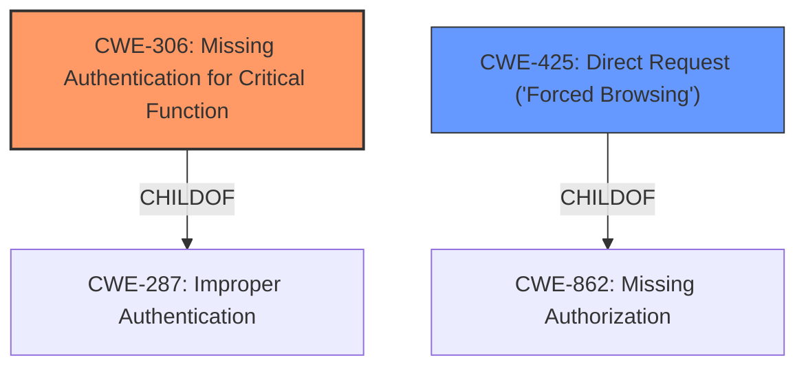

# Analysis Report for CVE-2022-34767

# Vulnerability Analysis Report: CVE-2022-34767

## Description


## Analysis (with Relationship Data)

# Summary

| CWE ID  | CWE Name                                       | Confidence | CWE Abstraction Level | CWE Vulnerability Mapping Label | CWE-Vulnerability Mapping Notes |
| :-------- | :--------------------------------------------- | :--------- | :---------------------- | :------------------------------ | :------------------------------ |
| CWE-306 | Missing Authentication for Critical Function | 0.9        | Base                    | Allowed                         | Primary CWE                     |
| CWE-425 | Direct Request ('Forced Browsing')             | 0.7        | Base                    | Allowed                         | Secondary Candidate             |

## Evidence and Confidence

*   **Confidence Score:** 0.8
*   **Evidence Strength:** HIGH

## Relationship Analysis

The primary relationship that influenced the CWE selection was the parent-child relationship between CWE-287 (Improper Authentication) and CWE-306 (Missing Authentication for Critical Function). CWE-306 is a more specific case of CWE-287, where no authentication is performed at all. Also of consideration was the relationship between CWE-862 (Missing Authorization) and CWE-425 (Direct Request).



## Vulnerability Chain

The vulnerability chain starts with the **missing authentication** (**CWE-306**) for the web page wizardpwd.asp, leading to a direct request (**CWE-425**) that allows an attacker to bypass authentication and change the password.

## Summary of Analysis

The initial analysis focused on identifying the **root cause** of the vulnerability. The vulnerability description clearly states that the web page `wizardpwd.asp` in the ALLNET Router model WR0500AC is prone to an **"Authorization bypass vulnerability"** because it "Does not validate the users identity and can be accessed publicly." This statement directly points to the **lack of authentication** for a critical function, which is the password change functionality.

The Retriever Results highlighted CWE-284 (Improper Access Control), CWE-306 (Missing Authentication for Critical Function), and CWE-425 (Direct Request ('Forced Browsing')) as potential candidates. CWE-284 is a very high-level "Pillar" CWE and the mapping guidance discourages its use. Both CWE-306 and CWE-425 are "Base" level CWEs, which are preferred.

CWE-306 (Missing Authentication for Critical Function) was chosen as the primary CWE because the vulnerability description explicitly mentions the **lack of user identity validation**. This aligns perfectly with the definition of CWE-306, which states that "The product does not perform any authentication for functionality that requires a provable user identity or consumes a significant amount of resources."

CWE-425 (Direct Request ('Forced Browsing')) was considered as a secondary CWE because the vulnerable page can be accessed directly without proper authorization checks. The description for CWE-425 states: "The web application does not adequately enforce appropriate authorization on all restricted URLs, scripts, or files."

The final decision was based on the evidence from the vulnerability description, the relationship analysis, and the mapping guidance. CWE-306 is the more specific and accurate representation of the **root cause** of the vulnerability.

Relevant CWE Information:

# Enhanced Context (25 CWEs)

## CWE-807: Reliance on Untrusted Inputs in a Security Decision
**Abstraction Level**: Base
**Similarity Score**: 0.78

**Description**:
The product uses a protection mechanism that relies on the existence or values of an input, but the input can be modified by an untrusted actor in a way that bypasses the protection mechanism.

**Mapping Guidance**:
- Usage: Allowed
- Rationale: This CWE entry is at the Base level of abstraction, which is a preferred level of abstraction for mapping to the root causes of vulnerabilities.

*Not Selected:* This CWE is about relying on untrusted inputs, which is not the primary issue here. The primary issue is the lack of authentication.

## CWE-552: Files or Directories Accessible to External Parties
**Abstraction Level**: Base
**Similarity Score**: 0.77

**Description**:
The product makes files or directories accessible to unauthorized actors, even though they should not be.

**Mapping Guidance**:
- Usage: Allowed
- Rationale: This CWE entry is at the Base level of abstraction, which is a preferred level of abstraction for mapping to the root causes of vulnerabilities.

*Not Selected:* While the vulnerability involves accessing a file (`wizardpwd.asp`), the core issue is not simply making a file accessible, but the lack of authentication before accessing it.

## CWE-184: Incomplete List of Disallowed Inputs
**Abstraction Level**: Base
**Similarity Score**: 0.76

**Description**:
The product implements a protection mechanism that relies on a list of inputs (or properties of inputs) that are not allowed by policy or otherwise require other action to neutralize before additional processing takes place, but the list is incomplete.

**Mapping Guidance**:
- Usage: Allowed
- Rationale: This CWE entry is at the Base level of abstraction, which is a preferred level of abstraction for mapping to the root causes of vulnerabilities.

*Not Selected:* The vulnerability doesn't involve an incomplete list of disallowed inputs. It's about the absence of authentication.

## CWE-41: Improper Resolution of Path Equivalence
**Abstraction Level**: Base
**Similarity Score**: 0.76

**Description**:
The product is vulnerable to file system contents disclosure through path equivalence. Path equivalence involves the use of special characters in file and directory names. The associated manipulations are intended to generate multiple names for the same object.

**Mapping Guidance**:
- Usage: Allowed
- Rationale: This CWE entry is at the Base level of abstraction, which is a preferred level of abstraction for mapping to the root causes of vulnerabilities.

*Not Selected:* This CWE is specific to path equivalence issues, which are not relevant to the vulnerability description.

## CWE-472: External Control of Assumed-Immutable Web Parameter
**Abstraction Level**: Base
**Similarity Score**: 0.76

**Description**:
The web application does not sufficiently verify inputs that are assumed to be immutable but are actually externally controllable, such as hidden form fields.

**Mapping Guidance**:
- Usage: Allowed
- Rationale: This CWE entry is at the Base level of abstraction, which is a preferred level of abstraction for mapping to the root causes of vulnerabilities.

*Not Selected:* The vulnerability doesn't involve external control of assumed-immutable web parameters.

## CWE-1289: Improper Validation of Unsafe Equivalence in Input
**Abstraction Level**: Base
**Similarity Score**: 0.76

**Description**:
The product receives an input value that is used as a resource identifier or other type of reference, but it does not validate or incorrectly validates that the input is equivalent to a potentially-unsafe value.

**Mapping Guidance**:
- Usage: Allowed
- Rationale: This CWE entry is at the Base level of abstraction, which is a preferred level of abstraction for mapping to the root causes of vulnerabilities.

*Not Selected:* The vulnerability isn't about improper validation of unsafe equivalence in input. It's the lack of authentication that is the primary issue.

## CWE-434: Unrestricted Upload of File with Dangerous Type
**Abstraction Level**: Base
**Similarity Score**: 0.76

**Description**:
The product allows the upload or transfer of dangerous file types that are automatically processed within its environment.

**Mapping Guidance**:
- Usage: Allowed
- Rationale: This CWE entry is at the Base level of abstraction, which is a preferred level of abstraction for mapping to the root causes of vulnerabilities.

*Not Selected:* The vulnerability doesn't involve unrestricted file uploads.

## CWE-274: Improper Handling of Insufficient Privileges
**Abstraction Level**: Base
**Similarity Score**: 0.76

**Description**:
The product does not handle or incorrectly handles when it has insufficient privileges to perform an operation, leading to resultant weaknesses.

**Mapping Guidance**:
- Usage: Discouraged
- Rationale: This CWE entry could be deprecated in a future version of CWE.

*Not Selected:* The vulnerability is not primarily about improper handling of insufficient privileges.

## CWE-183: Permissive List of Allowed Inputs
**Abstraction Level**: Base
**Similarity Score**: 0.76

**Description**:
The product implements a protection mechanism that relies on a list of inputs (or properties of inputs) that are explicitly allowed by policy because the inputs are assumed to be safe, but the list is too permissive - that is, it allows an input that is unsafe, leading to resultant weaknesses.

**Mapping Guidance**:
- Usage: Allowed
- R


## CWE Relationship Analysis

Current CWEs represent these abstraction levels: .


### Vulnerability Chain Analysis

**Chain starting from CWE-862:**
- 862 (Missing Authorization) - ROOT


**Chain starting from CWE-552:**
- 552 (Files or Directories Accessible to External Parties) - ROOT


### CWE Relationship Diagram

```mermaid
graph TD
    classDef primary fill:#f96,stroke:#333,stroke-width:2px
    classDef secondary fill:#69f,stroke:#333
    classDef tertiary fill:#9e9,stroke:#333
```


*Report generated on 2025-03-30 14:13:27*
