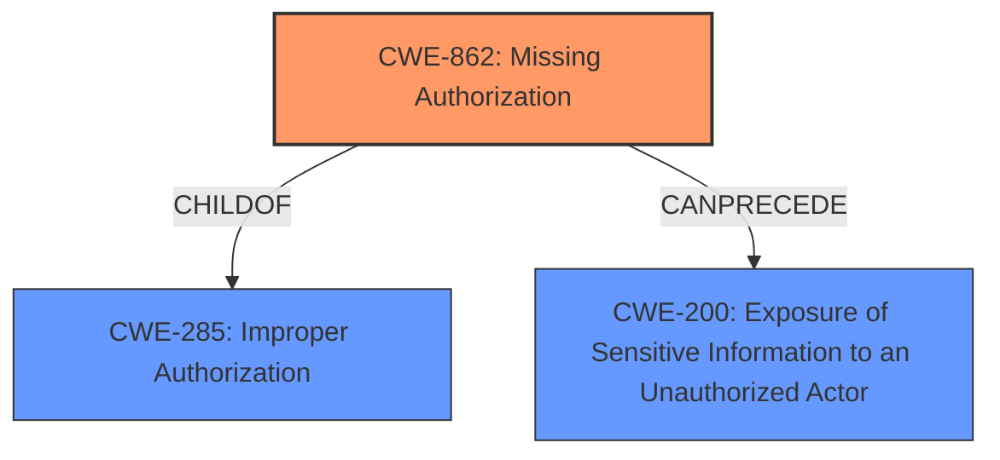

# Raw Analyzer Response for CVE-2022-34779

# Summary
| CWE ID | CWE Name | Confidence | CWE Abstraction Level | CWE Vulnerability Mapping Label | CWE-Vulnerability Mapping Notes |
|---|---|---|---|---|---|
| CWE-862 | Missing Authorization | 1.0 | Class | Primary | Allowed-with-Review |
| CWE-200 | Exposure of Sensitive Information to an Unauthorized Actor | 0.7 | Class | Secondary | Allowed |

## Evidence and Confidence

*   **Confidence Score:** 0.85
*   **Evidence Strength:** HIGH

## Relationship Analysis
The primary CWE identified is CWE-862 (**Missing Authorization**), which is a Class-level CWE. It falls under the broader category of CWE-285 (**Improper Authorization**). The vulnerability description clearly indicates a **missing permission check**, which directly aligns with the definition of CWE-862.

CWE-862 is related to CWE-200 (**Exposure of Sensitive Information to an Unauthorized Actor**), because missing authorization often leads to sensitive information being exposed to unauthorized actors.

## Vulnerability Chain
The vulnerability chain starts with a **missing permission check** (CWE-862), which allows attackers with Overall/Read permission to enumerate credentials IDs (CWE-200).

## Summary of Analysis
The initial assessment, based on the provided evidence, points strongly towards CWE-862 (**Missing Authorization**) as the primary weakness. The vulnerability description states a **missing permission check** in Jenkins XebiaLabs XL Release Plugin, allowing attackers with Overall/Read permission to enumerate credentials IDs. This aligns directly with the definition of CWE-862, which describes a product not performing an authorization check when an actor attempts to access a resource or perform an action.

The "CVE Reference Links Content Summary" further supports this by stating: "**Missing permission checks** in several HTTP endpoints. This allows attackers with Overall/Read permission to enumerate credentials IDs of credentials stored in Jenkins."

The retriever results also list CWE-862 as the top combined result.

While CWE-862 is a Class-level CWE, the evidence does not point to a more specific Base or Variant CWE. Therefore, CWE-862 is the most appropriate choice.

CWE-200 (**Exposure of Sensitive Information to an Unauthorized Actor**) is a secondary weakness. The **missing permission check** (CWE-862) leads directly to the exposure of credential IDs, which constitutes sensitive information. This exposure is the direct consequence of the **missing authorization**.

Other CWEs were considered but deemed less relevant:

*   CWE-863 (**Incorrect Authorization**): This CWE implies that an authorization check is performed but is done incorrectly. The vulnerability description clearly indicates a **missing** check, not an incorrect one.
*   CWE-276 (**Incorrect Default Permissions**): This CWE is related to file system permissions during installation, which is not relevant to the described vulnerability.
*   CWE-522 (**Insufficiently Protected Credentials**): While the vulnerability allows enumeration of credential IDs, the root cause is the **missing authorization check**, not the method of credential storage or transmission.
*   CWE-256 (**Plaintext Storage of a Password**): Similar to CWE-522, this is not the root cause, but a potential related issue.
*   CWE-668 (**Exposure of Resource to Wrong Sphere**): This is a high-level CWE and not as specific as CWE-862.
*   CWE-497 (**Exposure of Sensitive System Information to an Unauthorized Control Sphere**): Similar to CWE-668, this is a broader category and less specific than CWE-862.

The selection of CWE-862 is at the optimal level of specificity, as it directly addresses the **missing authorization check** that is the root cause of the vulnerability. The evidence strongly supports this classification, and the relationship analysis further reinforces the choice.

Relevant CWE Information:

# Enhanced Context (25 CWEs)
The following CWEs were identified as potentially relevant to this vulnerability:

## CWE-538: Insertion of Sensitive Information into Externally-Accessible File or Directory
**Abstraction Level**: Base
**Similarity Score**: 0.81
**Source**: dense

**Description**:
The product places sensitive information into files or directories that are accessible to actors who are allowed to have access to the files, but not to the sensitive information.

**Mapping Guidance**:
- Usage: Allowed
- Rationale: This CWE entry is at the Base level of abstraction, which is a preferred level of abstraction for mapping to the root causes of vulnerabilities.

## CWE-552: Files or Directories Accessible to External Parties
**Abstraction Level**: Base
**Similarity Score**: 0.79
**Source**: dense

**Description**:
The product makes files or directories accessible to unauthorized actors, even though they should not be.

**Mapping Guidance**:
- Usage: Allowed
- Rationale: This CWE entry is at the Base level of abstraction, which is a preferred level of abstraction for mapping to the root causes of vulnerabilities.

## CWE-212: Improper Removal of Sensitive Information Before Storage or Transfer
**Abstraction Level**: Base
**Similarity Score**: 0.77
**Source**: dense

**Description**:
The product stores, transfers, or shares a resource that contains sensitive information, but it does not properly remove that information before the product makes the resource available to unauthorized actors.

**Mapping Guidance**:
- Usage: Allowed
- Rationale: This CWE entry is at the Base level of abstraction, which is a preferred level of abstraction for mapping to the root causes of vulnerabilities.

## CWE-668: Exposure of Resource to Wrong Sphere
**Abstraction Level**: Class
**Similarity Score**: 0.77
**Source**: dense

**Description**:
The product exposes a resource to the wrong control sphere, providing unintended actors with inappropriate access to the resource.

**Mapping Guidance**:
- Usage: Discouraged
- Rationale: CWE-668 is high-level and is often misused as a catch-all when lower-level CWE IDs might be applicable. It is sometimes used for low-information vulnerability reports [REF-1287]. It is a level-1 Class (i.e., a child of a Pillar). It is not useful for trend analysis.

## CWE-312: Cleartext Storage of Sensitive Information
**Abstraction Level**: Base
**Similarity Score**: 0.77
**Source**: dense

**Description**:
The product stores sensitive information in cleartext within a resource that might be accessible to another control sphere.

**Mapping Guidance**:
- Usage: Allowed
- Rationale: This CWE entry is at the Base level of abstraction, which is a preferred level of abstraction for mapping to the root causes of vulnerabilities.

## CWE-807: Reliance on Untrusted Inputs in a Security Decision
**Abstraction Level**: Base
**Similarity Score**: 0.76
**Source**: dense

**Description**:
The product uses a protection mechanism that relies on the existence or values of an input, but the input can be modified by an untrusted actor in a way that bypasses the protection mechanism.

**Mapping Guidance**:
- Usage: Allowed
- Rationale: This CWE entry is at the Base level of abstraction, which is a preferred level of abstraction for mapping to the root causes of vulnerabilities.

## CWE-497: Exposure of Sensitive System Information to an Unauthorized Control Sphere
**Abstraction Level**: Base
**Similarity Score**: 0.76
**Source**: dense

**Description**:
The product does not properly prevent sensitive system-level information from being accessed by unauthorized actors who do not have the same level of access to the underlying system as the product does.

**Mapping Guidance**:
- Usage: Allowed
- Rationale: This CWE entry is at the Base level of abstraction, which is a preferred level of abstraction for mapping to the root causes of vulnerabilities.

## CWE-1391: Use of Weak Credentials
**Abstraction Level**: Class
**Similarity Score**: 0.76
**Source**: dense

**Description**:
The product uses weak credentials (such as a default key or hard-coded password) that can be calculated, derived, reused, or guessed by an attacker.

**Mapping Guidance**:
- Usage: Allowed-with-Review
- Rationale: This CWE entry is a Class and might have Base-level children that would be more appropriate

## CWE-639: Authorization Bypass Through User-Controlled Key
**Abstraction Level**: Base
**Similarity Score**: 0.76
**Source**: dense

**Description**:
The system's authorization functionality does not prevent