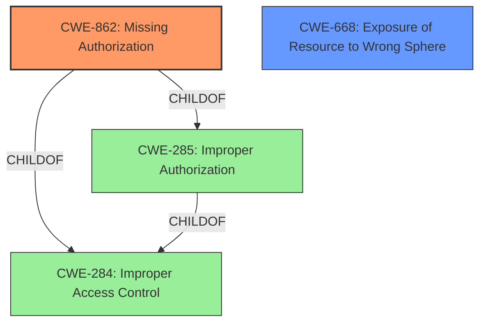

# Analysis for CVE-2022-34781

# Summary
| CWE ID | CWE Name | Confidence | CWE Abstraction Level | CWE Vulnerability Mapping Label | CWE-Vulnerability Mapping Notes |
|---|---|---|---|---|---|
| CWE-862 | Missing Authorization | 1.0 | Class | Primary | Allowed-with-Review |
| CWE-668 | Exposure of Resource to Wrong Sphere | 0.7 | Class | Secondary | Discouraged |

## Evidence and Confidence

*   **Confidence Score:** 1.0
*   **Evidence Strength:** HIGH

## Relationship Analysis
The primary relationship is that CWE-862 [CWE-862: Missing Authorization] is a child of CWE-285 [CWE-285: Improper Authorization] and CWE-284 [CWE-284: Improper Access Control]. Because the vulnerability description specifies that there are **missing permission checks**, CWE-862 [CWE-862: Missing Authorization] is the most appropriate. While CWE-285 [CWE-285: Improper Authorization] could be considered, the guidance suggests using its children, such as CWE-862 [CWE-862: Missing Authorization], if they are a better fit, as they are more specific. CWE-668 [CWE-668: Exposure of Resource to Wrong Sphere] is a Class-level CWE related to exposing resources to the wrong sphere. It is less specific than CWE-862 [CWE-862: Missing Authorization] but could be a secondary consideration given that the credentials stored in Jenkins are exposed due to the **missing permission checks**.

## Vulnerability Chain
The vulnerability chain starts with the **missing permission checks** (CWE-862 [CWE-862: Missing Authorization]), leading to the ability for attackers with Overall/Read permission to connect to an attacker-specified HTTP server using attacker-specified credentials IDs, ultimately capturing credentials stored in Jenkins.

## Summary of Analysis
The initial analysis identified the **missing permission checks** as the primary weakness, leading to the selection of CWE-862 [CWE-862: Missing Authorization]. The vulnerability description states: "Missing permission checks in Jenkins XebiaLabs XL Release Plugin 22.0.0 and earlier allow attackers with Overall/Read permission to connect to an attacker-specified HTTP server using attacker-specified credentials IDs obtained through another method, capturing credentials stored in Jenkins." The "CVE Reference Links Content Summary" confirms this: "The XebiaLabs XL Release Plugin does not perform permission checks in methods implementing form validation."

CWE-862 [CWE-862: Missing Authorization] is the most specific and appropriate CWE because it directly addresses the root cause of the vulnerability: the absence of authorization checks. This allows attackers with certain permissions to perform actions they should not be authorized to do, leading to the capture of credentials.

Other CWEs were considered, but were not selected for the following reasons:

*   CWE-863 [CWE-863: Incorrect Authorization]: This CWE implies that an authorization check is performed but is done incorrectly. The vulnerability description explicitly states that authorization checks are *missing*, making CWE-862 [CWE-862: Missing Authorization] more accurate.
*   CWE-522 [CWE-522: Insufficiently Protected Credentials] and CWE-256 [CWE-256: Plaintext Storage of a Password]: While the impact of the vulnerability is the capture of credentials, the root cause is the **missing authorization checks**, not the way the credentials are stored or transmitted.
*   CWE-285 [CWE-285: Improper Authorization] and CWE-284 [CWE-284: Improper Access Control]: These are higher-level Class and Pillar CWEs, respectively. The mapping guidance for CWE-285 [CWE-285: Improper Authorization] specifically suggests using its children, such as CWE-862 [CWE-862: Missing Authorization], if they are a better fit.
*   CWE-306 [CWE-306: Missing Authentication for Critical Function]: This CWE is related to missing authentication, whereas the identified vulnerability is related to **missing authorization**.
*   CWE-668 [CWE-668: Exposure of Resource to Wrong Sphere]: This CWE could be a secondary consideration, as the **missing permission checks** ultimately expose the credentials to the wrong sphere, allowing unauthorized access. However, it is less specific than CWE-862 [CWE-862: Missing Authorization] in describing the root cause.