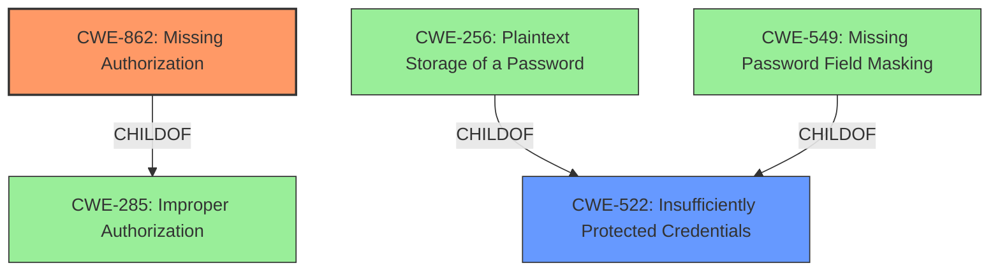

# Enhanced Analysis for CVE-2022-34796

# Summary
| CWE ID | CWE Name | Confidence | CWE Abstraction Level | CWE Vulnerability Mapping Label | CWE-Vulnerability Mapping Notes |
|---|---|---|---|---|---|
| CWE-862 | Missing Authorization | 1.0 | Class | Primary | Allowed-with-Review |
| CWE-522 | Insufficiently Protected Credentials | 0.5 | Class | Secondary | Allowed-with-Review |

## Evidence and Confidence

*   **Confidence Score:** 0.75
*   **Evidence Strength:** HIGH

## Relationship Analysis
The primary relationship that influenced the CWE selection is the ChildOf relationship between CWE-862 (Missing Authorization) and CWE-285 (Improper Authorization). While CWE-285 could be considered, CWE-862 is more specific and directly reflects the **missing permission check** described in the vulnerability. CWE-522 (Insufficiently Protected Credentials) is related to CWE-256 (Plaintext Storage of a Password) and CWE-549 (Missing Password Field Masking) as a parent. However, since the vulnerability describes the enumeration of credential IDs and not the exposure of the credentials themselves, CWE-522 is only a secondary consideration.



## Vulnerability Chain
The vulnerability chain starts with a **missing permission check** (CWE-862), which allows attackers to enumerate credential IDs. The potential next step in the chain, as noted in the CVE description, is the use of these IDs to capture the credentials using another vulnerability.

## Summary of Analysis
The primary CWE is CWE-862 (Missing Authorization) because the vulnerability description explicitly states a **missing permission check**. This aligns with the CWE's description: "The product does not perform an authorization check when an actor attempts to access a resource or perform an action." The impact is that attackers with Overall/Read permission can enumerate credential IDs. The evidence is strong, as the "Vulnerability Description Key Phrases" section identifies the **"missing permission check"** as the root cause. The "CVE Reference Links Content Summary" also confirms this by stating "**Missing permission checks in several HTTP endpoints.**"

CWE-522 (Insufficiently Protected Credentials) was considered because the vulnerability allows enumeration of credential IDs. However, the vulnerability doesn't directly expose the credentials themselves, but rather the IDs. Therefore, CWE-522 is a secondary concern.

The selection of CWE-862 is at the optimal level of specificity, as it directly addresses the root cause **(missing permission check)**. The MITRE mapping guidance allows for CWE-862, but suggests examining children for a better fit, but there isn't a more specific child. The analysis relies heavily on the provided evidence, specifically the vulnerability description and the CVE reference summary, which both point to the **missing permission check**.


## CWE Relationship Analysis

Current CWEs represent these abstraction levels: .


### Vulnerability Chain Analysis

**Chain starting from CWE-862:**
- 862 (Missing Authorization) - ROOT


**Chain starting from CWE-549:**
- 549 (Missing Password Field Masking) - ROOT


### CWE Relationship Diagram

```mermaid
graph TD
    classDef primary fill:#f96,stroke:#333,stroke-width:2px
    classDef secondary fill:#69f,stroke:#333
    classDef tertiary fill:#9e9,stroke:#333
```