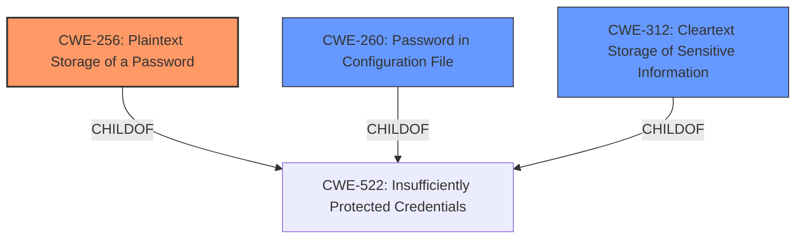

# Analysis for CVE-2022-34807

# Summary
| CWE ID | CWE Name | Confidence | CWE Abstraction Level | CWE Vulnerability Mapping Label | CWE-Vulnerability Mapping Notes |
|---|---|---|---|---|---|
| CWE-256 | Plaintext Storage of a Password | 1.0 | Base | Allowed | Primary CWE |
| CWE-260 | Password in Configuration File | 0.9 | Base | Allowed | Secondary Candidate |
| CWE-312 | Cleartext Storage of Sensitive Information | 0.7 | Base | Allowed | Secondary Candidate |

## Evidence and Confidence

*   **Confidence Score:** 0.9
*   **Evidence Strength:** HIGH

## Relationship Analysis
The primary CWE is CWE-256 **Plaintext Storage of a Password**, which is a **Base** level CWE. CWE-256 is a child of CWE-522 **Insufficiently Protected Credentials**, which is a **Class** level CWE. The vulnerability specifically states that the password is stored unencrypted. Since the storage is in a configuration file, CWE-260 **Password in Configuration File** is also considered. CWE-312 **Cleartext Storage of Sensitive Information** is also considered since the password is **stored unencrypted**.

## Vulnerability Chain
The vulnerability chain starts with the **root cause**, which is the **plaintext storage of the password** in the configuration file. This leads to the impact of the password being viewed by users with access to the Jenkins controller file system, which could lead to unauthorized access to the Elasticsearch instance.

## Summary of Analysis
The analysis is based on the provided evidence, especially the **Vulnerability Description Key Phrases** and **CVE Reference Links Content Summary**. The key phrase "**password stored unencrypted**" directly indicates **CWE-256 Plaintext Storage of a Password**. The retriever results also list CWE-256 as the top candidate. CWE-256 is at the **Base** level of abstraction, which is the preferred level.

Other CWEs considered but not used:

*   CWE-522 **Insufficiently Protected Credentials**: This is a class-level CWE and is too general. The vulnerability is more specific than just insufficiently protected credentials.
*   CWE-538 **Insertion of Sensitive Information into Externally-Accessible File or Directory**: While the configuration file is externally accessible, the main issue is the **plaintext storage**, not the insertion into an accessible file.
*   CWE-862 **Missing Authorization**: This CWE is not relevant as there is no mention of missing authorization checks.
*   CWE-319 **Cleartext Transmission of Sensitive Information**: This CWE is not relevant as the vulnerability deals with storage and not transmission.
*   CWE-260 **Password in Configuration File**: This is a good secondary match to show the password storage location.
*   CWE-312 **Cleartext Storage of Sensitive Information**: This is a good secondary match to show the password **stored unencrypted**.