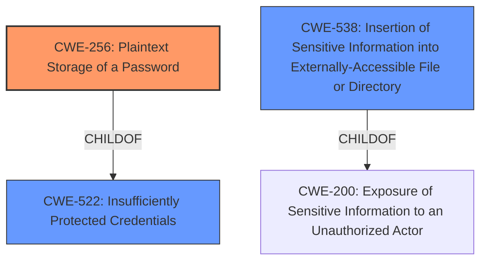

# Enhanced Analysis for CVE-2022-34808

# Summary
| CWE ID | CWE Name | Confidence | CWE Abstraction Level | CWE Vulnerability Mapping Label | CWE-Vulnerability Mapping Notes |
|---|---|---|---|---|---|
| **CWE-256** | Plaintext Storage of a Password | 1.0 | Base | Allowed | **Primary CWE** The vulnerability explicitly states that the bearer tokens are stored unencrypted (plaintext) in the global configuration file. |
| CWE-522 | Insufficiently Protected Credentials | 0.7 | Class | Allowed-with-Review | **Secondary Candidate** This CWE is a parent of CWE-256, representing a broader category of vulnerabilities involving insecure storage of credentials. While applicable, CWE-256 is more specific. |
| CWE-538 | Insertion of Sensitive Information into Externally-Accessible File or Directory | 0.6 | Base | Allowed | **Secondary Candidate** This CWE addresses the storage of sensitive data in accessible files. The vulnerability involves storing bearer tokens in a file accessible to users with access to the Jenkins controller file system. |

## Evidence and Confidence

*   **Confidence Score:** 1.0
*   **Evidence Strength:** HIGH

## Relationship Analysis
The primary relationship influencing the decision is the ChildOf relationship between CWE-256 (Plaintext Storage of a Password) and CWE-522 (Insufficiently Protected Credentials). CWE-256 is a specific type of CWE-522, where the credentials are not just insufficiently protected, but stored in plaintext. Thus, CWE-256 is the most specific and appropriate choice.



## Vulnerability Chain
The vulnerability chain is relatively simple:

1.  **Root Cause:** **Improper Storage of Sensitive Information** (CWE-256) - Bearer tokens are stored in plaintext in the global configuration file.
2.  **Impact:** Exposure of bearer tokens, potentially leading to unauthorized access to systems or resources protected by those tokens.

## Summary of Analysis
The primary CWE selected is CWE-256 (Plaintext Storage of a Password). This choice is based on the explicit statement in the vulnerability description that the bearer tokens are stored unencrypted in the global configuration file. This aligns directly with the definition of CWE-256.

The following evidence supports this decision:

*   **Vulnerability Description Key Phrases:** "**rootcause:** **improper storage of sensitive information**"
*   **CVE Reference Links Content Summary:** "The plugin stores bearer tokens in plain text within its global configuration file."

CWE-522 (Insufficiently Protected Credentials) was considered as a broader category. However, since the vulnerability specifies plaintext storage, CWE-256 is the more accurate and specific choice. CWE-538 (Insertion of Sensitive Information into Externally-Accessible File or Directory) was also considered as the sensitive information was being inserted into a file. Again, since the vulnerability specifies plaintext storage, CWE-256 is the more accurate and specific choice.

The retriever results also support this selection, with CWE-256 being the top-ranked CWE. The MITRE mapping guidance for CWE-256 allows its usage at the Base level of abstraction.


## CWE Relationship Analysis

Current CWEs represent these abstraction levels: .


### Vulnerability Chain Analysis

**Chain starting from CWE-522:**
- 522 (Insufficiently Protected Credentials) - ROOT


**Chain starting from CWE-200:**
- 200 (Exposure of Sensitive Information to an Unauthorized Actor) - ROOT


### CWE Relationship Diagram

```mermaid
graph TD
    classDef primary fill:#f96,stroke:#333,stroke-width:2px
    classDef secondary fill:#69f,stroke:#333
    classDef tertiary fill:#9e9,stroke:#333
```