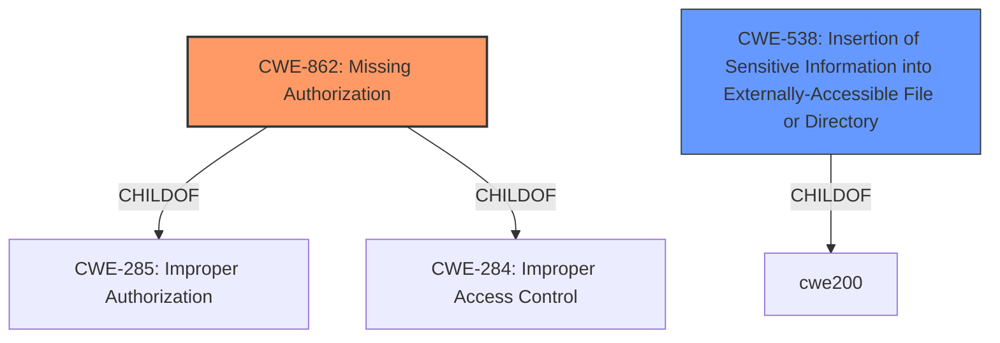

# Analysis Report for CVE-2022-34810

# Vulnerability Analysis Report: CVE-2022-34810

## Description


## Analysis (with Relationship Data)

# Summary

| CWE ID | CWE Name | Confidence | CWE Abstraction Level | CWE Vulnerability Mapping Label | CWE-Vulnerability Mapping Notes |
|---|---|---|---|---|---|
| CWE-862 | Missing Authorization | 1.0 | Class | Primary | Allowed-with-Review |
| CWE-538 | Insertion of Sensitive Information into Externally-Accessible File or Directory | 0.6 | Base | Secondary | Allowed |

## Evidence and Confidence

*   **Confidence Score:** 0.8
*   **Evidence Strength:** HIGH

## Relationship Analysis
The primary relationship that influenced the decision was the ChildOf relationship between CWE-862 **CWE-862: Missing Authorization** and its parents, CWE-285 and CWE-284, both related to improper authorization. However, the description clearly points to a **missing check**, making CWE-862 the more appropriate choice. CWE-538 **CWE-538: Insertion of Sensitive Information into Externally-Accessible File or Directory** was considered as a secondary weakness because the credentials IDs, which are sensitive, are exposed.



## Vulnerability Chain
The vulnerability chain begins with a **missing authorization check** (CWE-862), which allows attackers with Overall/Read permissions to enumerate credentials IDs, which leads to exposure of sensitive information (CWE-538).

## Summary of Analysis
The initial analysis focused on the **missing check** in the Jenkins RQM Plugin, which directly leads to the vulnerability. The CVE Reference Links Content Summary explicitly states the **root cause** as the "RQM Plugin does not perform a permission check in an HTTP endpoint" and identifies the weakness as "**Missing authorization**." This evidence strongly supports the selection of CWE-862 **CWE-862: Missing Authorization** as the primary CWE. The relationship graph reinforced the decision to choose the most specific applicable CWE, which in this case is CWE-862, over its more general parents. The selection of CWE-862 is at the optimal level of specificity because the vulnerability is directly caused by the absence of an authorization check.

CWE-538 **CWE-538: Insertion of Sensitive Information into Externally-Accessible File or Directory** was also considered, as the enumeration of credential IDs does result in sensitive information being exposed. The vulnerability description supports this since the "impact" is that attackers can "enumerate credentials IDs of credentials stored in Jenkins." This is sensitive information being exposed.

The retriever results suggested other CWEs such as CWE-256 **CWE-256: Plaintext Storage of a Password**, CWE-522 **CWE-522: Insufficiently Protected Credentials**, and CWE-863 **CWE-863: Incorrect Authorization**. However, these were deemed less relevant. CWE-256 and CWE-522 were not selected because the vulnerability doesn't involve storing passwords in plaintext or using insufficiently protected credentials directly. CWE-863 was not selected because the core issue is not an incorrect authorization check but the complete absence of one.

The selection is primarily based on the provided evidence, specifically the vulnerability description and the CVE Reference Links Content Summary, both of which highlight the **missing authorization check**.

Relevant CWE Information:

# Enhanced Context (25 CWEs)

## CWE-538: Insertion of Sensitive Information into Externally-Accessible File or Directory
**Abstraction Level**: Base
**Similarity Score**: 0.76
**Source**: dense

**Description**:
The product places sensitive information into files or directories that are accessible to actors who are allowed to have access to the files, but not to the sensitive information.

**Mapping Guidance**:
- Usage: Allowed
- Rationale: This CWE entry is at the Base level of abstraction, which is a preferred level of abstraction for mapping to the root causes of vulnerabilities.

## CWE-862: Missing Authorization
**Abstraction:** Class
**Status:** Incomplete

### Description
The product does not perform an authorization check when an actor attempts to access a resource or perform an action.

### Extended Description
Not provided

### Alternative Terms
AuthZ: "AuthZ" is typically used as an abbreviation of "authorization" within the web application security community. It is distinct from "AuthN" (or, sometimes, "AuthC") which is an abbreviation of "authentication." The use of "Auth" as an abbreviation is discouraged, since it could be used for either authentication or authorization.

### Relationships
ChildOf -> CWE-285
ChildOf -> CWE-284

### Mapping Guidance
**Usage:** Allowed-with-Review
**Rationale:** This CWE entry is a Class and might have Base-level children that would be more appropriate
**Comments:** Examine children of this entry to see if there is a better fit
**Reasons:**
- Abstraction
### Observed Examples
- **CVE-2022-24730:** Go-based continuous deployment product does not check that a user has certain privileges to update or create an app, allowing adversaries to read sensitive repository information
- **CVE-2009-3168:** Web application does not restrict access to admin scripts, allowing authenticated users to reset administrative passwords.
- **CVE-2009-3597:** Web application stores database file under the web root with insufficient access control (CWE-219), allowing direct request.


## CWE Relationship Analysis

Current CWEs represent these abstraction levels: .


### Vulnerability Chain Analysis

**Chain starting from CWE-862:**
- 862 (Missing Authorization) - ROOT


**Chain starting from CWE-285:**
- 285 (Improper Authorization) - ROOT


### CWE Relationship Diagram

```mermaid
graph TD
    classDef primary fill:#f96,stroke:#333,stroke-width:2px
    classDef secondary fill:#69f,stroke:#333
    classDef tertiary fill:#9e9,stroke:#333
```


*Report generated on 2025-03-31 05:18:48*
