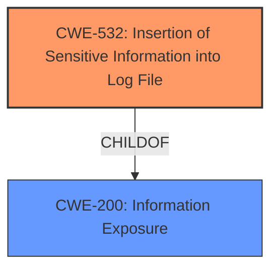

# Analysis Report for CVE-2022-34826

# Vulnerability Analysis Report: CVE-2022-34826

## Description


## Analysis (with Relationship Data)

# Summary
| CWE ID  | CWE Name                                           | Confidence | CWE Abstraction Level | CWE Vulnerability Mapping Label | CWE-Vulnerability Mapping Notes |
| :-------- | :------------------------------------------------- | :--------- | :---------------------- | :------------------------------ | :------------------------------ |
| CWE-532   | Insertion of Sensitive Information into Log File | 1          | Base                    | Primary                         | Allowed                       |

## Evidence and Confidence

*   **Confidence Score:** 1
*   **Evidence Strength:** HIGH

## Relationship Analysis
The primary relationship considered was ChildOf -> CWE-200 (Information Exposure), as logging sensitive information is a specific type of information exposure. Additionally, the retriever results and observed examples strongly supported CWE-532 as the best fit.



## Vulnerability Chain
The vulnerability chain is straightforward: the **incorrect** logging of the encrypted private key passphrase directly leads to the exposure of sensitive information.

## Summary of Analysis
The vulnerability is the **leakage** of an encrypted private key passphrase in the logs of Couchbase Server. The primary CWE identified is CWE-532 (Insertion of Sensitive Information into Log File).

The selection of CWE-532 is strongly supported by:
*   The **Vulnerability Description** states that "an encrypted Private Key passphrase may be **leaked** in the logs".
*   The **CVE Reference Links Content Summary** confirms this, stating the "**root_cause**" as "Encrypted private key passphrase may be **leaked** in the logs." and "**weaknesses**" as "Private key passphrase leakage". It further identifies the "**attack_vectors**" as "Log files."

CWE-532's description perfectly matches this: "The product writes sensitive information to a log file." The "Mapping Guidance" for CWE-532 indicates "Usage: Allowed" and provides a "Rationale" that "This CWE entry is at the Base level of abstraction, which is a preferred level of abstraction for mapping to the root causes of vulnerabilities." The observed examples for CWE-532 contain similar vulnerabilities related to logging credentials.

The other CWEs considered were not as good a fit:

*   CWE-325 (Missing Cryptographic Step): While cryptography is involved, the core issue isn't a missing step, but the **improper** logging of data.
*   CWE-522 (Insufficiently Protected Credentials): This is a broader category, and CWE-532 is more specific to the logging context.
*   CWE-201 (Insertion of Sensitive Information Into Sent Data): The data is being written to a log file, not sent as data.
*   CWE-321 (Use of Hard-coded Cryptographic Key): This doesn't apply as the issue isn't a hard-coded key, but a **leaked** key passphrase.
*   CWE-256 (Plaintext Storage of a Password): While the key is encrypted, the **leakage** of even the encrypted version is the problem.
*   CWE-226 (Sensitive Information in Resource Not Removed Before Reuse): This CWE applies when sensitive information is left in a resource after its release, which is not the case here.
*   CWE-312 (Cleartext Storage of Sensitive Information): The key is encrypted, so this CWE doesn't directly apply.
*   CWE-327 (Use of a Broken or Risky Cryptographic Algorithm): There's no indication of a broken algorithm.
*   CWE-209 (Generation of Error Message Containing Sensitive Information): The **leakage** is not necessarily via an error message.

Therefore, CWE-532 is the most accurate and specific representation of the vulnerability.

Relevant CWE Information:

# Enhanced Context (25 CWEs)
The following CWEs were identified as potentially relevant to this vulnerability:

## CWE-312: Cleartext Storage of Sensitive Information
**Abstraction Level**: Base
**Similarity Score**: 0.80
**Source**: dense

**Description**:
The product stores sensitive information in cleartext within a resource that might be accessible to another control sphere.

**Mapping Guidance**:
- Usage: Allowed
- Rationale: This CWE entry is at the Base level of abstraction, which is a preferred level of abstraction for mapping to the root causes of vulnerabilities.


## CWE-311: Missing Encryption of Sensitive Data
**Abstraction Level**: Class
**Similarity Score**: 0.77
**Source**: dense

**Description**:
The product does not encrypt sensitive or critical information before storage or transmission.

**Mapping Guidance**:
- Usage: Discouraged
- Rationale: CWE-311 is high-level with more precise children available. It is a level-1 Class (i.e., a child of a Pillar).


## CWE-226: Sensitive Information in Resource Not Removed Before Reuse
**Abstraction Level**: Base
**Similarity Score**: 0.77
**Source**: dense

**Description**:
The product releases a resource such as memory or a file so that it can be made available for reuse, but it does not clear or "zeroize" the information contained in the resource before the product performs a critical state transition or makes the resource available for reuse by other entities.

**Mapping Guidance**:
- Usage: Allowed
- Rationale: This CWE entry is at the Base level of abstraction, which is a preferred level of abstraction for mapping to the root causes of vulnerabilities.


## CWE-538: Insertion of Sensitive Information into Externally-Accessible File or Directory
**Abstraction Level**: Base
**Similarity Score**: 0.77
**Source**: dense

**Description**:
The product places sensitive information into files or directories that are accessible to actors who are allowed to have access to the files, but not to the sensitive information.

**Mapping Guidance**:
- Usage: Allowed
- Rationale: This CWE entry is at the Base level of abstraction, which is a preferred level of abstraction for mapping to the root causes of vulnerabilities.


## CWE-319: Cleartext Transmission of Sensitive Information
**Abstraction Level**: Base
**Similarity Score**: 0.76
**Source**: dense

**Description**:
The product transmits sensitive or security-critical data in cleartext in a communication channel that can be sniffed by unauthorized actors.

**Mapping Guidance**:
- Usage: Allowed
- Rationale: This CWE entry is at the Base level of abstraction, which is a preferred level of abstraction for mapping to the root causes of vulnerabilities.


## CWE-209: Generation of Error Message Containing Sensitive Information
**Abstraction Level**: Base
**Similarity Score**: 0.75
**Source**: dense

**Description**:
The product generates an error message that includes sensitive information about its environment, users, or associated data.

**Mapping Guidance**:
- Usage: Allowed
- Rationale: This CWE entry is at the Base level of abstraction, which is a preferred level of abstraction for mapping to the root causes of vulnerabilities.


## CWE-316: Cleartext Storage of Sensitive Information in Memory
**Abstraction Level**: Variant
**Similarity Score**: 0.75
**Source**: dense

**Description**:
The product stores sensitive information in cleartext in memory.

**Mapping Guidance**:
- Usage: Allowed
- Rationale: This CWE entry is at the Variant level of abstraction, which is a preferred level of abstraction for mapping to the root causes of vulnerabilities.


## CWE-922: Insecure Storage of Sensitive Information
**Abstraction Level**: Class
**Similarity Score**: 0.75
**Source**: dense

**Description**:
The product stores sensitive information without properly limiting read or write access by unauthorized actors.

**Mapping Guidance**:
- Usage: Allowed-with-Review
- Rationale: This CWE entry is a Class and might have Base-level children that would be more appropriate


## CWE-212: Improper Removal of Sensitive Information Before Storage or Transfer
**Abstraction Level**: Base
**Similarity Score**: 0.75
**Source**: dense

**Description**:
The product stores, transfers, or shares a resource that contains sensitive information, but it does not properly remove that information before the product makes the resource available to unauthorized actors.

**Mapping Guidance**:
- Usage: Allowed
- Rationale: This CWE entry is at the Base level of abstraction, which is a preferred level of abstraction for mapping to the root causes of vulnerabilities.


## CWE-1391: Use of Weak Credentials
**Abstraction Level**: Class
**Similarity Score**: 0.74
**Source**: dense

**Description**:
The product uses weak credentials (such as a default key or hard-coded password) that can be calculated, derived, reused, or guessed by an attacker.

**Mapping Guidance**:
- Usage: Allowed-with-Review
- Rationale: This CWE entry is a Class and might have Base-level children that would be


## CWE Relationship Analysis

Current CWEs represent these abstraction levels: .


### Vulnerability Chain Analysis

**Chain starting from CWE-201:**
- 201 (Insertion of Sensitive Information Into Sent Data) - ROOT


**Chain starting from CWE-200:**
- 200 (Exposure of Sensitive Information to an Unauthorized Actor) - ROOT


### CWE Relationship Diagram

```mermaid
graph TD
    classDef primary fill:#f96,stroke:#333,stroke-width:2px
    classDef secondary fill:#69f,stroke:#333
    classDef tertiary fill:#9e9,stroke:#333
```


*Report generated on 2025-03-31 05:11:07*
