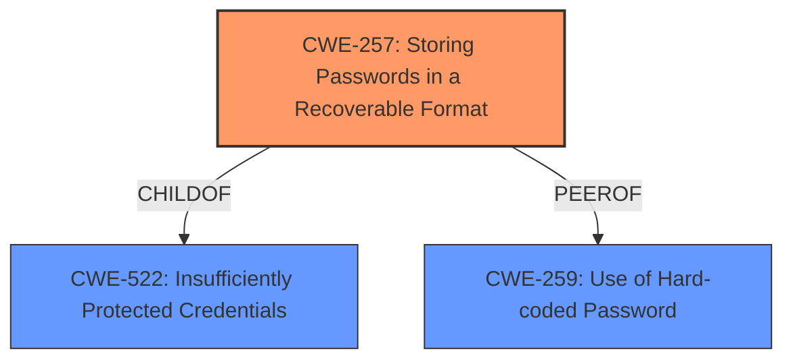

# Analysis for CVE-2022-34837

# Summary
| CWE ID | CWE Name | Confidence | CWE Abstraction Level | CWE Vulnerability Mapping Label | CWE-Vulnerability Mapping Notes |
|---|---|---|---|---|---|
| CWE-257 | Storing Passwords in a Recoverable Format | 1.0 | Base | Allowed | Primary CWE |

## Evidence and Confidence

*   **Confidence Score:** 1.0
*   **Evidence Strength:** HIGH

## Relationship Analysis
The primary relationship influencing the decision is the ChildOf relationship between CWE-257 and CWE-522 (Insufficiently Protected Credentials). CWE-257 is more specific, representing the base cause, whereas CWE-522 is a broader class. Additionally, CWE-257 has a PeerOf relationship with CWE-259 (Use of Hard-coded Password), indicating a related but distinct weakness. The Base abstraction level of CWE-257 is preferred for mapping to root causes.

## Vulnerability Chain
The vulnerability chain starts with the **root cause** of storing passwords in a recoverable format (CWE-257). The **impact** is that an attacker can add more network clients to monitor activities, leading to potential unauthorized access and information disclosure.

## Summary of Analysis
The analysis is based on the provided vulnerability description, which explicitly states "**storing passwords in recoverable format**". This aligns directly with the definition of CWE-257: Storing Passwords in a Recoverable Format. The vulnerability allows an attacker to add network clients to monitor activities, indicating a security compromise due to the insecure storage of passwords.

The retriever results also list CWE-257 as the top candidate with a score of 0.506. The mapping guidance for CWE-257 specifies that it is at the Base level of abstraction, which is preferred, and its usage is "Allowed".

CWE-321 (Use of Hard-coded Cryptographic Key), CWE-23 (Relative Path Traversal), CWE-312 (Cleartext Storage of Sensitive Information), and CWE-916 (Use of Password Hash With Insufficient Computational Effort) were considered but not selected. CWE-321 is related to cryptographic keys, which is not mentioned in the description. CWE-23 is about path traversal, which is irrelevant. CWE-312 refers to storing sensitive information in cleartext, while the description specifies "recoverable format," implying some form of encoding or encryption is present, making CWE-257 a more accurate fit. CWE-916 is about insufficient computational effort in password hashing, which is not the primary issue. The description focuses on the recoverability of the password, not the strength of the hash.
CWE-256 (Plaintext Storage of a Password) was considered. While similar to CWE-257, "recoverable format" suggests a method other than plaintext, making CWE-257 the more precise classification.
CWE-259 (Use of Hard-coded Password) was also considered, but the description focuses on stored passwords, not hard-coded ones.
CWE-522 (Insufficiently Protected Credentials) is a class-level CWE and is less specific than CWE-257, making CWE-257 the better choice.

Therefore, CWE-257 is the most appropriate because it directly addresses the **root cause** described in the vulnerability: storing passwords in a recoverable format, which allows unauthorized access. This is at the optimal level of specificity (Base) and is supported by the provided evidence.