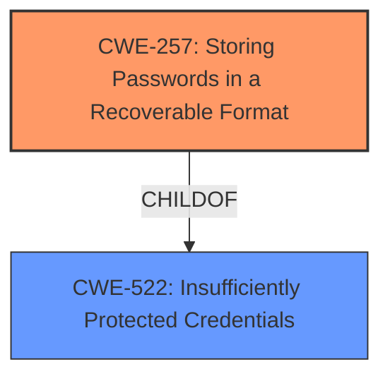

# Enhanced Analysis for CVE-2022-34838

# Summary
| CWE ID | CWE Name | Confidence | CWE Abstraction Level | CWE Vulnerability Mapping Label | CWE-Vulnerability Mapping Notes |
|---|---|---|---|---|---|
| CWE-257 | Storing Passwords in a Recoverable Format | 1.0 | Base | Allowed | Primary CWE |

## Evidence and Confidence

*   **Confidence Score:** 1.0
*   **Evidence Strength:** HIGH

## Relationship Analysis
The primary relationship considered was the parent-child relationship where CWE-257 (Storing Passwords in a Recoverable Format) is a child of CWE-522 (Insufficiently Protected Credentials). This indicates that the vulnerability is a specific case of storing credentials in an insecure manner.



## Vulnerability Chain
The vulnerability chain consists of:
1.  **Root Cause:** **Storing passwords in a recoverable format** (CWE-257)
2.  **Impact:** An attacker may add or alter data points and corresponding attributes, leading to altered data visualization for the end user.

## Summary of Analysis
The analysis is based on the provided evidence and the relationships between CWEs. The vulnerability description explicitly states that the **root cause** is "**storing passwords in recoverable format**". This maps directly to CWE-257 (Storing Passwords in a Recoverable Format). The retriever results also strongly suggest CWE-257 as the most relevant CWE.

The evidence is "**rootcause:** **storing passwords in recoverable format**" from the "Vulnerability Description Key Phrases" section.

The relationship analysis supports selecting CWE-257 as a specific base-level weakness, rather than a more general class.

The selected CWE, CWE-257, is at the optimal level of specificity as it directly addresses the **root cause** identified in the vulnerability description.

Relevant CWE Information:

# Enhanced Context (25 CWEs)

## CWE-257: Storing Passwords in a Recoverable Format
**Abstraction:** Base
**Similarity Score**: 0.82
**Source**: dense

**Description**:
The storage of passwords in a recoverable format makes them subject to password reuse attacks by malicious users. In fact, it should be noted that recoverable encrypted passwords provide no significant benefit over plaintext passwords since they are subject not only to reuse by malicious attackers but also by malicious insiders. If a system administrator can recover a password directly, or use a brute force search on the available information, the administrator can use the password on other accounts.

**Mapping Guidance**:
- Usage: Allowed
- Rationale: This CWE entry is at the Base level of abstraction, which is a preferred level of abstraction for mapping to the root causes of vulnerabilities.

## CWE-321: Use of Hard-coded Cryptographic Key
CWE-321 was considered because it appeared in the retriever results, but it was not selected because the vulnerability description focuses on passwords, not cryptographic keys.

## CWE-256: Plaintext Storage of a Password
CWE-256 was considered because it appeared in the retriever results, but it was not selected because the vulnerability description focuses on passwords that are recoverable, implying some form of encryption (however weak) is in use.

## CWE-916: Use of Password Hash With Insufficient Computational Effort
CWE-916 was considered because it appeared in the retriever results, but it was not selected because there is no specific evidence that a hash is used, or that the computational effort is insufficient. The vulnerability description is about passwords being recoverable, not about the strength of the hashing algorithm.

## CWE-23: Relative Path Traversal
CWE-23 was not considered because the vulnerability description does not involve path manipulation or file access.

## CWE-620: Unverified Password Change
CWE-620 was considered because it appeared in the retriever results, but it was not selected because the vulnerability description does not describe changing a password without verification.

## CWE-640: Weak Password Recovery Mechanism for Forgotten Password
CWE-640 was considered because it appeared in the retriever results, but it was not selected because the vulnerability description is not specific to password recovery mechanisms.

## CWE-522: Insufficiently Protected Credentials
CWE-522 was considered as a potential parent CWE, but the description focuses on a specific type of credential storage and the use of CWE-522 would not be specific enough.

## CWE-328: Use of Weak Hash
CWE-328 was considered because it appeared in the retriever results, but it was not selected because there is no specific evidence that a weak hash is used.

## CWE-798: Use of Hard-coded Credentials
CWE-798 was considered because it appeared in the retriever results, but it was not selected because there is no specific evidence that credentials were hard-coded. The vulnerability description is about passwords being recoverable.


## CWE Relationship Analysis

Current CWEs represent these abstraction levels: .


### Vulnerability Chain Analysis

**Chain starting from CWE-916:**
- 916 (Use of Password Hash With Insufficient Computational Effort) - ROOT


**Chain starting from CWE-640:**
- 640 (Weak Password Recovery Mechanism for Forgotten Password) - ROOT


### CWE Relationship Diagram

```mermaid
graph TD
    classDef primary fill:#f96,stroke:#333,stroke-width:2px
    classDef secondary fill:#69f,stroke:#333
    classDef tertiary fill:#9e9,stroke:#333
```