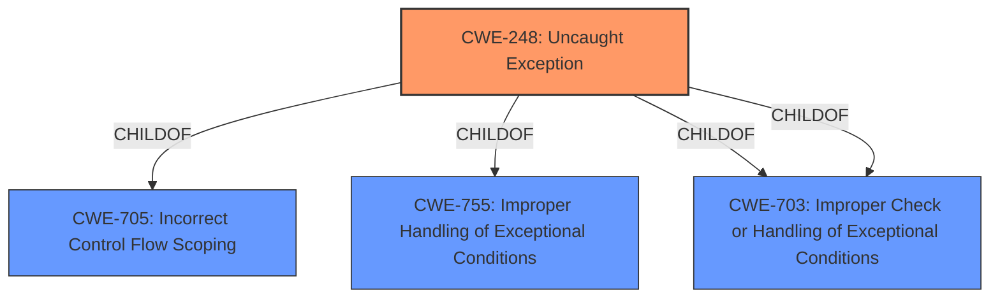

# Enhanced Analysis for CVE-2022-34849

# Summary
| CWE ID | CWE Name | Confidence | CWE Abstraction Level | CWE Vulnerability Mapping Label | CWE-Vulnerability Mapping Notes |
|---|---|---|---|---|---|
| CWE-248 | Uncaught Exception | 1.0 | Base | Allowed | Primary CWE |

## Evidence and Confidence

*   **Confidence Score:** 1.0
*   **Evidence Strength:** HIGH

## Relationship Analysis
The primary relationship that impacted my decision was the direct mapping of the **"uncaught exception"** to CWE-248. The other CWEs were considered but deemed less relevant as they represent broader categories or were related to access control or memory management, which are not the primary issues in this case.



## Vulnerability Chain
The vulnerability chain starts with the **root cause**, the **"uncaught exception"**, which directly leads to a denial-of-service **impact**.

## Summary of Analysis
My assessment is based on direct evidence from the vulnerability description and CVE reference summary, specifically the phrase "**Uncaught exception**" which clearly maps to CWE-248. The retriever results also strongly support this mapping.

The graph relationships confirm that CWE-248 is a child of broader exception handling and control flow CWEs, but it is the most specific and accurate representation of the vulnerability.

My decision is justified by the direct match between the vulnerability's root cause and the CWE description. The selected CWE is at the optimal level of specificity because it directly addresses the **"uncaught exception"**, rather than broader categories like "Improper Error Handling" or "Insufficient Control Flow Management".

Relevant CWE Information:

# Enhanced Context (25 CWEs)

## CWE-248: Uncaught Exception
**Abstraction:** Base
**Status:** Draft

### Description
An exception is thrown from a function, but it is not caught.

### Extended Description
When an exception is not caught, it may cause the program to crash or expose sensitive information.

### Alternative Terms
None

### Relationships
ChildOf -> CWE-705
ChildOf -> CWE-755
ChildOf -> CWE-703
ChildOf -> CWE-703

### Mapping Guidance
**Usage:** Allowed
**Rationale:** This CWE entry is at the Base level of abstraction, which is a preferred level of abstraction for mapping to the root causes of vulnerabilities.
**Comments:** Carefully read both the name and description to ensure that this mapping is an appropriate fit. Do not try to 'force' a mapping to a lower-level Base/Variant simply to comply with this preferred level of abstraction.
**Reasons:**
- Acceptable-Use

### Observed Examples
- **CVE-2023-41151:** SDK for OPC Unified Architecture (OPC UA) server has uncaught exception when a socket is blocked for writing but the server tries to send an error
- **CVE-2023-21087:** Java code in a smartphone OS can encounter a "boot loop" due to an uncaught exception

**Analysis:** The vulnerability description explicitly states "**Uncaught exception**," which aligns perfectly with the description of CWE-248. The impact, denial of service, is a potential consequence of an uncaught exception. Therefore, CWE-248 is the most appropriate mapping.

### Other CWEs Considered but Not Used

*   **CWE-691 Insufficient Control Flow Management:** This is a high-level category and less specific than CWE-248. While an uncaught exception could be seen as a control flow issue, CWE-248 directly addresses the root cause.
*   **CWE-782 Exposed IOCTL with Insufficient Access Control and CWE-781 Improper Address Validation in IOCTL with METHOD_NEITHER I/O Control Code:** These CWEs are specific to IOCTLs, which are not explicitly mentioned or implied in the vulnerability description. The vulnerability description indicates a general software flaw related to exception handling within the driver, not specifically related to IOCTLs.
*   **CWE-119 Improper Restriction of Operations within the Bounds of a Memory Buffer:** This CWE is related to memory management issues, which are not directly indicated in the vulnerability description. The issue is with exception handling, not memory corruption.
*   **CWE-277 Insecure Inherited Permissions:** This CWE is related to file permission issues, which are not indicated in the vulnerability description.


## CWE Relationship Analysis

Current CWEs represent these abstraction levels: .


### Vulnerability Chain Analysis

**Chain starting from CWE-277:**
- 277 (Insecure Inherited Permissions) - ROOT


**Chain starting from CWE-755:**
- 755 (Improper Handling of Exceptional Conditions) - ROOT


### CWE Relationship Diagram

```mermaid
graph TD
    classDef primary fill:#f96,stroke:#333,stroke-width:2px
    classDef secondary fill:#69f,stroke:#333
    classDef tertiary fill:#9e9,stroke:#333
```