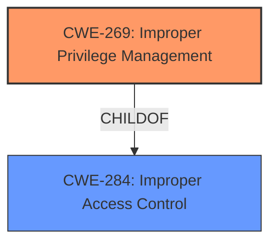

# Analysis for CVE-2022-34854

# Summary
| CWE ID  | CWE Name                       | Confidence | CWE Abstraction Level | CWE Vulnerability Mapping Label | CWE-Vulnerability Mapping Notes |
| :-------- | :----------------------------- | :--------- | :-------------------- | :------------------------------ | :------------------------------ |
| CWE-269 | Improper Privilege Management | 0.75     | Class                 | Allowed                  | Primary CWE                      |

## Evidence and Confidence

*   **Confidence Score:** 0.75
*   **Evidence Strength:** HIGH

## Relationship Analysis
The primary relationship considered was the child-of relationship, as CWE-269 is a child of CWE-284. However, CWE-284 is a Pillar level CWE and too high-level. The retriever also identified CWE-269. This suggests that a privilege management issue is at the core of the vulnerability. The abstraction levels influenced the decision by guiding toward more specific classifications when available and appropriate.

## Vulnerability Chain
The chain starts with **Improper access control**, leading to an escalation of privilege.

## Summary of Analysis
The initial analysis focused on the description's emphasis on "**improper access control**" as the root cause. This led to considering CWE-284 and its children. The retriever results also identified CWE-269.

The final decision to select CWE-269 is based on the following:

*   The vulnerability description explicitly states "**Improper access control**."
*   The CVE Reference Links Content Summary confirms the root cause as "**Improper access control**" leading to "Escalation of privilege."
*   CWE-269 is a child of CWE-284, providing more specific detail related to privilege management, and is rated as **Allowed-with-Review**.

The selection of CWE-269 is at an optimal level of specificity because it directly reflects the **root cause** as **improper access control** leading to privilege escalation.

Relevant CWE Information:

# Enhanced Context (25 CWEs)
The following CWEs were identified as potentially relevant to this vulnerability:

## CWE-691: Insufficient Control Flow Management
**Abstraction Level**: Pillar
**Similarity Score**: 0.75
**Source**: dense

**Description**:
The code does not sufficiently manage its control flow during execution, creating conditions in which the control flow can be modified in unexpected ways.
**Not Used:** This is a very general pillar-level CWE, and does not fit the specific **improper access control** issue.

## CWE-284: Improper Access Control
**Abstraction Level**: Pillar
**Similarity Score**: 0.220
**Source**: sparse

**Description**:
The product does not restrict or incorrectly restricts access to a resource from an unauthorized actor.
**Not Used:** While "**improper access control**" is in the description, this CWE is too high-level (Pillar).

## CWE-277: Insecure Inherited Permissions
**Abstraction Level**: Variant
**Similarity Score**: 0.216
**Source**: sparse

**Description**:
A product defines a set of insecure permissions that are inherited by objects that are created by the program.
**Not Used:** There is no mention of insecurely defined or inherited permissions, so this is not applicable.

## CWE-693: Protection Mechanism Failure
**Abstraction Level**: Pillar
**Similarity Score**: 0.201
**Source**: sparse

**Description**:
The product does not use or incorrectly uses a protection mechanism that provides sufficient defense against directed attacks against the product.
**Not Used:** Too high level, doesn't fit the specifics of the vulnerability.

## CWE-287: Improper Authentication
**Abstraction Level**: Class
**Similarity Score**: 0.201
**Source**: sparse

**Description**:
When an actor claims to have a given identity, the product does not prove or insufficiently proves that the claim is correct.
**Not Used:** The vulnerability is about access control, not authentication.

## CWE-269: Improper Privilege Management
**Abstraction Level**: Class
**Similarity Score**: 0.602
**Source**: dense

**Description**:
The product does not properly assign, modify, track, or check privileges for an actor, creating an unintended sphere of control for that actor.
**Used:** This aligns with the **root cause** of **improper access control** leading to an escalation of privilege.

## CWE-613: Insufficient Session Expiration
**Abstraction Level**: Base
**Similarity Score**: 0.002
**Source**: graph

**Description**:
According to WASC, "Insufficient Session Expiration is when a web site permits an attacker to reuse old session credentials or session IDs for authorization."
**Not Used:** Session expiration is not mentioned in the description.

## CWE-119: Improper Restriction of Operations within the Bounds of a Memory Buffer
**Abstraction Level**: Class
**Similarity Score**: 0.195
**Source**: sparse

**Description**:
The product performs operations on a memory buffer, but it reads from or writes to a memory location outside the buffer's intended boundary.
**Not Used:** This is unrelated to the **improper access control** issue.

## CWE-453: Insecure Default Variable Initialization
**Abstraction Level**: Variant
**Similarity Score**: 0.191
**Source**: sparse

**Description**:
The product, by default, initializes an internal variable with an insecure or less secure value than is possible.
**Not Used:** This is not relevant to the **improper access control** issue.

## CWE-248: Uncaught Exception
**Abstraction Level**: Base
**Similarity Score**: 0.190
**Source**: sparse

**Description**:
An exception is thrown from a function, but it is not caught.
**Not Used:** Uncaught exceptions are not mentioned in the description.