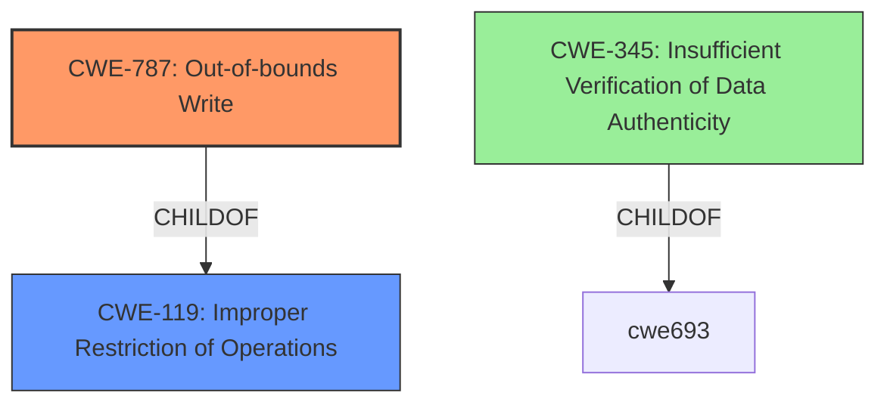

# Raw Analyzer Response for CVE-2022-34866

# Summary
| CWE ID | CWE Name | Confidence | CWE Abstraction Level | CWE Vulnerability Mapping Label | CWE-Vulnerability Mapping Notes |
|---|---|---|---|---|---|
| CWE-787 | Out-of-bounds Write | 0.7 | Base | Allowed | Primary CWE |
| CWE-119 | Improper Restriction of Operations within the Bounds of a Memory Buffer | 0.6 | Class | Discouraged | Secondary Candidate |
| CWE-345 | Insufficient Verification of Data Authenticity | 0.5 | Class | Discouraged | Secondary Candidate |

## Evidence and Confidence

*   **Confidence Score:** 0.7
*   **Evidence Strength:** MEDIUM

## Relationship Analysis
The primary relationship that impacted the decision was the parent-child relationship between CWE-119 and CWE-787. CWE-787 is a more specific instance of CWE-119, and given the potential for OS command injection, out-of-bounds write is a plausible root cause. CWE-345 was considered due to the phrase "**insufficient data verification**," but it's a class-level CWE and less descriptive of the actual flaw.

## Vulnerability Chain
The vulnerability chain starts with **insufficient data verification** leading to a potential out-of-bounds write, ultimately resulting in the ability to execute arbitrary OS commands with LocalSystem privileges.

## Summary of Analysis
The initial analysis focused on identifying the root cause of the vulnerability based on the provided description and CVE reference links. The key phrase "**insufficient data verification**" pointed towards a data handling issue. However, the ability to execute arbitrary OS commands suggests a more specific weakness. The CVE Reference Links Content Summary mentions "Improper input validation of data used in interprocess communication" and "OS Command Injection."

The Retriever Results suggested CWE-427 (Uncontrolled Search Path Element), CWE-119 (Improper Restriction of Operations within the Bounds of a Memory Buffer), and CWE-345 (Insufficient Verification of Data Authenticity).

CWE-427 was deemed less relevant as the vulnerability description focuses on data verification during interprocess communication, not on search path manipulation.

CWE-119 is a strong candidate, but it is a Class-level CWE. Given that the impact is arbitrary OS command execution, a more specific cause is likely to be present.

CWE-345 is also relevant but at the Class level of abstraction.

Considering the potential for "OS Command Injection," an out-of-bounds write (CWE-787) could allow overwriting critical system data, leading to command execution. Therefore, CWE-787 is selected as the primary CWE.

The selection is based on the evidence: "insufficient data verification during interprocess communication" and "the vulnerability is an OS command injection vulnerability." While the evidence isn't explicit about out-of-bounds write, it is a plausible root cause that aligns with the observed impact.

Relevant CWE Information:

# Enhanced Context (25 CWEs)
The following CWEs were identified as potentially relevant to this vulnerability:

## CWE-345: Insufficient Verification of Data Authenticity
**Abstraction Level**: Class
**Similarity Score**: 0.77
**Source**: dense

**Description**:
The product does not sufficiently verify the origin or authenticity of data, in a way that causes it to accept invalid data.

**Mapping Guidance**:
- Usage: Discouraged
- Rationale: This CWE entry is a level-1 Class (i.e., a child of a Pillar). It might have lower-level children that would be more appropriate

## CWE-787: Out-of-bounds Write
**Abstraction Level**: base
**Similarity Score**: 4.33
**Source**: graph

**Description**:
CWE-787: Out-of-bounds Write

**Mapping Guidance**:
- Usage: Allowed
- Rationale: This CWE entry is at the Base level of abstraction, which is a preferred level of abstraction for mapping to the root causes of vulnerabilities.

## CWE-119: Improper Restriction of Operations within the Bounds of a Memory Buffer
**Abstraction Level**: Class
**Similarity Score**: 6649.94
**Source**: sparse

**Description**:
The product performs operations on a memory buffer, but it reads from or writes to a memory location outside the buffer's intended boundary. This may result in read or write operations on unexpected memory locations that could be linked to other variables, data structures, or internal program data.

**Mapping Guidance**:
- Usage: Discouraged
- Rationale: CWE-119 is commonly misused in low-information vulnerability reports when lower-level CWEs could be used instead, or when more details about the vulnerability are available.