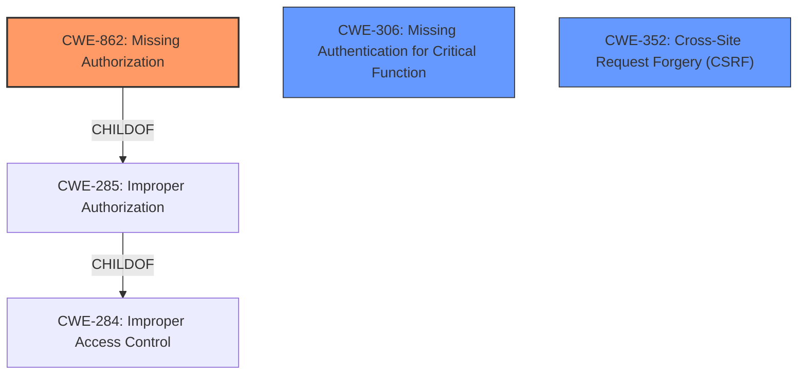

# Analysis Report for CVE-2022-34868

# Vulnerability Analysis Report: CVE-2022-34868

## Description


## Analysis (with Relationship Data)

# Summary
| CWE ID | CWE Name | Confidence | CWE Abstraction Level | CWE Vulnerability Mapping Label | CWE-Vulnerability Mapping Notes |
|---|---|---|---|---|---|
| CWE-862 | Missing Authorization | 1.0 | Class | Primary | Allowed-with-Review |
| CWE-306 | Missing Authentication for Critical Function | 0.7 | Base | Secondary | Allowed |
| CWE-352 | Cross-Site Request Forgery (CSRF) | 0.6 | Compound | Secondary | Allowed |

## Evidence and Confidence

*   **Confidence Score:** 0.8
*   **Evidence Strength:** HIGH

## Relationship Analysis
The primary relationship impacting the CWE selection is the hierarchical relationship where CWE-862 (Missing Authorization) is a child of CWE-285 (Improper Authorization) and CWE-284 (Improper Access Control). While CWE-284 and CWE-285 are broader, CWE-862 specifically addresses the **missing** authorization, aligning with the **root cause** described in the vulnerability. CWE-306 is included because **missing** authentication is also mentioned as a potential factor. Finally, CWE-352 is considered because of the **missing nonce token check**, suggesting a lack of CSRF protection.



## Vulnerability Chain
The vulnerability chain starts with the **missing authorization** check in a function within the YooMoney ?Kassa ??? WooCommerce plugin. This allows an unprivileged user to perform actions that should require higher privileges, leading to an **Authenticated Arbitrary Settings Update**. This could further lead to modification of plugin settings, accessing sensitive information, performing unauthorized actions, or even taking over the website.

## Summary of Analysis
The initial assessment focused on identifying the **root cause** of the vulnerability, which is the **missing authorization** check. The evidence from the "CVE Reference Links Content Summary" section explicitly mentions this: "The vulnerability stems from a broken access control issue, specifically a **missing authorization**, authentication, or nonce token check in a function within the plugin. This allows an unprivileged user to execute actions that should require higher privileges."

The retriever results also point towards authorization-related CWEs, with CWE-862 (Missing Authorization) being a strong candidate. However, given the additional context of **missing** authentication and **missing** nonce token check (CSRF protection), CWE-306 (Missing Authentication for Critical Function) and CWE-352 (Cross-Site Request Forgery (CSRF)) were considered as secondary CWEs.

The final selection emphasizes CWE-862 as the primary CWE due to the explicit mention of **missing authorization**. This is further supported by the description which states: "The product does not perform an authorization check when an actor attempts to access a resource or perform an action." The other CWEs are secondary because the evidence supports their involvement, but they are not as directly stated as the authorization issue. The selected CWEs are at the optimal level of specificity, focusing on the **missing** security checks rather than broader access control issues.

Relevant CWE Information:

# Enhanced Context (25 CWEs)

## CWE-472: External Control of Assumed-Immutable Web Parameter
**Abstraction Level**: Base
**Similarity Score**: 0.76
**Source**: dense

**Description**:
The web application does not sufficiently verify inputs that are assumed to be immutable but are actually externally controllable, such as hidden form fields.

**Mapping Guidance**:
- Usage: Allowed
- Rationale: This CWE entry is at the Base level of abstraction, which is a preferred level of abstraction for mapping to the root causes of vulnerabilities.

*Rationale for not using this CWE:*
This CWE is about the lack of verification of assumed immutable web parameters, which doesn't fit the **missing authorization** described in this vulnerability.

## CWE-639: Authorization Bypass Through User-Controlled Key
**Abstraction Level**: Base
**Similarity Score**: 0.76
**Source**: dense

**Description**:
The system's authorization functionality does not prevent one user from gaining access to another user's data or record by modifying the key value identifying the data.

**Mapping Guidance**:
- Usage: Allowed
- Rationale: This CWE entry is at the Base level of abstraction, which is a preferred level of abstraction for mapping to the root causes of vulnerabilities.

*Rationale for not using this CWE:*
This CWE is about authorization bypass through user controlled keys which doesn't match the **missing authorization** described in the vulnerability.

## CWE-807: Reliance on Untrusted Inputs in a Security Decision
**Abstraction Level**: Base
**Similarity Score**: 0.76
**Source**: dense

**Description**:
The product uses a protection mechanism that relies on the existence or values of an input, but the input can be modified by an untrusted actor in a way that bypasses the protection mechanism.

**Mapping Guidance**:
- Usage: Allowed
- Rationale: This CWE entry is at the Base level of abstraction, which is a preferred level of abstraction for mapping to the root causes of vulnerabilities.

*Rationale for not using this CWE:*
This CWE is about relying on untrusted inputs in a security decision, while the described vulnerability is primarily about **missing** authorization checks.

## CWE-1289: Improper Validation of Unsafe Equivalence in Input
**Abstraction Level**: Base
**Similarity Score**: 0.75
**Source**: dense

**Description**:
The product receives an input value that is used as a resource identifier or other type of reference, but it does not validate or incorrectly validates that the input is equivalent to a potentially-unsafe value.

**Mapping Guidance**:
- Usage: Allowed
- Rationale: This CWE entry is at the Base level of abstraction, which is a preferred level of abstraction for mapping to the root causes of vulnerabilities.

*Rationale for not using this CWE:*
This CWE is about improper validation of unsafe equivalence in input, which is not as directly related to the **missing authorization** as CWE-862.

## CWE-425: Direct Request ('Forced Browsing')
**Abstraction Level**: Base
**Similarity Score**: 0.75
**Source**: dense

**Description**:
The web application does not adequately enforce appropriate authorization on all restricted URLs, scripts, or files.

**Mapping Guidance**:
- Usage: Allowed
- Rationale: This CWE entry is at the Base level of abstraction, which is a preferred level of abstraction for mapping to the root causes of vulnerabilities.

*Rationale for not using this CWE:*
CWE-425 is about not enforcing authorization on restricted URLs, which is similar to CWE-862, but CWE-862 is broader and more directly applicable to the **missing authorization** described.

## CWE-184: Incomplete List of Disallowed Inputs
**Abstraction Level**: Base
**Similarity Score**: 0.75
**Source**: dense

**Description**:
The product implements a protection mechanism that relies on a list of inputs (or properties of inputs) that are not allowed by policy or otherwise require other action to neutralize before additional processing takes place, but the list is incomplete.

**Mapping Guidance**:
- Usage: Allowed
- Rationale: This CWE entry is at the Base level of abstraction, which is a preferred level of abstraction for mapping to the root causes of vulnerabilities.

*Rationale for not using this CWE:*
This CWE is about incomplete lists of disallowed inputs, which doesn't align with the **missing authorization** issue.

## CWE-1220: Insufficient Granularity of Access Control
**Abstraction Level**: Base
**Similarity Score**: 0.75
**Source**: dense

**Description**:
The product implements access controls via a policy or other feature with the intention to disable or restrict accesses (reads and/or writes) to assets in a system from untrusted agents. However, implemented access controls lack required granularity, which renders the control policy too broad because it allows accesses from unauthorized agents to the security-sensitive assets.

**Mapping Guidance**:
- Usage: Allowed
- Rationale: This CWE entry is at the Base level of abstraction, which is a preferred level of abstraction for mapping to the root causes of vulnerabilities.

*Rationale for not using this CWE:*
This CWE is about insufficient granularity of access control, while the vulnerability is about the **missing authorization** completely.

## CWE-274: Improper Handling of Insufficient Privileges
**Abstraction Level**: Base
**Similarity Score**: 0.75
**Source**: dense

**Description**:
The product does not handle or incorrectly handles


## CWE Relationship Analysis

Current CWEs represent these abstraction levels: .


### Vulnerability Chain Analysis

**Chain starting from CWE-862:**
- 862 (Missing Authorization) - ROOT


**Chain starting from CWE-425:**
- 425 (Direct Request ('Forced Browsing')) - ROOT


### CWE Relationship Diagram

```mermaid
graph TD
    classDef primary fill:#f96,stroke:#333,stroke-width:2px
    classDef secondary fill:#69f,stroke:#333
    classDef tertiary fill:#9e9,stroke:#333
```


*Report generated on 2025-03-31 02:12:45*
