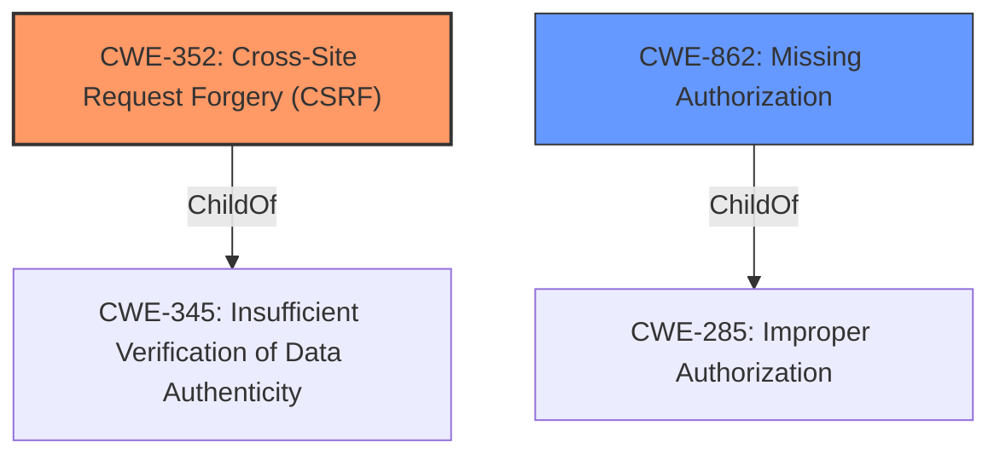

# Analysis Report for CVE-2022-3489

# Vulnerability Analysis Report: CVE-2022-3489

## Description


## Analysis (with Relationship Data)

# Summary
| CWE ID | CWE Name | Confidence | CWE Abstraction Level | CWE Vulnerability Mapping Label | CWE-Vulnerability Mapping Notes |
|---|---|---|---|---|---|
| CWE-352 | Cross-Site Request Forgery (CSRF) | 0.9 | Compound | Allowed | Primary CWE |
| CWE-862 | Missing Authorization | 0.9 | Class | Allowed-with-Review | Secondary Candidate |

## Evidence and Confidence

*   **Confidence Score:** 0.9
*   **Evidence Strength:** HIGH

## Relationship Analysis
The primary weakness is classified as CWE-352, which is a compound weakness requiring multiple conditions to be met. A key requirement for CWE-352 is **missing** CSRF protection, which aligns directly with the vulnerability description stating "**missing authorisation and CSRF checks**". Additionally, CWE-352 has a ChildOf relationship with CWE-345: Insufficient Verification of Data Authenticity. CWE-862 is a Class-level weakness representing **missing** authorization, which is a direct component of this vulnerability. While CWE-862 is valid, CWE-352 more accurately represents the compound nature of the vulnerability.



## Vulnerability Chain
The vulnerability chain starts with the **missing authorization and CSRF checks**. This leads to the impact of allowing unauthenticated attackers to update the `custom_wpadmin_slug` settings via a crafted request.
- **Root Cause:** Missing Authorization and CSRF Checks
- **Weakness:** Unauthenticated Access to Sensitive Settings
- **Impact:** Updating `custom_wpadmin_slug` Settings

## Summary of Analysis
The initial analysis correctly identifies the **missing authorization and CSRF checks** as the root cause. The decision to map CWE-352 as the primary weakness is strongly supported by the evidence. The "Vulnerability Description Key Phrases" highlights "**missing authorisation and CSRF checks**," and the "CVE Reference Links Content Summary" further confirms that "The plugin lacks authorization and CSRF checks when updating the `custom_wpadmin_slug` setting." These pieces of evidence combined provide a strong foundation for selecting CWE-352. The graph relationships highlight the hierarchical structure, showing that CWE-352 is a more specific representation of the vulnerability compared to its parent classes. This ensures the chosen CWE is at the optimal level of specificity.

Relevant CWE Information:

# Enhanced Context (25 CWEs)
The following CWEs were identified as potentially relevant to this vulnerability:

## CWE-472: External Control of Assumed-Immutable Web Parameter
**Abstraction Level**: Base
**Similarity Score**: 0.79
**Source**: dense

**Description**:
The web application does not sufficiently verify inputs that are assumed to be immutable but are actually externally controllable, such as hidden form fields.

**Mapping Guidance**:
- Usage: Allowed
- Rationale: This CWE entry is at the Base level of abstraction, which is a preferred level of abstraction for mapping to the root causes of vulnerabilities.

CWE-472 was considered because the `custom_wpadmin_slug` setting might be treated as an assumed-immutable parameter. However, the primary issue is the **missing authorization and CSRF checks** which allow the parameter to be modified in the first place. Thus, CWE-472 is not as directly relevant as CWE-352 or CWE-862.

## CWE-807: Reliance on Untrusted Inputs in a Security Decision
**Abstraction Level**: Base
**Similarity Score**: 0.78
**Source**: dense

**Description**:
The product uses a protection mechanism that relies on the existence or values of an input, but the input can be modified by an untrusted actor in a way that bypasses the protection mechanism.

**Mapping Guidance**:
- Usage: Allowed
- Rationale: This CWE entry is at the Base level of abstraction, which is a preferred level of abstraction for mapping to the root causes of vulnerabilities.

CWE-807 was considered because the application relies on the input for the `custom_wpadmin_slug` setting without proper validation. However, the **missing authorization and CSRF checks** are the more direct cause of the vulnerability.

## CWE-639: Authorization Bypass Through User-Controlled Key
**Abstraction Level**: Base
**Similarity Score**: 0.77
**Source**: dense

**Description**:
The system's authorization functionality does not prevent one user from gaining access to another user's data or record by modifying the key value identifying the data.

**Mapping Guidance**:
- Usage: Allowed
- Rationale: This CWE entry is at the Base level of abstraction, which is a preferred level of abstraction for mapping to the root causes of vulnerabilities.

CWE-639 was considered, but it is more applicable when a user bypasses authorization by modifying a key value. The vulnerability here stems from the **missing authorization and CSRF checks** allowing unauthenticated access.

## CWE-425: Direct Request ('Forced Browsing')
**Abstraction Level**: Base
**Similarity Score**: 0.76
**Source**: dense

**Description**:
The web application does not adequately enforce appropriate authorization on all restricted URLs, scripts, or files.

**Mapping Guidance**:
- Usage: Allowed
- Rationale: This CWE entry is at the Base level of abstraction, which is a preferred level of abstraction for mapping to the root causes of vulnerabilities.

CWE-425 was considered because the crafted request can be seen as a direct request. However, the root cause is the **missing authorization and CSRF checks** rather than inadequate enforcement of authorization on URLs.

## CWE-41: Improper Resolution of Path Equivalence
**Abstraction Level**: Base
**Similarity Score**: 0.76
**Source**: dense

**Description**:
The product is vulnerable to file system contents disclosure through path equivalence. Path equivalence involves the use of special characters in file and directory names. The associated manipulations are intended to generate multiple names for the same object.

**Mapping Guidance**:
- Usage: Allowed
- Rationale: This CWE entry is at the Base level of abstraction, which is a preferred level of abstraction for mapping to the root causes of vulnerabilities.

CWE-41 is not applicable as the vulnerability does not involve path equivalence or file system contents disclosure.

## CWE-1289: Improper Validation of Unsafe Equivalence in Input
**Abstraction Level**: Base
**Similarity Score**: 0.76
**Source**: dense

**Description**:
The product receives an input value that is used as a resource identifier or other type of reference, but it does not validate or incorrectly validates that the input is equivalent to a potentially-unsafe value.

**Mapping Guidance**:
- Usage: Allowed
- Rationale: This CWE entry is at the Base level of abstraction, which is a preferred level of abstraction for mapping to the root causes of vulnerabilities.

CWE-1289 is not directly relevant because the issue is not about improper validation of equivalence, but rather the **missing authorization and CSRF checks**.

## CWE-1390: Weak Authentication
**Abstraction Level**: Class
**Similarity Score**: 0.76
**Source**: dense

**Description**:
The product uses an authentication mechanism to restrict access to specific users or identities, but the mechanism does not sufficiently prove that the claimed identity is correct.

**Mapping Guidance**:
- Usage: Allowed-with-Review
- Rationale: This CWE entry is a Class and might have Base-level children that would be more appropriate

CWE-1390 is not applicable as the vulnerability is due to the **missing authorization and CSRF checks**, not a weakness in the authentication mechanism itself.

## CWE-302: Authentication Bypass by Assumed-Immutable Data
**Abstraction Level**: Base
**Similarity Score**: 0.76
**Source**: dense

**Description**:
The authentication scheme or implementation uses key data elements that are assumed to be immutable, but can be controlled or modified by the attacker.

**Mapping Guidance**:
- Usage: Allowed
- Rationale: This CWE entry is at the Base level of abstraction, which is a preferred level of abstraction for mapping to the root causes of vulnerabilities.

CWE-302 is not applicable as the vulnerability does not involve bypassing authentication through modification of assumed-immutable data.

## CWE-74: Improper Neutralization of Special Elements in Output Used by a Downstream Component ('Injection')
**Abstraction Level**: Class
**Similarity Score**: 0.76
**Source**: dense

**Description**:
The product constructs all or part of a command, data structure, or record using externally-influenced input from an upstream component, but it does not neutralize


## CWE Relationship Analysis

Current CWEs represent these abstraction levels: .


### Vulnerability Chain Analysis

**Chain starting from CWE-862:**
- 862 (Missing Authorization) - ROOT


**Chain starting from CWE-425:**
- 425 (Direct Request ('Forced Browsing')) - ROOT


### CWE Relationship Diagram

```mermaid
graph TD
    classDef primary fill:#f96,stroke:#333,stroke-width:2px
    classDef secondary fill:#69f,stroke:#333
    classDef tertiary fill:#9e9,stroke:#333
```


*Report generated on 2025-03-31 00:48:44*
