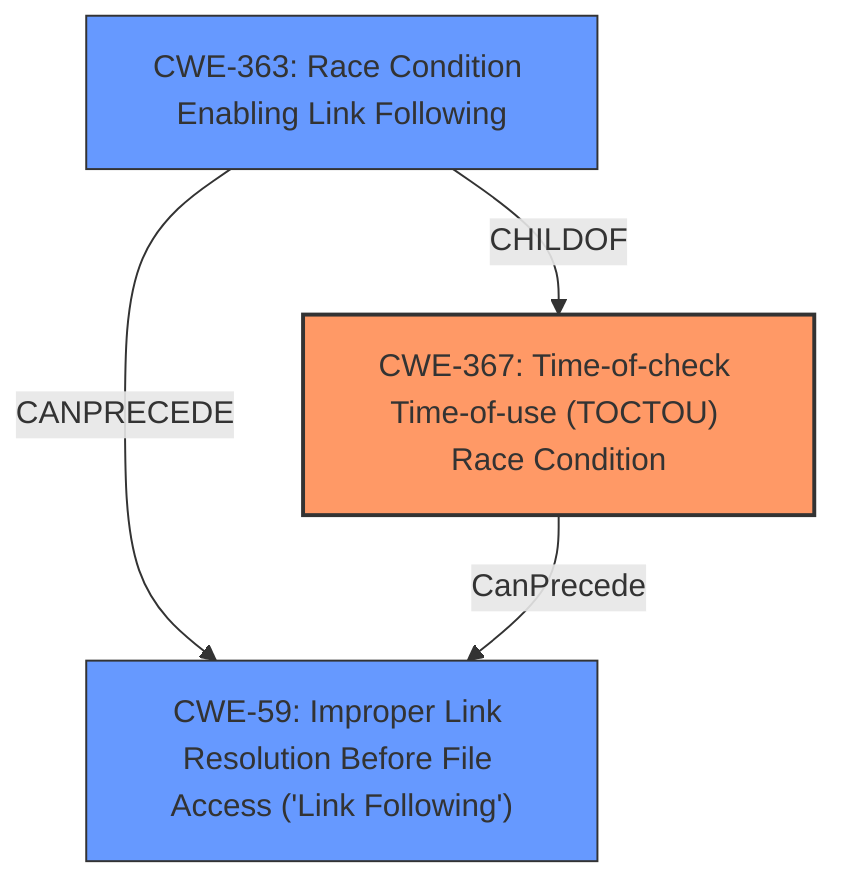

# Analysis Report for CVE-2022-34899

# Vulnerability Analysis Report: CVE-2022-34899

## Description


## Analysis (with Relationship Data)

# Summary
| CWE ID | CWE Name | Confidence | CWE Abstraction Level | CWE Vulnerability Mapping Label | CWE-Vulnerability Mapping Notes |
|---|---|---|---|---|---|
| CWE-367 | Time-of-check Time-of-use (TOCTOU) Race Condition | 0.9 | Base | Allowed | Primary CWE |
| CWE-59 | Improper Link Resolution Before File Access ('Link Following') | 0.8 | Base | Allowed | Secondary Candidate |

## Evidence and Confidence

*   **Confidence Score:** 0.85
*   **Evidence Strength:** HIGH

## Relationship Analysis
The primary CWE is CWE-367, which describes a Time-of-check Time-of-use (TOCTOU) race condition. This CWE has a child relationship with CWE-362, indicating that it is a specific type of race condition. CWE-59, Improper Link Resolution Before File Access ('Link Following'), is a secondary CWE because the vulnerability involves using a symbolic link to exploit the TOCTOU condition. CWE-363, Race Condition Enabling Link Following, is a child of CWE-367 and `CanPrecede` CWE-59, showing the potential chain of events.



## Vulnerability Chain
The vulnerability chain starts with a **TOCTOU** vulnerability (CWE-367) where the Parallels service checks the state of a file. An attacker then manipulates the file system, replacing the original file with a symbolic link, thus leading to **improper link resolution** (CWE-59). This allows the attacker to execute arbitrary code with elevated privileges.

## Summary of Analysis
The analysis is based on the provided vulnerability description and the CVE Reference Links Content Summary. The key phrase "By creating a symbolic link, an attacker can abuse the service to execute a file" directly points to the exploitation method. The CVE Reference Links Content Summary states: "The vulnerability is a Time-of-Check Time-of-Use (TOCTOU) issue within the Parallels service" and "Attackers can exploit this by creating a symbolic link to a malicious file after the service has performed the initial validation check".

CWE-367 is selected as the primary CWE because the core issue is the race condition. CWE-59 is included as a secondary CWE because the symbolic link is the method used to exploit the race condition. The abstraction levels (Base) are appropriate as they represent the specific weaknesses involved.

Other CWEs Considered:

*   **CWE-427 (Count: 4) - Uncontrolled Search Path Element**: The primary match from "CWE for similar CVE Descriptions" is not chosen as it doesn't accurately describe the **TOCTOU** vulnerability exploited via symbolic links.
*   **CWE-269 (Count: 2) - Improper Privilege Management**: This is a high-level class that is too general.
*   **CWE-59 - Improper Link Resolution Before File Access ('Link Following')**: Included as a secondary factor, but not the primary cause.
*   **CWE-732 - Incorrect Permission Assignment for Critical Resource**: While privilege escalation is the impact, the root cause is not related to permission assignment itself but the **TOCTOU** condition.
*   **CWE-250 - Execution with Unnecessary Privileges**: The root cause is not the service running with unnecessary privileges but the race condition that allows the exploit.
*   **CWE-1386 - Insecure Operation on Windows Junction / Mount Point**: Specific to Windows, while the description does not mention the OS.
*   **CWE-20 - Improper Input Validation**: While input is involved, the core of the weakness is the race condition, not the lack of validation.

Relevant CWE Information:

# Enhanced Context (25 CWEs)

## CWE-367: Time-of-check Time-of-use (TOCTOU) Race Condition
**Abstraction Level**: Base
**Similarity Score**: 8021.65
**Source**: sparse

**Description**:
The product checks the state of a resource before using that resource, but the resource's state can change between the check and the use in a way that invalidates the results of the check. This can cause the product to perform invalid actions when the resource is in an unexpected state.

**Mapping Guidance**:
- Usage: Allowed
- Rationale: This CWE entry is at the Base level of abstraction, which is a preferred level of abstraction for mapping to the root causes of vulnerabilities.

## CWE-59: Improper Link Resolution Before File Access ('Link Following')
**Abstraction Level**: Base
**Similarity Score**: 8137.43
**Source**: sparse

**Description**:
The product attempts to access a file based on the filename, but it does not properly prevent that filename from identifying a link or shortcut that resolves to an unintended resource.

**Mapping Guidance**:
- Usage: Allowed
- Rationale: This CWE entry is at the Base level of abstraction, which is a preferred level of abstraction for mapping to the root causes of vulnerabilities.


## CWE Relationship Analysis

Current CWEs represent these abstraction levels: .


### Vulnerability Chain Analysis

**Chain starting from CWE-363:**
- 363 (Race Condition Enabling Link Following) - ROOT


**Chain starting from CWE-250:**
- 250 (Execution with Unnecessary Privileges) - ROOT


### CWE Relationship Diagram

```mermaid
graph TD
    classDef primary fill:#f96,stroke:#333,stroke-width:2px
    classDef secondary fill:#69f,stroke:#333
    classDef tertiary fill:#9e9,stroke:#333
```


*Report generated on 2025-03-30 23:02:34*
