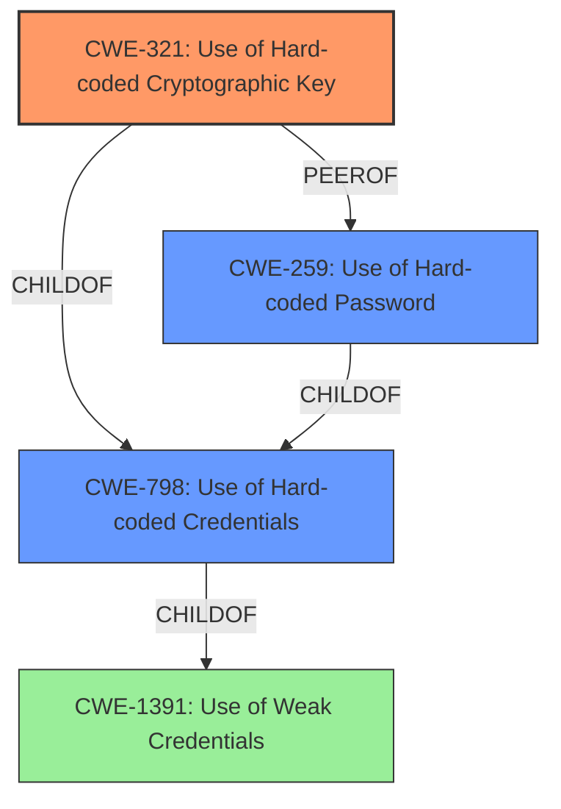

# Enhanced Analysis for CVE-2022-34906

# Summary
| CWE ID  | CWE Name                            | Confidence | CWE Abstraction Level | CWE Vulnerability Mapping Label | CWE-Vulnerability Mapping Notes |
| :------- | :---------------------------------- | :--------- | :-------------------- | :------------------------------ | :------------------------------ |
| CWE-321 | Use of Hard-coded Cryptographic Key | 1          | Variant               | Allowed                       | Primary CWE                     |
| CWE-798 | Use of Hard-coded Credentials       | 0.8        | Base                  | Allowed                       | Secondary candidate             |
| CWE-259 | Use of Hard-coded Password          | 0.7        | Variant               | Allowed                       | Secondary candidate             |

## Evidence and Confidence

*   **Confidence Score:** 0.9
*   **Evidence Strength:** HIGH

## Relationship Analysis
The primary CWE is CWE-321, which is a variant of CWE-798, indicating a more specific case of using hard-coded credentials. CWE-798 itself is a child of CWE-1391 (Use of Weak Credentials), showing a hierarchical relationship where CWE-321 is the most specific. CWE-259 (Use of Hard-coded Password) is a peer of CWE-321 and a child of CWE-798, indicating an alternative but related classification. The selection of CWE-321 is based on the explicit mention of a cryptographic key being hard-coded, making it a more precise match than the more general CWE-798 or CWE-1391.



## Vulnerability Chain
The vulnerability chain starts with the **hard-coded cryptographic key** (CWE-321), which leads to the ability for an unauthenticated actor to decrypt sensitive information and send crafted requests, effectively bypassing authentication. The chain is:
1.  **CWE-321: Use of Hard-coded Cryptographic Key** - The root cause.
2.  Authentication Bypass (Implicit) - The hardcoded key allows bypassing authentication.
3.  Information Disclosure (Impact) - Sensitive information can be decrypted.
4.  Ability to send crafted requests (Impact) - Leading to potential further exploitation such as remote code execution and control of managed devices.

## Summary of Analysis
The initial analysis focused on identifying the root cause of the vulnerability based on the provided description and CVE details. The description clearly states that a **hard-coded cryptographic key** is used, which directly maps to CWE-321. The CVE reference summary further reinforces this by explaining how this hard-coded key allows bypassing authentication and leads to sensitive information disclosure and other impacts.

The analysis considered other CWEs such as CWE-798 (Use of Hard-coded Credentials) and CWE-259 (Use of Hard-coded Password), but these were deemed less specific than CWE-321, which explicitly addresses the use of a cryptographic key. CWE-1391 (Use of Weak Credentials) was also considered, but as a class-level CWE, it is less specific than the variant-level CWE-321.

The graph relationships influenced the final selection by highlighting the hierarchical structure, where CWE-321 is a specific type of CWE-798. This reinforced the decision to choose the most specific CWE that accurately represents the vulnerability. The retriever results also supported the selection of CWE-321, as it had a high similarity score.

The selected CWEs are at the optimal level of specificity because CWE-321 accurately captures the root cause (use of **hard-coded cryptographic key**), while other CWEs are either too general or address different aspects of the vulnerability. The evidence from the vulnerability description and CVE reference summary strongly supports this classification.

Relevant CWE Information:
# Enhanced Context (25 CWEs)

## CWE-321: Use of Hard-coded Cryptographic Key
**Abstraction:** Variant
**Status:** Draft

### Description
The use of a **hard-coded cryptographic key** significantly increases the possibility that encrypted data may be recovered.

### Mapping Guidance
**Usage:** Allowed
**Rationale:** This CWE entry is at the Variant level of abstraction, which is a preferred level of abstraction for mapping to the root causes of vulnerabilities.

### Observed Examples
- **CVE-2022-29960:** Engineering Workstation uses **hard-coded cryptographic keys** that could allow for unathorized filesystem access and privilege escalation
- **CVE-2022-30271:** Remote Terminal Unit (RTU) uses a **hard-coded SSH private key** that is likely to be used by default.
- **CVE-2020-10884:** WiFi router service has a **hard-coded encryption key**, allowing root access

## CWE-798: Use of Hard-coded Credentials
**Abstraction:** Base
**Status:** Draft

### Description
The product contains **hard-coded credentials**, such as a password or cryptographic key.

### Mapping Guidance
**Usage:** Allowed
**Rationale:** This CWE entry is at the Base level of abstraction, which is a preferred level of abstraction for mapping to the root causes of vulnerabilities.

## CWE-259: Use of Hard-coded Password
**Abstraction:** Variant
**Status:** Draft

### Description
The product contains a **hard-coded password**, which it uses for its own inbound authentication or for outbound communication to external components.

### Mapping Guidance
**Usage:** Allowed
**Rationale:** This CWE entry is at the Variant level of abstraction, which is a preferred level of abstraction for mapping to the root causes of vulnerabilities.

CWEs considered but not used:
- CWE-1391: Use of Weak Credentials: This is a Class-level CWE and less specific than CWE-321 and CWE-798.
- CWE-327: Use of a Broken or Risky Cryptographic Algorithm: While the hard-coded key could potentially be a weak algorithm, the primary issue is the hard-coding itself, not the algorithm's inherent weakness.
- CWE-1394: Use of Default Cryptographic Key: This CWE is relevant, but less specific than CWE-321 since the key is hard-coded, not just a default value.
- CWE-208, CWE-203: Observable Discrepancy: These CWEs are related to information disclosure through side channels, which is an impact of the vulnerability but not the root cause.
- CWE-912: Hidden Functionality: Not applicable as the key usage is not necessarily hidden functionality.
- CWE-290: Authentication Bypass by Spoofing: While authentication bypass is an impact, the root cause is the **hard-coded key**.


## CWE Relationship Analysis

Current CWEs represent these abstraction levels: .


### Vulnerability Chain Analysis

**Chain starting from CWE-208:**
- 208 (Observable Timing Discrepancy) - ROOT


**Chain starting from CWE-203:**
- 203 (Observable Discrepancy) - ROOT


### CWE Relationship Diagram

```mermaid
graph TD
    classDef primary fill:#f96,stroke:#333,stroke-width:2px
    classDef secondary fill:#69f,stroke:#333
    classDef tertiary fill:#9e9,stroke:#333
```