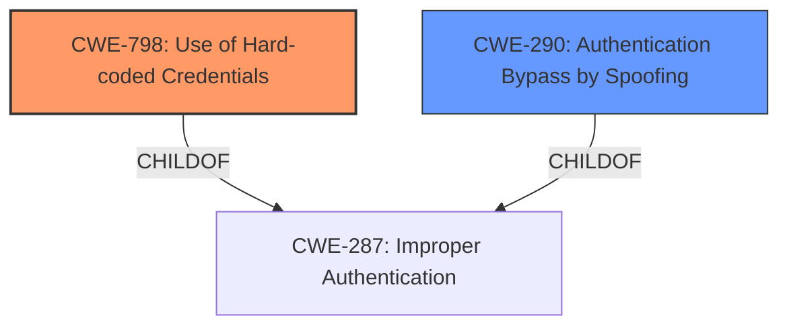

# Analysis Report for CVE-2022-34907

# Vulnerability Analysis Report: CVE-2022-34907

## Description


## Analysis (with Relationship Data)

# Summary

| CWE ID  | CWE Name                       | Confidence | CWE Abstraction Level | CWE Vulnerability Mapping Label | CWE-Vulnerability Mapping Notes |
|---------|--------------------------------|------------|-----------------------|---------------------------------|---------------------------------|
| CWE-798 | Use of Hard-coded Credentials  | 1.0        | Base                  | Primary                          | Allowed                         |
| CWE-290 | Authentication Bypass by Spoofing | 0.75       | Base                  | Secondary                        | Allowed                         |

## Evidence and Confidence

*   **Confidence Score:** 0.9
*   **Evidence Strength:** HIGH

## Relationship Analysis

The primary relationship influencing the CWE selection is the hierarchical one. CWE-798 **[CWE-798: Use of Hard-coded Credentials]** is a base CWE that falls under the class CWE-287 **[CWE-287: Improper Authentication]**. The description explicitly mentions the use of a hardcoded secret, making CWE-798 the most specific and appropriate choice.

CWE-290 **[CWE-290: Authentication Bypass by Spoofing]** is a base CWE and a child of CWE-287 **[CWE-287: Improper Authentication]**. In this case, by using the **hardcoded** credentials, an actor is **spoofing** the identity of an authorized user.



## Vulnerability Chain

The vulnerability chain starts with the **hardcoded secret** (CWE-798) which leads to **improper authentication**, which enables an **authentication bypass** leading to gaining full system control.

## Summary of Analysis

The selection of CWE-798 **[CWE-798: Use of Hard-coded Credentials]** as the primary CWE is strongly supported by the vulnerability description and CVE reference. The description clearly states that the root cause of the vulnerability is the use of a **hardcoded shared secret** (`SCHEDULER_SECRET`) for authentication. This aligns perfectly with the definition of CWE-798, which states that "The product contains hard-coded credentials, such as a password or cryptographic key." The use of this secret allows for an **authentication bypass**, which is the impact of the vulnerability. The `SCHEDULER_SECRET` is used to provide superuser privileges, which is incorrect.
Evidence: "This occurs because the server uses a hardcoded shared secret (`SCHEDULER_SECRET`) to authenticate requests from its scheduler service. This secret is used to provide superuser privileges."

CWE-290 **[CWE-290: Authentication Bypass by Spoofing]** is a secondary weakness that can be considered. The evidence suggests the attacker is spoofing by leveraging the hardcoded secret to gain unauthorized access to the system and MDM platform. The confidence is lower because the primary weakness is more directly related to the root cause.

CWE-287 **[CWE-287: Improper Authentication]**, CWE-863 **[CWE-863: Incorrect Authorization]**, and CWE-1390 **[CWE-1390: Weak Authentication]** were considered but deemed less appropriate. While they relate to authentication and authorization issues, they don't capture the specific root cause of the vulnerability, which is the use of hardcoded credentials. CWE-287 is a class-level CWE, and the guidance suggests using more specific children. CWE-863 relates to incorrect authorization checks, but the primary issue here is the authentication bypass. CWE-1390 is a class-level CWE and suggests looking for a more specific child.


## CWE Relationship Analysis

Current CWEs represent these abstraction levels: .


### Vulnerability Chain Analysis

**Chain starting from CWE-290:**
- 290 (Authentication Bypass by Spoofing) - ROOT


**Chain starting from CWE-1390:**
- 1390 (Weak Authentication) - ROOT


### CWE Relationship Diagram

```mermaid
graph TD
    classDef primary fill:#f96,stroke:#333,stroke-width:2px
    classDef secondary fill:#69f,stroke:#333
    classDef tertiary fill:#9e9,stroke:#333
```


*Report generated on 2025-03-30 11:26:42*
