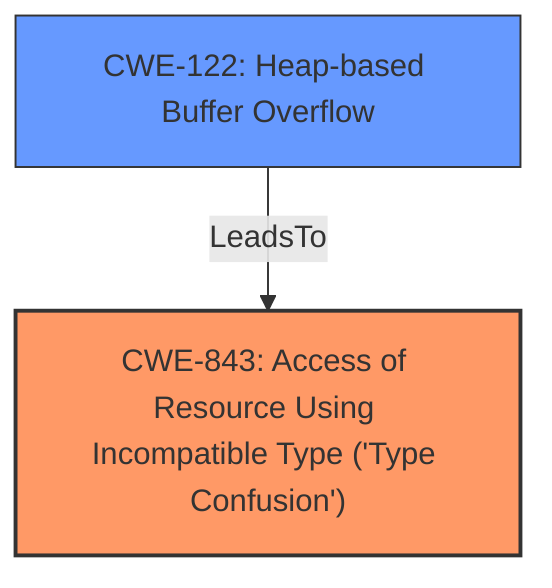

# Analysis for CVE-2022-34918

# Summary

| CWE ID | CWE Name | Confidence | CWE Abstraction Level | CWE Vulnerability Mapping Label | CWE-Vulnerability Mapping Notes |
|---|---|---|---|---|---|
| CWE-843 | Access of Resource Using Incompatible Type ('Type Confusion') | 0.9 | Base | Allowed | Primary CWE. The vulnerability stems from a **type confusion** bug. |
| CWE-122 | Heap-based Buffer Overflow | 0.8 | Variant | Allowed | Secondary CWE. The **type confusion** leads to a **buffer overflow** on the heap. |

## Evidence and Confidence

*   **Confidence Score:** 0.85
*   **Evidence Strength:** HIGH

## Relationship Analysis

The primary weakness is CWE-843, **Type Confusion**, which leads to CWE-122, **Heap-based Buffer Overflow**. This is a cause-and-effect relationship, where the incorrect type usage directly results in the overflow. CWE-843 is a Base level CWE, while CWE-122 is a Variant, representing a more specific type of buffer overflow.

## Vulnerability Chain

The vulnerability chain starts with **type confusion** (CWE-843) due to the **missing length check**, leading to a **heap-based buffer overflow** (CWE-122). The overflow allows for arbitrary writes, leading to privilege escalation.
Missing length check --> Type Confusion (CWE-843) --> Heap-based Buffer Overflow (CWE-122) --> Arbitrary Write --> Privilege Escalation

## Summary of Analysis

The primary vulnerability is a **type confusion** (CWE-843) that results in a **heap-based buffer overflow** (CWE-122). The evidence for this is strong, based on the vulnerability description and the CVE reference summary. The "Vulnerability Description Key Phrases" explicitly mentions "**type confusion**" and "**buffer overflow**" as the weakness. The CVE reference summary details how the **missing length check** in `nft_setelem_parse_data` allows an attacker to cause a **heap buffer overflow** in `nft_set_elem_init`.

The retriever results also support this, with CWE-843 and CWE-122 being highly ranked. CWE-843 has a high similarity score from the alternate_terms retriever, indicating that the description aligns well with the concept of **type confusion**. CWE-122 has a good score from the dense retriever.

The relationships between CWEs also support this analysis. CWE-843 can precede CWE-119 (Improper Restriction of Operations within the Bounds of a Memory Buffer), and CWE-122 is a child of CWE-787 (Out-of-bounds Write), further solidifying the chain of events.

The selection of CWE-843 and CWE-122 is at the optimal level of specificity. CWE-843 is a Base level CWE that accurately represents the **type confusion**, while CWE-122 is a Variant that specifies the type of **buffer overflow** (heap-based).

CWE-120 (Buffer Copy without Checking Size of Input) was considered but rejected because the vulnerability isn't a simple buffer copy without size checking. It's a more complex issue involving **type confusion** leading to the overflow due to a **missing length check**, making CWE-843 a more accurate root cause.

Relevant CWE Information:

# Enhanced Context (25 CWEs)

## CWE-667: Improper Locking
**Abstraction Level**: Class
**Similarity Score**: 0.78
**Source**: dense
**Description**:
The product does not properly acquire or release a lock on a resource, leading to unexpected resource state changes and behaviors.
**Mapping Guidance**:
- Usage: Allowed-with-Review
- Rationale: This CWE entry is a Class and might have Base-level children that would be more appropriate
NOT SELECTED: Not applicable because there's no concurrency or locking issue.

## CWE-404: Improper Resource Shutdown or Release
**Abstraction Level**: Class
**Similarity Score**: 0.77
**Source**: dense
**Description**:
The product does not release or incorrectly releases a resource before it is made available for re-use.
**Mapping Guidance**:
- Usage: Allowed-with-Review
- Rationale: This CWE entry is a Class and might have Base-level children that would be more appropriate
NOT SELECTED: Not applicable because there's no resource release issue.

## CWE-362: Concurrent Execution using Shared Resource with Improper Synchronization ('Race Condition')
**Abstraction Level**: Class
**Similarity Score**: 0.77
**Source**: dense
**Description**:
The product contains a concurrent code sequence that requires temporary, exclusive access to a shared resource, but a timing window exists in which the shared resource can be modified by another code sequence operating concurrently.
**Mapping Guidance**:
- Usage: Allowed-with-Review
- Rationale: This CWE entry is a Class and might have Base-level children that would be more appropriate
NOT SELECTED: Not applicable because there's no concurrency or race condition in the code.

## CWE-367: Time-of-check Time-of-use (TOCTOU) Race Condition
**Abstraction Level**: Base
**Similarity Score**: 0.76
**Source**: dense
**Description**:
The product checks the state of a resource before using that resource, but the resource's state can change between the check and the use in a way that invalidates the results of the check. This can cause the product to perform invalid actions when the resource is in an unexpected state.
**Mapping Guidance**:
- Usage: Allowed
- Rationale: This CWE entry is at the Base level of abstraction, which is a preferred level of abstraction for mapping to the root causes of vulnerabilities.
NOT SELECTED: Not applicable because there is no TOCTOU condition present.

## CWE-226: Sensitive Information in Resource Not Removed Before Reuse
**Abstraction Level**: Base
**Similarity Score**: 0.75
**Source**: dense
**Description**:
The product releases a resource such as memory or a file so that it can be made available for reuse, but it does not clear or "zeroize" the information contained in the resource before the product performs a critical state transition or makes the resource available for reuse by other entities.
**Mapping Guidance**:
- Usage: Allowed
- Rationale: This CWE entry is at the Base level of abstraction, which is a preferred level of abstraction for mapping to the root causes of vulnerabilities.
NOT SELECTED: Not applicable because there's no sensitive information exposure issue.

## CWE-754: Improper Check for Unusual or Exceptional Conditions
**Abstraction Level**: Class
**Similarity Score**: 0.75
**Source**: dense
**Description**:
The product does not check or incorrectly checks for unusual or exceptional conditions that are not expected to occur frequently during day to day operation of the product.
**Mapping Guidance**:
- Usage: Allowed-with-Review
- Rationale: This CWE entry is a Class and might have Base-level children that would be more appropriate
NOT SELECTED: While there is a **missing length check**, the primary issue is **type confusion** that allows the code to reach the vulnerable state.

## CWE-653: Improper Isolation or Compartmentalization
**Abstraction Level**: Class
**Similarity Score**: 0.75
**Source**: dense
**Description**:
The product does not properly compartmentalize or isolate functionality, processes, or resources that require different privilege levels, rights, or permissions.
**Mapping Guidance**:
- Usage: Allowed
- Rationale: This CWE entry is at the Base level of abstraction, which is a preferred level of abstraction for mapping to the root causes of vulnerabilities.
NOT SELECTED: Not applicable because there's no issue of isolation or compartmentalization.

## CWE-668: Exposure of Resource to Wrong Sphere
**Abstraction Level**: Class
**Similarity Score**: 0.75
**Source**: dense
**Description**:
The product exposes a resource to the wrong control sphere, providing unintended actors with inappropriate access to the resource.
**Mapping Guidance**:
- Usage: Discouraged
- Rationale: CWE-668 is high-level and is often misused as a catch-all when lower-level CWE IDs might be applicable. It is sometimes used for low-information vulnerability reports [REF-1287]. It is a level-1 Class (i.e., a child of a Pillar). It is not useful for trend analysis.
NOT SELECTED: Not applicable because the core of the issue is type confusion and buffer overflow, not resource exposure.

## CWE-662: Improper Synchronization
**Abstraction Level**: Class
**Similarity Score**: 0.75
**Source**: dense
**Description**:
The product utilizes multiple threads or processes to allow temporary access to