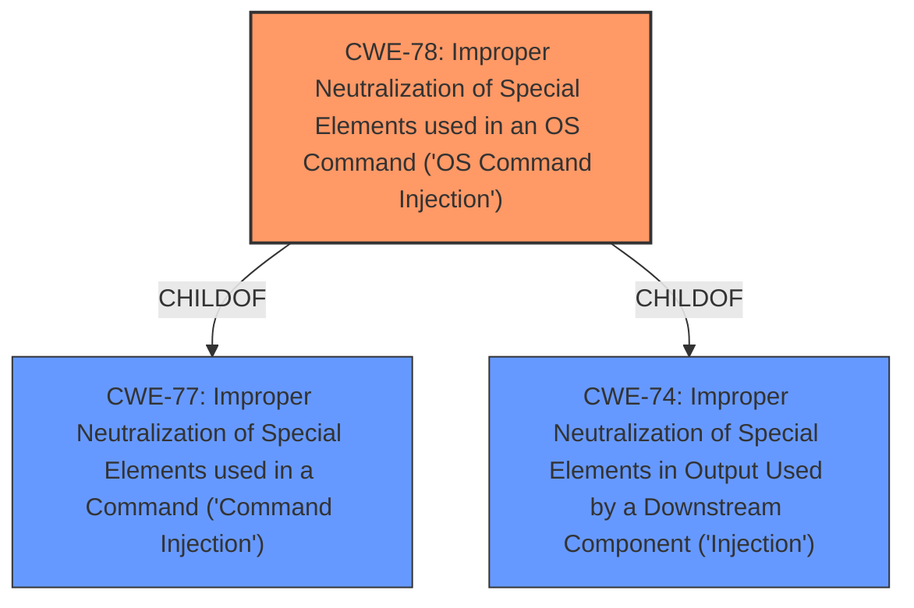

# Analysis Report for CVE-2022-3492

# Vulnerability Analysis Report: CVE-2022-3492

## Description


## Analysis (with Relationship Data)

# Summary
| CWE ID | CWE Name | Confidence | CWE Abstraction Level | CWE Vulnerability Mapping Label | CWE-Vulnerability Mapping Notes |
|---|---|---|---|---|---|
| CWE-78 | Improper Neutralization of Special Elements used in an OS Command ('OS Command Injection') | 1.0 | Base | Allowed | Primary CWE |

## Evidence and Confidence

*   **Confidence Score:** 1.0
*   **Evidence Strength:** HIGH

## Relationship Analysis
The primary relationship that influenced the decision was the ChildOf relationship between CWE-78 and CWE-77. While CWE-77 is a broader category, CWE-78 provides a more specific classification as the vulnerability involves OS command injection.



## Vulnerability Chain
The chain of events for this vulnerability begins with the **improper handling of user-supplied input** which leads directly to **OS command injection**.

## Summary of Analysis
The initial analysis strongly points to CWE-78 as the primary weakness. The vulnerability description explicitly mentions "**command injection**" and the "CVE Reference Links Content Summary" states that the root cause involves constructing OS commands using externally influenced input without proper sanitization.

The retriever results also support this with CWE-78 being the second ranked result and CWE-77 being the first ranked result. CWE-77, however, is a more general class of command injection, while CWE-78 specifically addresses OS command injection, which aligns precisely with the provided evidence.

The decision to select CWE-78 is based on direct evidence from the vulnerability description and supporting information in the CVE reference links. The confidence is high (1.0) due to the explicit mention of OS command injection and the clear description of how user-supplied input is used to construct OS commands without proper sanitization.

Other CWEs Considered:

*   **CWE-77:** Considered but not chosen as CWE-78 is more specific. The vulnerability clearly involves OS commands, making CWE-78 a better fit.
*   **CWE-79:** Considered but not chosen as the vulnerability is not related to Cross-Site Scripting.
*   **CWE-434:** Considered but not chosen as the vulnerability is not related to unrestricted file uploads.
*   **CWE-89:** Considered but not chosen as the vulnerability is not related to SQL injection.
*   **CWE-1336:** Considered but not chosen as the vulnerability is not related to template injection.


## CWE Relationship Analysis

Current CWEs represent these abstraction levels: .


### Vulnerability Chain Analysis

**Chain starting from CWE-89:**
- 89 (Improper Neutralization of Special Elements used in an SQL Command ('SQL Injection')) - ROOT


**Chain starting from CWE-434:**
- 434 (Unrestricted Upload of File with Dangerous Type) - ROOT


### CWE Relationship Diagram

```mermaid
graph TD
    classDef primary fill:#f96,stroke:#333,stroke-width:2px
    classDef secondary fill:#69f,stroke:#333
    classDef tertiary fill:#9e9,stroke:#333
```


*Report generated on 2025-03-30 16:20:33*
