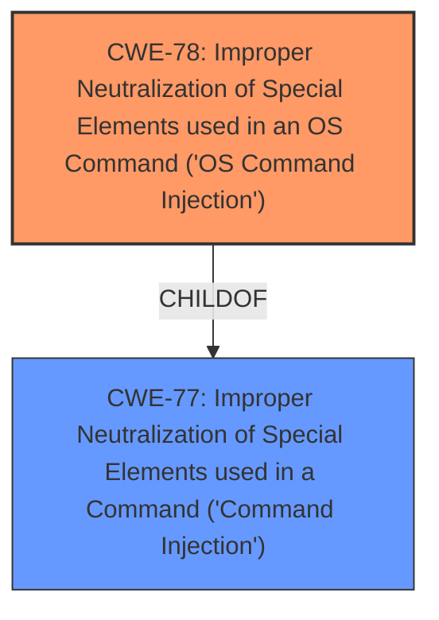

# Raw Analyzer Response for CVE-2022-34974

# Summary
| CWE ID | CWE Name | Confidence | CWE Abstraction Level | CWE Vulnerability Mapping Label | CWE-Vulnerability Mapping Notes |
|---|---|---|---|---|---|
| CWE-78 | Improper Neutralization of Special Elements used in an OS Command ('OS Command Injection') | 1.0 | Base | Allowed | Primary CWE. The product constructs an OS command using externally-influenced input, but it does not neutralize special elements. |
| CWE-77 | Improper Neutralization of Special Elements used in a Command ('Command Injection') | 0.7 | Class | Allowed-with-Review | Secondary CWE. More general case of command injection. |

## Evidence and Confidence

*   **Confidence Score:** 1.0
*   **Evidence Strength:** HIGH

## Relationship Analysis
The primary relationship influencing the decision is the ChildOf relationship between CWE-78 and CWE-77. CWE-78 is a specific type of CWE-77. Since the vulnerability description explicitly mentions "command injection" via the Ping_addr function (likely an OS command), CWE-78 is a more precise classification. CWE-77 serves as a broader, more general classification if the command injection were not related to OS commands, but another custom command language.

## Vulnerability Chain
The vulnerability chain starts with the **improper neutralization** of special elements in the Ping_addr function, leading to OS command injection.
  - Root Cause: **Improper Neutralization** (likely missing input validation/sanitization).
  - Weakness: CWE-78: Improper Neutralization of Special Elements used in an OS Command ('OS Command Injection').
  - Impact: Ability to execute arbitrary OS commands.

## Summary of Analysis
The initial analysis correctly identified "command injection" as the primary weakness. Based on the provided information, specifically the vulnerability description stating "command injection vulnerability via the Ping_addr function," the most appropriate CWE is CWE-78 (Improper Neutralization of Special Elements used in an OS Command ('OS Command Injection')). This is because Ping is typically an OS command.

The retriever results also support this decision, with CWE-78 being a highly relevant candidate. CWE-77 is considered because it is a parent of CWE-78, but the specificity of CWE-78 makes it a better fit.

The decision is based on the evidence from the vulnerability description: "D-Link DIR810LA1_FW102B22 was discovered to contain a **command injection** vulnerability via the Ping_addr function." The phrase "**command injection** vulnerability via the Ping_addr function" directly implies the ability to inject OS commands through the Ping function.

The selected CWEs are at the optimal level of specificity because CWE-78 is a Base level CWE, which is preferred, and accurately describes the vulnerability.
Other CWEs Considered:

*   CWE-77: Considered, but CWE-78 is a more specific and accurate classification given the context of "Ping_addr." The mapping guidance for CWE-77 also suggests considering CWE-78 for OS command injection.
*   CWE-790, CWE-138, CWE-95, CWE-121, CWE-184, CWE-89, CWE-74, CWE-88: These were considered but deemed less relevant because they represent different types of weaknesses (e.g., XSS, buffer overflows, SQL injection) or are too abstract. They do not directly address the core issue of OS command injection.