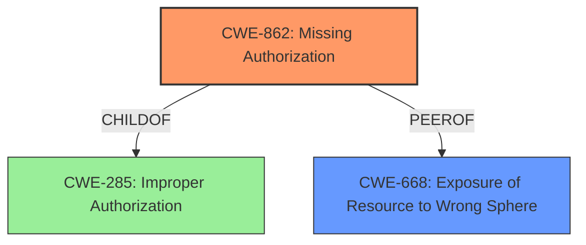

# Analysis Report for CVE-2022-3501

# Vulnerability Analysis Report: CVE-2022-3501

## Description


## Analysis (with Relationship Data)

# Summary
| CWE ID | CWE Name | Confidence | CWE Abstraction Level | CWE Vulnerability Mapping Label | CWE-Vulnerability Mapping Notes |
|---|---|---|---|---|---|
| CWE-862 | Missing Authorization | 0.9 | Class | Primary | Allowed-with-Review |
| CWE-668 | Exposure of Resource to Wrong Sphere | 0.7 | Class | Secondary | Discouraged |

## Evidence and Confidence

*   **Confidence Score:** 0.9
*   **Evidence Strength:** HIGH

## Relationship Analysis
The primary relationship that influenced the decision was the ChildOf relationship between CWE-862 and CWE-285 (Improper Authorization). The vulnerability stems from a **missing permission check**, so CWE-862, Missing Authorization, is more appropriate than its parent, CWE-285, which encompasses both missing and incorrect authorization. The fact that the agent **lacks permissions** is evidence of Missing Authorization.
CWE-668 (Exposure of Resource to Wrong Sphere) was considered due to the exposure of sensitive data, but it is a high-level class, and the root cause is more accurately represented by the **missing authorization check**.



## Vulnerability Chain
The vulnerability chain starts with the **missing authorization check** (CWE-862). This leads to **exposure of sensitive data** (potentially CWE-359, but not selected because it's an impact rather than a root cause or directly exploitable weakness), ultimately resulting in potential data breach and compromised confidentiality.

## Summary of Analysis
The initial analysis focused on the **missing permission check** which aligns perfectly with the definition of CWE-862 (Missing Authorization). The vulnerability description explicitly mentions that "article template content containing sensitive information could be accessed by agents who do not possess the necessary permissions." This is direct evidence supporting the selection of CWE-862.

The Retriever Results listed CWE-862 as a relevant candidate. While it is a Class-level CWE, the evidence strongly supports its use. The mapping guidance suggests reviewing its children, but none of them provide a more specific fit.

CWE-668 (Exposure of Resource to Wrong Sphere) was considered but not selected as the primary CWE because it represents the impact rather than the root cause. The root cause is the **lack of authorization check**, which directly leads to the exposure.

The final decision to select CWE-862 is based on the direct evidence of a **missing authorization check**, its relevance to the vulnerability description, and its position in the CWE hierarchy. The selected CWE is at the optimal level of specificity, accurately representing the root cause of the vulnerability.

Relevant CWE Information:

# Enhanced Context (25 CWEs)
The following CWEs were identified as potentially relevant to this vulnerability:

## CWE-668: Exposure of Resource to Wrong Sphere
**Abstraction Level**: Class
**Similarity Score**: 0.78
**Source**: dense

**Description**:
The product exposes a resource to the wrong control sphere, providing unintended actors with inappropriate access to the resource.

**Mapping Guidance**:
- Usage: Discouraged
- Rationale: CWE-668 is high-level and is often misused as a catch-all when lower-level CWE IDs might be applicable. It is sometimes used for low-information vulnerability reports [REF-1287]. It is a level-1 Class (i.e., a child of a Pillar). It is not useful for trend analysis.

### Explanation of Selected CWEs:

*   **CWE-862: Missing Authorization**
    *   **How it matches:** The vulnerability description states that article template contents with sensitive data could be accessed by agents without permissions. This directly indicates a **lack of authorization checks** before granting access to sensitive resources.
    *   **Security Implications:** Without proper authorization, unauthorized users can access sensitive information, leading to data breaches and confidentiality compromises.
    *   **Relationships:** It is a child of CWE-285 (Improper Authorization), but more specific because the authorization check is missing entirely, not just performed incorrectly.
    *   **Mapping Guidance:** The mapping guidance suggests that it's a Class level and to examine children for a better fit, but none of the children fit better than the parent in this case.
    *   **Confidence:** 0.9

*   **CWE-668: Exposure of Resource to Wrong Sphere**
    *   **How it matches:** The vulnerability results in the **exposure of article template contents containing sensitive data** to agents who should not have access.
    *   **Security Implications:** This exposure can lead to data breaches, confidentiality violations, and potential misuse of sensitive information.
    *   **Relationships:** It is related as an impact of the **missing authorization check** (CWE-862).
    *   **Mapping Guidance:** Discouraged because it is high-level.
    *   **Confidence:** 0.7


## CWE Relationship Analysis

Current CWEs represent these abstraction levels: .


### Vulnerability Chain Analysis

**Chain starting from CWE-862:**
- 862 (Missing Authorization) - ROOT


**Chain starting from CWE-285:**
- 285 (Improper Authorization) - ROOT


### CWE Relationship Diagram

```mermaid
graph TD
    classDef primary fill:#f96,stroke:#333,stroke-width:2px
    classDef secondary fill:#69f,stroke:#333
    classDef tertiary fill:#9e9,stroke:#333
```


*Report generated on 2025-03-30 15:11:09*
