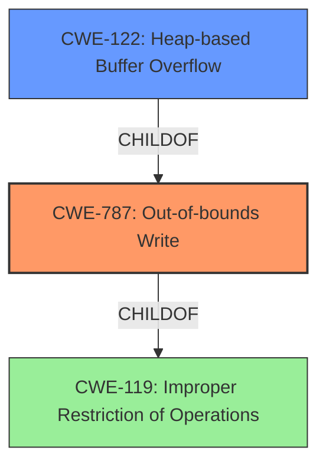

# Analysis for CVE-2022-35104

# Summary
| CWE ID | CWE Name | Confidence | CWE Abstraction Level | CWE Vulnerability Mapping Label | CWE-Vulnerability Mapping Notes |
|---|---|---|---|---|---|
| CWE-787 | Out-of-bounds Write | 0.9 | Base | Allowed | Primary CWE |
| CWE-122 | Heap-based Buffer Overflow | 0.8 | Variant | Allowed | Secondary Candidate |
| CWE-119 | Improper Restriction of Operations within the Bounds of a Memory Buffer | 0.6 | Class | Discouraged | Secondary Candidate |

## Evidence and Confidence

*   **Confidence Score:** 0.9
*   **Evidence Strength:** HIGH

## Relationship Analysis
The primary CWE is CWE-787, which is a base-level CWE that directly describes the out-of-bounds write condition. CWE-122, a variant of CWE-787, specifies that the overflow occurs in the heap, which is also stated in the vulnerability description. CWE-119 is a more general class that describes improper restriction of operations within memory bounds, encompassing both reads and writes, but it's discouraged when more specific CWEs like CWE-787 or CWE-122 apply.

## Vulnerability Chain
The vulnerability chain starts with the **heap-buffer overflow** condition in the `DCTStreamreset()` function, leading to an out-of-bounds write. The root cause is the **improper handling of input data**, leading to the overflow.

## Summary of Analysis
The initial analysis focused on identifying the most specific CWE that accurately describes the vulnerability. The vulnerability description explicitly mentions a **heap-buffer overflow** in the `DCTStreamreset()` function. The CVE Reference Links Content Summary further corroborates this by detailing multiple heap buffer overflows in `swftools-pdf2swf` due to **improper handling of input data**.

Based on the evidence, CWE-787 (Out-of-bounds Write) is the most appropriate primary CWE because it directly addresses the **out-of-bounds write** condition. CWE-122 (Heap-based Buffer Overflow) is considered as a secondary candidate, as it provides further specificity about the location of the buffer overflow on the heap. Although CWE-119 (Improper Restriction of Operations within the Bounds of a Memory Buffer) was a top retriever result, it is too general and therefore less preferred as the primary CWE. The selection of CWE-787 and CWE-122 is based on the explicit mention of **heap-buffer overflow** and **out-of-bounds write** in the vulnerability description and reference links.

The graph relationships support this by showing CWE-122 as a child of CWE-787, indicating that heap-based buffer overflows are a specific type of out-of-bounds write. The selected CWEs are at the optimal level of specificity because they accurately describe the vulnerability's nature and location (heap).

Relevant CWE Information:

# Enhanced Context (25 CWEs)
The following CWEs were identified as potentially relevant to this vulnerability:

## CWE-131: Incorrect Calculation of Buffer Size
**Abstraction Level**: Base
**Similarity Score**: 0.78
**Source**: dense

**Description**:
The product does not correctly calculate the size to be used when allocating a buffer, which could lead to a buffer overflow.

**Mapping Guidance**:
- Usage: Allowed
- Rationale: This CWE entry is at the Base level of abstraction, which is a preferred level of abstraction for mapping to the root causes of vulnerabilities.

*Was considered, but not selected:* The evidence doesn't show an incorrect calculation of buffer size was the cause, so this CWE was not selected.

## CWE-191: Integer Underflow (Wrap or Wraparound)
**Abstraction Level**: Base
**Similarity Score**: 0.78
**Source**: dense

**Description**:
The product subtracts one value from another, such that the result is less than the minimum allowable integer value, which produces a value that is not equal to the correct result.

**Mapping Guidance**:
- Usage: Allowed
- Rationale: This CWE entry is at the Base level of abstraction, which is a preferred level of abstraction for mapping to the root causes of vulnerabilities.

*Was considered, but not selected:* There's no evidence of integer underflow so this CWE was not selected.

## CWE-125: Out-of-bounds Read
**Abstraction Level**: Base
**Similarity Score**: 0.78
**Source**: dense

**Description**:
The product reads data past the end, or before the beginning, of the intended buffer.

**Mapping Guidance**:
- Usage: Allowed
- Rationale: This CWE entry is at the Base level of abstraction, which is a preferred level of abstraction for mapping to the root causes of vulnerabilities.

*Was considered, but not selected:* The vulnerability is a heap buffer overflow, which is an out-of-bounds write.

## CWE-681: Incorrect Conversion between Numeric Types
**Abstraction Level**: Base
**Similarity Score**: 0.77
**Source**: dense

**Description**:
When converting from one data type to another, such as long to integer, data can be omitted or translated in a way that produces unexpected values. If the resulting values are used in a sensitive context, then dangerous behaviors may occur.

**Mapping Guidance**:
- Usage: Allowed
- Rationale: This CWE entry is at the Base level of abstraction, which is a preferred level of abstraction for mapping to the root causes of vulnerabilities.

*Was considered, but not selected:* This CWE does not fit as there is no evidence of a conversion between numeric types.

## CWE-124: Buffer Underwrite ('Buffer Underflow')
**Abstraction Level**: Base
**Similarity Score**: 0.76
**Source**: dense

**Description**:
The product writes to a buffer using an index or pointer that references a memory location prior to the beginning of the buffer.

**Mapping Guidance**:
- Usage: Allowed
- Rationale: This CWE entry is at the Base level of abstraction, which is a preferred level of abstraction for mapping to the root causes of vulnerabilities.

*Was considered, but not selected:* This is an overflow, not an underflow.

## CWE-126: Buffer Over-read
**Abstraction Level**: Variant
**Similarity Score**: 0.76
**Source**: dense

**Description**:
The product reads from a buffer using buffer access mechanisms such as indexes or pointers that reference memory locations after the targeted buffer.

**Mapping Guidance**:
- Usage: Allowed
- Rationale: This CWE entry is at the Variant level of abstraction, which is a preferred level of abstraction for mapping to the root causes of vulnerabilities.

*Was considered, but not selected:* The vulnerability is a heap buffer overflow, which is an out-of-bounds write.

## CWE-805: Buffer Access with Incorrect Length Value
**Abstraction Level**: Base
**Similarity Score**: 0.76
**Source**: dense

**Description**:
The product uses a sequential operation to read or write a buffer, but it uses an incorrect length value that causes it to access memory that is outside of the bounds of the buffer.

**Mapping Guidance**:
- Usage: Allowed
- Rationale: This CWE entry is at the Base level of abstraction, which is a preferred level of abstraction for mapping to the root causes of vulnerabilities.

*Was considered, but not selected:* While it may be the root cause, there's not enough information to select this CWE.

## CWE-193: Off-by-one Error
**Abstraction Level**: Base
**Similarity Score**: 0.76
**Source**: dense

**Description**:
A product calculates or uses an incorrect maximum or minimum value that is 1 more, or 1 less, than the correct value.

**Mapping Guidance**:
- Usage: Allowed
- Rationale: This CWE entry is at the Base level of abstraction, which is a preferred level of abstraction for mapping to the root causes of vulnerabilities.

*Was considered, but not selected:* There's no evidence of an off-by-one error.

## CWE-789: Memory Allocation with Excessive Size Value
**Abstraction Level**: Variant
**Similarity Score**: 0.75
**Source**: dense

**Description**:
The product allocates memory based on an untrusted, large size value, but it does not ensure that the size is within expected limits, allowing arbitrary amounts of memory to be allocated.

**Mapping Guidance**:
- Usage: Allowed
- Rationale: This CWE entry is at the Variant level of abstraction,