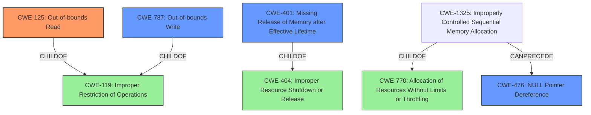

# Enhanced Analysis for CVE-2022-35108

# Summary
| CWE ID | CWE Name | Confidence | CWE Abstraction Level | CWE Vulnerability Mapping Label | CWE-Vulnerability Mapping Notes |
|---|---|---|---|---|---|
| CWE-125 | Out-of-bounds Read | 0.8 | Base | Primary | Allowed |
| CWE-787 | Out-of-bounds Write | 0.6 | Base | Secondary | Allowed |
| CWE-476 | NULL Pointer Dereference | 0.5 | Base | Secondary | Allowed |
| CWE-401 | Missing Release of Memory after Effective Lifetime | 0.4 | Variant | Secondary | Allowed |

## Evidence and Confidence

*   **Confidence Score:** 0.7
*   **Evidence Strength:** MEDIUM

## Relationship Analysis
The primary weakness identified is CWE-125 (Out-of-bounds Read) due to the **segmentation violation** in `DCTStreamgetChar()`. This indicates an attempt to access memory outside the allocated buffer. CWE-125 is a base-level CWE and a child of CWE-119 (Improper Restriction of Operations Within the Bounds of a Memory Buffer). CWE-787 (Out-of-bounds Write) is also considered as a potential related weakness if the invalid memory access involves writing. Also, the reference to "Memory Leak" suggests improper resource management. The graph shows that CWE-1325 can precede CWE-476. CWE-770 is a parent of CWE-1325.



## Vulnerability Chain
The vulnerability chain starts with a crafted PDF file processed by `pdf2swf`. This leads to incorrect handling of image data within the DCT stream processing, ultimately resulting in a **segmentation fault** due to an out-of-bounds read. A **memory leak** could also occur due to improper memory management.

## Summary of Analysis
The primary vulnerability is classified as CWE-125 (Out-of-bounds Read) because the description indicates a **segmentation violation** during the processing of an image stream in `DCTStream::getChar()`, which is a strong indicator of attempting to read memory outside the allocated buffer.

Supporting evidence:
*   "A segmentation fault occurs during the processing of an image stream, specifically within the `DCTStream::getChar()` function, likely due to an invalid memory access."

The retriever results also list CWE-125 as a top candidate. The mapping guidance for CWE-125 allows it and states it is at the Base level of abstraction, which is a preferred level of abstraction.

CWE-787 (Out-of-bounds Write) is considered as a secondary weakness because the invalid memory access could potentially involve writing data outside the buffer, leading to memory corruption.

CWE-476 (NULL Pointer Dereference) is considered because the vulnerability is happening during the processing of an image stream and a NULL pointer dereference could be the rootcause of the segmentation fault.

CWE-401 (Missing Release of Memory after Effective Lifetime) is considered as another secondary weakness due to the mention of **memory leak** in the CVE Reference Links Content Summary.

Other CWEs considered but not used:

*   CWE-770 (Allocation of Resources Without Limits or Throttling): While the vulnerability involves resource consumption, there is no explicit evidence that the root cause is related to allocating resources without limits.
*   CWE-674 (Uncontrolled Recursion): There is no information to suggest that recursion is involved in this vulnerability.
*   CWE-788 (Access of Memory Location After End of Buffer): This is discouraged as a mapping recommendation and is not a better fit than CWE-125 or CWE-787.
*   CWE-1325 (Improperly Controlled Sequential Memory Allocation): While memory allocation is likely involved, there is no specific evidence to suggest that it is improperly controlled sequential memory allocation.
* CWE-789 (Memory Allocation with Excessive Size Value): No evidence of this weakness.
* CWE-1284 (Improper Validation of Specified Quantity in Input): No evidence of this weakness.


## CWE Relationship Analysis

Current CWEs represent these abstraction levels: .


### Vulnerability Chain Analysis

**Chain starting from CWE-1325:**
- 1325 (Improperly Controlled Sequential Memory Allocation) - ROOT


**Chain starting from CWE-476:**
- 476 (NULL Pointer Dereference) - ROOT


### CWE Relationship Diagram

```mermaid
graph TD
    classDef primary fill:#f96,stroke:#333,stroke-width:2px
    classDef secondary fill:#69f,stroke:#333
    classDef tertiary fill:#9e9,stroke:#333
```