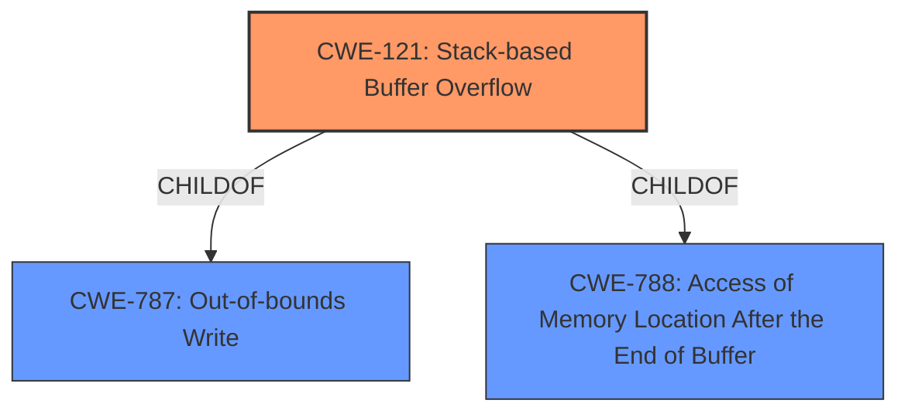

# Raw Analyzer Response for CVE-2022-35111

# Summary
| CWE ID | CWE Name | Confidence | CWE Abstraction Level | CWE Vulnerability Mapping Label | CWE-Vulnerability Mapping Notes |
|---|---|---|---|---|---|
| CWE-121 | Stack-based Buffer Overflow | 1.0 | Variant | Allowed | Primary CWE |

## Evidence and Confidence

*   **Confidence Score:** 1.0
*   **Evidence Strength:** HIGH

## Relationship Analysis
The primary relationship that influences the CWE selection is the ChildOf relationship between CWE-121 **(CWE-121: Stack-based Buffer Overflow)** and its parents, particularly CWE-787 **(CWE-787: Out-of-bounds Write)**. This hierarchy helps in understanding that a stack-based buffer overflow is a specific type of out-of-bounds write. The "Alternate Terms" section of CWE-121 also confirms that "Stack Overflow" is often used to mean the same thing as stack-based buffer overflow.

## Vulnerability Chain
The vulnerability chain starts with the software failing to properly handle a crafted PDF file, leading to a **stack overflow** due to **improper** handling in the `__sanitizerStackDepotNodehash` function. The overflow allows an attacker to overwrite stack memory, potentially leading to arbitrary code execution.

## Summary of Analysis
The initial analysis identifies a **stack overflow** vulnerability in SWFTools. The primary indicator is the explicit mention of "stack overflow" in the vulnerability description and supporting information from the CVE reference links.

The retriever results strongly support CWE-121 **(CWE-121: Stack-based Buffer Overflow)** as the most relevant CWE, and the "Alternate Terms" section of CWE-121 confirms that "Stack Overflow" is often used to mean the same thing as stack-based buffer overflow.

The selection of CWE-121 **(CWE-121: Stack-based Buffer Overflow)** is based on:
1.  The explicit mention of "stack overflow" in the vulnerability description, which aligns with CWE-121's definition.
2.  The stack-based nature of the overflow, confirming it as a stack-based buffer overflow, rather than a heap-based one.

The evidence provided directly supports the classification of this vulnerability as CWE-121 **(CWE-121: Stack-based Buffer Overflow)**.

Other considered CWEs and why they were not selected:

*   CWE-190 **(CWE-190: Integer Overflow or Wraparound)**: While integer overflows can sometimes lead to buffer overflows, there's no evidence of an integer overflow being the root cause in this case.
*   CWE-125 **(CWE-125: Out-of-bounds Read)**: This CWE relates to reading data out of bounds, whereas the vulnerability description specifies a write (**stack overflow**), making CWE-121 **(CWE-121: Stack-based Buffer Overflow)** more appropriate.
*   CWE-674 **(CWE-674: Uncontrolled Recursion)**: Although **stack overflow** can result from uncontrolled recursion, the description specifies a buffer overflow, suggesting that the stack exhaustion is due to excessive writing rather than excessive function calls.
*   CWE-770 **(CWE-770: Allocation of Resources Without Limits or Throttling)**: This CWE is about resource allocation issues. While related to denial-of-service, it does not accurately describe the **stack overflow** caused by writing beyond buffer boundaries.
*   CWE-122 **(CWE-122: Heap-based Buffer Overflow)**: The vulnerability is explicitly a **stack overflow**, not a heap overflow.

Therefore, based on the evidence, the most accurate classification is CWE-121 **(CWE-121: Stack-based Buffer Overflow)**.