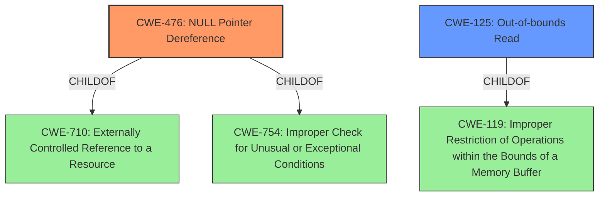

# Analysis for CVE-2022-35114

# Summary
| CWE ID | CWE Name | Confidence | CWE Abstraction Level | CWE Vulnerability Mapping Label | CWE-Vulnerability Mapping Notes |
|---|---|---|---|---|---|
| CWE-476 | NULL Pointer Dereference | 0.9 | Base | Primary | Allowed |
| CWE-125 | Out-of-bounds Read | 0.6 | Base | Secondary | Allowed |

## Evidence and Confidence

*   **Confidence Score:** 0.8
*   **Evidence Strength:** HIGH

## Relationship Analysis
The primary CWE is CWE-476, which is a base-level CWE. CWE-476 is child of CWE-710 and CWE-754.
CWE-125 is also a base level CWE and is a child of CWE-119.
The relationship between CWE-476 and CWE-125 is not directly defined. However, memory corruption leading to null pointer dereference is a common occurrence.

## Vulnerability Chain
The vulnerability chain starts with a crafted SWF file, leading to a read access to an invalid memory address, specifically `0x000000000004`, resulting in a **NULL pointer dereference** and program termination. There's also a heap buffer overflow vulnerability. Therefore, crafted SWF file leads to a **heap-buffer-overflow** in `swf_DefineLosslessBitsTagToImage` due to an out-of-bounds read.
1.  Crafted SWF File
2.  **NULL Pointer Dereference** (CWE-476) or **Heap-based Buffer Overflow**
3.  Program Crash (Denial of Service)

## Summary of Analysis
The initial assessment identified two potential vulnerabilities: a segmentation fault in `extractFrame` and a heap-buffer-overflow in `swf_DefineLosslessBitsTagToImage`.

The primary vulnerability, a segmentation fault in `extractFrame`, is caused by attempting to read memory at address `0x000000000004`, which typically indicates a **NULL pointer dereference** (CWE-476). This is supported by the vulnerability description, which states, "The crash occurs due to a read access to an invalid memory address, specifically address `0x000000000004`, which typically indicates a null pointer dereference or a similar memory corruption issue." The impact is a program crash, leading to a denial-of-service.

The second vulnerability, a heap-buffer-overflow in `swf_DefineLosslessBitsTagToImage`, is caused by an out-of-bounds read. The code attempts a `READ` operation of size 4 bytes at an address that is beyond the allocated buffer, resulting in a **heap-buffer-overflow**. The vulnerability description states, "The code attempts a `READ` operation of size 4 bytes at an address that is beyond the allocated buffer, resulting in a heap-buffer-overflow." This aligns with CWE-125 (Out-of-bounds Read), where the product reads data past the end, or before the beginning, of the intended buffer.

CWE-787 (Out-of-bounds Write) was considered because a heap buffer overflow could potentially lead to an out-of-bounds write. However, the provided information explicitly states a `READ` operation, making CWE-125 a more accurate fit.

The selected CWEs are at the optimal level of specificity, as they directly represent the root causes of the identified vulnerabilities. CWE-476 accurately describes the segmentation fault due to reading memory at address `0x000000000004`, and CWE-125 accurately describes the heap-buffer-overflow caused by an out-of-bounds read.

Relevant CWE Information:

# Enhanced Context (25 CWEs)
The following CWEs were identified as potentially relevant to this vulnerability:

## CWE-404: Improper Resource Shutdown or Release
**Abstraction Level**: Class
**Similarity Score**: 0.77
**Source**: dense

**Description**:
The product does not release or incorrectly releases a resource before it is made available for re-use.

**Mapping Guidance**:
- Usage: Allowed-with-Review
- Rationale: This CWE entry is a Class and might have Base-level children that would be more appropriate

## CWE-1325: Improperly Controlled Sequential Memory Allocation
**Abstraction Level**: Base
**Similarity Score**: 0.77
**Source**: dense

**Description**:
The product manages a group of objects or resources and performs a separate memory allocation for each object, but it does not properly limit the total amount of memory that is consumed by all of the combined objects.

**Mapping Guidance**:
- Usage: Allowed
- Rationale: This CWE entry is at the Base level of abstraction, which is a preferred level of abstraction for mapping to the root causes of vulnerabilities.

## CWE-226: Sensitive Information in Resource Not Removed Before Reuse
**Abstraction Level**: Base
**Similarity Score**: 0.77
**Source**: dense

**Description**:
The product releases a resource such as memory or a file so that it can be made available for reuse, but it does not clear or "zeroize" the information contained in the resource before the product performs a critical state transition or makes the resource available for reuse by other entities.

**Mapping Guidance**:
- Usage: Allowed
- Rationale: This CWE entry is at the Base level of abstraction, which is a preferred level of abstraction for mapping to the root causes of vulnerabilities.

## CWE-789: Memory Allocation with Excessive Size Value
**Abstraction Level**: Variant
**Similarity Score**: 0.76
**Source**: dense

**Description**:
The product allocates memory based on an untrusted, large size value, but it does not ensure that the size is within expected limits, allowing arbitrary amounts of memory to be allocated.

**Mapping Guidance**:
- Usage: Allowed
- Rationale: This CWE entry is at the Variant level of abstraction, which is a preferred level of abstraction for mapping to the root causes of vulnerabilities.

## CWE-125: Out-of-bounds Read
**Abstraction Level**: Base
**Similarity Score**: 0.76
**Source**: dense

**Description**:
The product reads data past the end, or before the beginning, of the intended buffer.

**Mapping Guidance**:
- Usage: Allowed
- Rationale: This CWE entry is at the Base level of abstraction, which is a preferred level of abstraction for mapping to the root causes of vulnerabilities.

## CWE-664: Improper Control of a Resource Through its Lifetime
**Abstraction Level**: Pillar
**Similarity Score**: 0.76
**Source**: dense

**Description**:
The product does not maintain or incorrectly maintains control over a resource throughout its lifetime of creation, use, and release.

**Mapping Guidance**:
- Usage: Discouraged
- Rationale: This CWE entry is high-level when lower-level children are available.

## CWE-667: Improper Locking
**Abstraction Level**: Class
**Similarity Score**: 0.76
**Source**: dense

**Description**:
The product does not properly acquire or release a lock on a resource, leading to unexpected resource state changes and behaviors.

**Mapping Guidance**:
- Usage: Allowed-with-Review
- Rationale: This CWE entry is a Class and might have Base-level children that would be more appropriate

## CWE-131: Incorrect Calculation of Buffer Size
**Abstraction Level**: Base
**Similarity Score**: 0.75
**Source**: dense

**Description**:
The product does not correctly calculate the size to be used when allocating a buffer, which could lead to a buffer overflow.

**Mapping Guidance**:
- Usage: Allowed
- Rationale: This CWE entry is at the Base level of abstraction, which is a preferred level of abstraction for mapping to the root causes of vulnerabilities.

## CWE-674: Uncontrolled Recursion
**Abstraction Level**: Class
**Similarity Score**: 0.75
**Source**: dense

**Description**:
The product does not properly control the amount of recursion that takes place,  consuming excessive