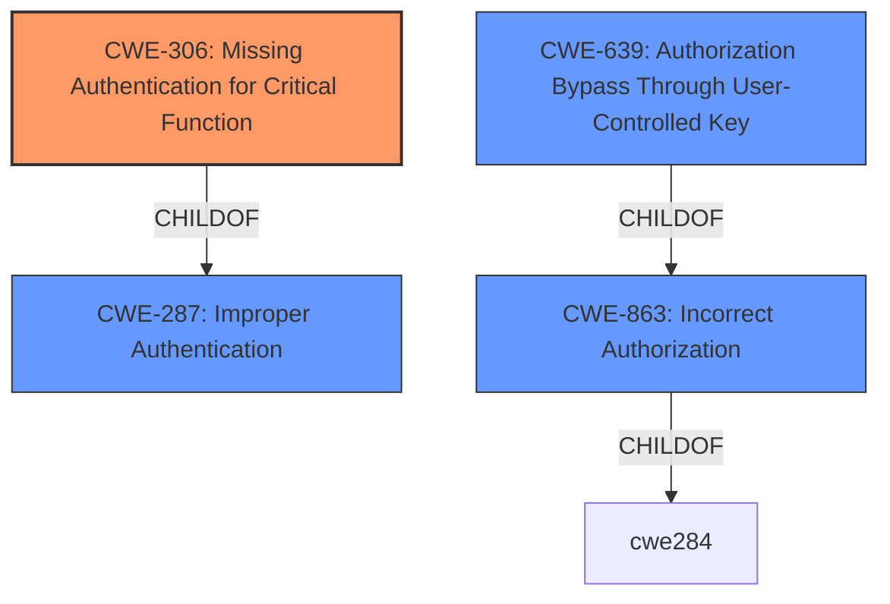

# Enhanced Analysis for CVE-2022-35136

# Summary
| CWE ID | CWE Name | Confidence | CWE Abstraction Level | CWE Vulnerability Mapping Label | CWE-Vulnerability Mapping Notes |
|---|---|---|---|---|---|
| CWE-306 | Missing Authentication for Critical Function | 1.0 | Base | Allowed | Primary CWE |
| CWE-863 | Incorrect Authorization | 0.75 | Class | Allowed-with-Review | Secondary Candidate |
| CWE-639 | Authorization Bypass Through User-Controlled Key | 0.60 | Base | Allowed | Secondary Candidate |

## Evidence and Confidence

*   **Confidence Score:** 0.9
*   **Evidence Strength:** HIGH

## Relationship Analysis
The primary CWE selected is CWE-306, which is a **Base** level CWE. This is appropriate as it directly addresses the **missing authentication** for critical API functions. While CWE-287 (Improper Authentication) is a parent **Class** of CWE-306, it's too general. CWE-863 (Incorrect Authorization) is a related Class-level CWE, but the problem isn't an authorization check that is incorrectly performed, but one that is **missing** altogether. CWE-639 (Authorization Bypass Through User-Controlled Key) is a more specific **Base** level CWE than CWE-863, but the user ID isn't being modified, it's being used without authentication.



## Vulnerability Chain
The chain of events for this vulnerability is straightforward:
1.  **Root Cause:** **Missing Authentication** (CWE-306) for API endpoints.
2.  **Weakness:** The `/api/user/upsert/<userid>` endpoint lacks proper checks.
3.  **Impact:** Privilege escalation and unauthorized modification of user data.

## Summary of Analysis
The primary weakness is the **lack of authentication** for API requests. The platform processes requests even when they lack valid credentials.

The assessment relies heavily on the "CVE Reference Links Content Summary" section. The summary explicitly states: "The root cause is the **lack of authentication** for API requests in the Boodskap IoT Platform." and "The primary weakness is the **absence of proper authentication checks** for API endpoints."

The graph relationships helped refine the selection, favoring the most specific **Base** level CWE.

CWE-306 is the most appropriate because it directly addresses the core issue of **missing authentication** for critical functions, as evidenced by the vulnerability description and CVE details. The other considered CWEs represent related, but ultimately less precise, classifications.

Relevant CWE Information:

# Enhanced Context (25 CWEs)

## CWE-306: Missing Authentication for Critical Function
**Technical Explanation:** The Boodskap IoT Platform **fails to authenticate** API requests to critical functions such as `/api/user/upsert/<userid>`. This allows unauthenticated users to perform actions as if they were authenticated, leading to privilege escalation and unauthorized data modification. The absence of authentication mechanisms on critical endpoints allows attackers to bypass security controls.
**Security Implications:** This vulnerability allows attackers to perform administrative actions, modify user profiles, and potentially compromise the entire platform. The impact is severe due to the lack of any authentication barrier.
**Relationship to Other CWEs:** CWE-306 is a child of CWE-287 (Improper Authentication), but it is more specific because it highlights the complete **absence of authentication**, rather than a flawed implementation.
**Mapping Guidance Influence:** The MITRE mapping guidance recommends using the **Base** level CWE when possible. CWE-306 is an "Allowed" mapping and directly addresses the root cause.

## CWE-863: Incorrect Authorization
**Technical Explanation:** The platform uses a user ID in the `/api/user/upsert/<userid>` endpoint without proper authorization checks. This falls under Incorrect Authorization because the application is not properly verifying if the user making the request is authorized to modify the specified user's data.
**Security Implications:** This allows attackers to modify user profiles and other user-related data without authentication by sending requests to the same vulnerable endpoint, effectively bypassing access control.
**Relationship to Other CWEs:** CWE-863 is a child of CWE-284 (Improper Access Control) and is related to CWE-639, which is a more specific base CWE.
**Mapping Guidance Influence:** The MITRE mapping guidance recommends reviewing this CWE entry because it is a Class and might have Base-level children that would be more appropriate.

## CWE-639: Authorization Bypass Through User-Controlled Key
**Technical Explanation:** An attacker can modify another user's data by directly targeting and modifying their ID in the `/api/user/upsert/<userid>` endpoint. The system's authorization functionality does not prevent one user from gaining access to another user's data or record by modifying the key value identifying the data.
**Security Implications:** This allows attackers to modify user profiles and other user-related data without authentication by sending requests to the same vulnerable endpoint, effectively bypassing access control.
**Relationship to Other CWEs:** CWE-639 is a child of CWE-863 (Incorrect Authorization) and is related to CWE-306, as the bypass is happening because authentication is completely missing.
**Mapping Guidance Influence:** The MITRE mapping guidance recommends using the Base level of abstraction, which CWE-639 is, but the user ID isn't being modified, it's being used without authentication so CWE-306 is more appropriate.


## CWE Relationship Analysis

Current CWEs represent these abstraction levels: .


### Vulnerability Chain Analysis

**Chain starting from CWE-639:**
- 639 (Authorization Bypass Through User-Controlled Key) - ROOT


**Chain starting from CWE-287:**
- 287 (Improper Authentication) - ROOT


### CWE Relationship Diagram

```mermaid
graph TD
    classDef primary fill:#f96,stroke:#333,stroke-width:2px
    classDef secondary fill:#69f,stroke:#333
    classDef tertiary fill:#9e9,stroke:#333
```