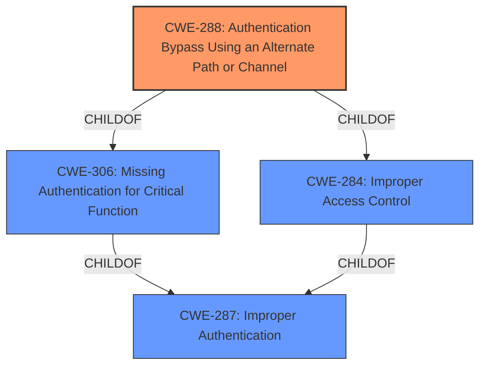

# Analysis Report for CVE-2022-35147

# Vulnerability Analysis Report: CVE-2022-35147

## Description


## Analysis (with Relationship Data)

# Summary
| CWE ID | CWE Name | Confidence | CWE Abstraction Level | CWE Vulnerability Mapping Label | CWE-Vulnerability Mapping Notes |
|---|---|---|---|---|---|
| CWE-288 | Authentication Bypass Using an Alternate Path or Channel | 0.9 | Base | Allowed | Primary CWE |
| CWE-287 | Improper Authentication | 0.6 | Class | Discouraged | Secondary CWE |

## Evidence and Confidence

*   **Confidence Score:** 0.8
*   **Evidence Strength:** HIGH

## Relationship Analysis
The primary CWE, CWE-288 (Authentication Bypass Using an Alternate Path or Channel), is a base-level CWE and a child of CWE-306 (Missing Authentication for Critical Function) and CWE-284 (Improper Access Control). CWE-287 (Improper Authentication) is a class-level CWE and a parent of CWE-306. The selection of CWE-288 is preferred because it is a more specific, base-level CWE that directly addresses the vulnerability mechanism. The relationship between CWE-288 and CWE-287 indicates a hierarchical structure, with CWE-288 providing a more granular classification of the authentication bypass.



## Vulnerability Chain
The vulnerability chain starts with the **insecure authentication** mechanism, where the application relies on the client-provided response for authentication rather than validating credentials on the server. This leads to the possibility of an **authentication bypass** by replaying a captured successful login response, ultimately resulting in **unauthorized access** and potential **complete control** of the application.

## Summary of Analysis
The vulnerability is an authentication bypass achieved by replaying a captured successful login response. The application **incorrectly trusts** the client-provided response without proper server-side validation.

The selection of CWE-288 is based on the evidence from the vulnerability description and CVE Reference Links Content Summary. The key phrase "bypass login authentication" and the root cause "application relies on the return package of a successful login for authentication" directly align with the description of CWE-288: "The product requires authentication, but the product has an alternate path or channel that does not require authentication."

CWE-287 (Improper Authentication) was considered but is less specific. While applicable, CWE-288 provides a more precise classification of the vulnerability mechanism, focusing on the bypass achieved through an alternate path (replaying the login response). The mapping guidance for CWE-287 discourages its use when lower-level CWEs are applicable, further supporting the selection of CWE-288.

Relevant CWE Information:

# Enhanced Context (25 CWEs)

## CWE-807: Reliance on Untrusted Inputs in a Security Decision
**Abstraction Level**: Base
**Similarity Score**: 0.76

This CWE was not selected. While the vulnerability does involve reliance on an input (the captured login response), it's more specifically about bypassing authentication, not just any security decision. Therefore, CWE-288 is a better fit.

## CWE-274: Improper Handling of Insufficient Privileges
**Abstraction Level**: Base
**Similarity Score**: 0.76
**Mapping Guidance**: Discouraged

This CWE was not selected because the vulnerability is not about handling insufficient privileges but about bypassing authentication altogether.

## CWE-280: Improper Handling of Insufficient Permissions or Privileges 
**Abstraction Level**: Base
**Similarity Score**: 0.76

This CWE was not selected for the same reason as CWE-274. The issue is not about handling insufficient permissions but bypassing authentication.

## CWE-405: Asymmetric Resource Consumption (Amplification)
**Abstraction Level**: Class
**Similarity Score**: 0.76

This CWE was not selected because the vulnerability is not related to resource consumption but rather to authentication bypass.

## CWE-668: Exposure of Resource to Wrong Sphere
**Abstraction Level**: Class
**Similarity Score**: 0.75
**Mapping Guidance**: Discouraged

This CWE was not selected because the vulnerability is not about exposing resources to the wrong sphere but about bypassing authentication.

## CWE-404: Improper Resource Shutdown or Release
**Abstraction Level**: Class
**Similarity Score**: 0.75

This CWE was not selected because the vulnerability is not related to resource shutdown or release but rather to authentication bypass.

## CWE-303: Incorrect Implementation of Authentication Algorithm
**Abstraction Level**: Base
**Similarity Score**: 0.75

This CWE was not selected because the vulnerability is not due to an incorrect implementation of an authentication algorithm but rather a **flawed process** that can be bypassed.

## CWE-1390: Weak Authentication
**Abstraction Level**: Class
**Similarity Score**: 0.75
**Mapping Guidance**: Allowed-with-Review

This CWE was not selected because although the authentication is weak, the vulnerability is about bypassing it altogether, rather than the weakness of the authentication mechanism itself.

## CWE-1220: Insufficient Granularity of Access Control
**Abstraction Level**: Base
**Similarity Score**: 0.75

This CWE was not selected because the vulnerability is not about the granularity of access control but about bypassing authentication.

## CWE-639: Authorization Bypass Through User-Controlled Key
**Abstraction Level**: Base
**Similarity Score**: 0.75

This CWE was not selected because the vulnerability is not about manipulating a user-controlled key for authorization but about bypassing authentication.

## CWE-863: Incorrect Authorization
**Abstraction Level**: Class
**Similarity Score**: 5367.01
**Mapping Guidance**: Allowed-with-Review

This CWE was not selected because the primary issue is with authentication bypass, not authorization.

## CWE-285: Improper Authorization
**Abstraction Level**: Class
**Similarity Score**: 5305.69
**Mapping Guidance**: Discouraged

This CWE was not selected because the primary issue is with authentication bypass, not authorization.

## CWE-208: Observable Timing Discrepancy
**Abstraction Level**: Base
**Similarity Score**: 5246.45

This CWE was not selected because the vulnerability is not related to timing discrepancies but rather to authentication bypass.

## CWE-1284: Improper Validation of Specified Quantity in Input
**Abstraction Level**: base
**Similarity Score**: 4.33

This CWE was not selected because the vulnerability is not about input validation of quantity, but about authentication bypass

## CWE-385: Covert Timing Channel
**Abstraction Level**: base
**Similarity Score**: 4.33

This CWE was not selected because the vulnerability is not related to timing channels but rather to authentication bypass.

## CWE-770: Allocation of Resources Without Limits or Throttling
**Abstraction Level**: base
**Similarity Score**: 3.89

This CWE was not selected because the vulnerability is not about resource allocation but about authentication bypass.

## CWE-789: Memory Allocation with Excessive Size Value
**Abstraction Level**: variant
**Similarity Score**: 3.88

This CWE was not selected because the vulnerability is not about memory allocation size but about authentication bypass.

## CWE-178: Improper Handling of Case Sensitivity
**Abstraction Level**: base
**Similarity Score**: 3.76

This CWE was not selected because the vulnerability is not about case sensitivity but about authentication bypass.

## CWE-420: Unprotected Alternate Channel
**Abstraction Level**: base
**Similarity Score**: 3.64

While CWE-420 might seem related, the vulnerability is specifically about bypassing the intended authentication mechanism. CWE-288 directly addresses this bypass, whereas CWE-420 is more general.

## CWE-202: Exposure of Sensitive Information Through Data Queries
**Abstraction Level**: base
**Similarity Score**: 3.64

This CWE was not selected because the vulnerability is not about exposing sensitive information through data queries but about authentication bypass.

## CWE-1289: Improper Validation of Unsafe Equivalence in Input
**Abstraction Level**: base
**Similarity Score**: 3.64

This CWE was not selected because the vulnerability is not about input equivalence validation but about authentication bypass.

## CWE-201: Insertion of Sensitive Information Into Sent Data
**Abstraction Level**: base
**Similarity Score**: 3


## CWE Relationship Analysis

Current CWEs represent these abstraction levels: .


### Vulnerability Chain Analysis

**Chain starting from CWE-208:**
- 208 (Observable Timing Discrepancy) - ROOT


**Chain starting from CWE-807:**
- 807 (Reliance on Untrusted Inputs in a Security Decision) - ROOT


### CWE Relationship Diagram

```mermaid
graph TD
    classDef primary fill:#f96,stroke:#333,stroke-width:2px
    classDef secondary fill:#69f,stroke:#333
    classDef tertiary fill:#9e9,stroke:#333
```


*Report generated on 2025-03-31 10:04:42*
