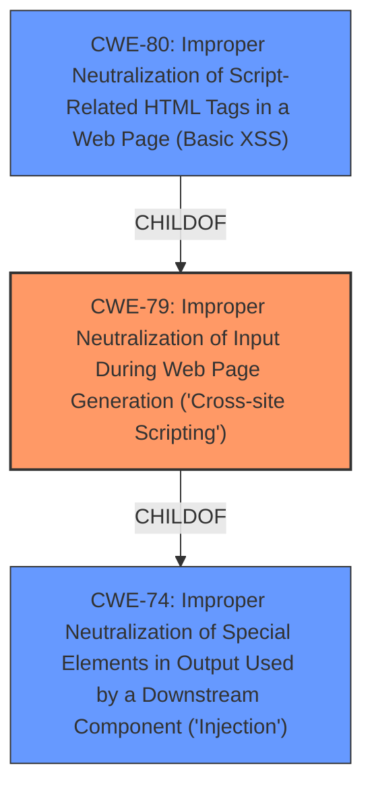

# Analysis Report for CVE-2022-3518

# Vulnerability Analysis Report: CVE-2022-3518

## Description


## Analysis (with Relationship Data)

# Summary
| CWE ID | CWE Name | Confidence | CWE Abstraction Level | CWE Vulnerability Mapping Label | CWE-Vulnerability Mapping Notes |
|---|---|---|---|---|---|
| CWE-79 | Improper Neutralization of Input During Web Page Generation ('Cross-site Scripting') | 1.0 | Base | Allowed | Primary CWE |

## Evidence and Confidence

*   **Confidence Score:** 1.0
*   **Evidence Strength:** HIGH

## Relationship Analysis
The primary relationship that influenced the selection of CWE-79 is its direct alignment with the vulnerability's description involving **improper input sanitization** leading to cross-site scripting. The CWE's base abstraction level is ideal for capturing the root cause. There are child relationships of CWE-79 such as CWE-80, CWE-83, CWE-84, CWE-85, CWE-86, and CWE-87. The retriever returned CWE-79 as the highest rated option.



## Vulnerability Chain
The vulnerability chain involves **improper input sanitization** as the root cause, which directly leads to cross-site scripting. The sequence is:

1.  **Improper Input Sanitization:** User input for "First Name/Middle Name/Last Name" is not properly sanitized.
2.  **Cross-Site Scripting (CWE-79):** The unsanitized input is used in a web page, allowing malicious scripts to be executed.

## Summary of Analysis
The analysis is based on the provided vulnerability description, which explicitly states that **improper input sanitization** leads to cross-site scripting.

The vulnerability description key phrases include:
*   **rootcause:** **improper input sanitization**
*   **impact:** cross-site scripting

The retriever results also strongly suggest CWE-79 as the most relevant, with a score of 0.548.

CWE-80 was considered but not used because the description states "The product receives input from an upstream component, but it does not neutralize or incorrectly neutralizes special characters such as "<", ">", and "&" that could be interpreted as web-scripting elements when they are sent to a downstream component that processes web pages." This is too specific as the description did not provide this level of detail.

The selection of CWE-79 is at the optimal level of specificity because it directly addresses the **improper neutralization** of input leading to cross-site scripting, without being overly specific about the type of input or the exact method of **neutralization failure**.

Relevant CWE Information:

# Enhanced Context (25 CWEs)

## CWE-79: Improper Neutralization of Input During Web Page Generation ('Cross-site Scripting')
**Abstraction:** Base
**Status:** Stable

### Description
The product does not neutralize or incorrectly neutralizes user-controllable input before it is placed in output that is used as a web page that is served to other users.


## CWE Relationship Analysis

Current CWEs represent these abstraction levels: .


### Vulnerability Chain Analysis

**Chain starting from CWE-79:**
- 79 (Improper Neutralization of Input During Web Page Generation ('Cross-site Scripting')) - ROOT


**Chain starting from CWE-80:**
- 80 (Improper Neutralization of Script-Related HTML Tags in a Web Page (Basic XSS)) - ROOT


### CWE Relationship Diagram

```mermaid
graph TD
    classDef primary fill:#f96,stroke:#333,stroke-width:2px
    classDef secondary fill:#69f,stroke:#333
    classDef tertiary fill:#9e9,stroke:#333
```


*Report generated on 2025-03-31 13:02:38*
