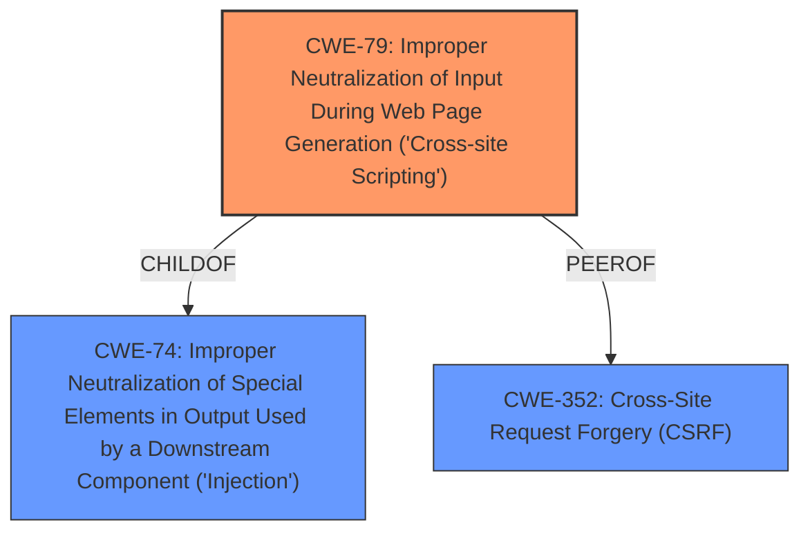

# Analysis Report for CVE-2022-3519

# Vulnerability Analysis Report: CVE-2022-3519

## Description


## Analysis (with Relationship Data)

# Summary
| CWE ID | CWE Name | Confidence | CWE Abstraction Level | CWE Vulnerability Mapping Label | CWE-Vulnerability Mapping Notes |
|---|---|---|---|---|---|
| CWE-79 | Improper Neutralization of Input During Web Page Generation ('Cross-site Scripting') | 1.0 | Base | Allowed | Primary CWE |

## Evidence and Confidence

*   **Confidence Score:** 1.0
*   **Evidence Strength:** HIGH

## Relationship Analysis
The primary relationship that influenced the decision was the ChildOf relationship between CWE-79 and CWE-74 (Improper Neutralization of Special Elements in Output Used by a Downstream Component ('Injection')), indicating that XSS is a specific type of injection. However, since the vulnerability description explicitly mentions cross-site scripting, the more specific CWE-79 was chosen. The PeerOf relationship with CWE-352 (Cross-Site Request Forgery (CSRF)) was considered, but CSRF was not applicable here as the vulnerability is about injecting malicious scripts, not about tricking a user into performing actions.



## Vulnerability Chain
The chain of events is as follows:
1.  **Root Cause:** **Lack of input sanitization** on the `Manage Remarks` argument.
2.  **Weakness:** Improper neutralization of input leading to Cross-Site Scripting (XSS).
3.  **Impact:** Execution of JavaScript code in the browser, potentially compromising the integrity of the application or stealing user information.

## Summary of Analysis
The analysis is based on strong evidence provided in the vulnerability description, particularly the "Vulnerability Description Key Phrases" and "CVE Reference Links Content Summary," which explicitly mention the **lack of input sanitization** as the root cause and **cross-site scripting** as the weakness. The CVE Reference Links Content Summary states, "The application fails to properly neutralize user-controllable input before including it in the output displayed on a web page. This allows an attacker to inject malicious scripts." This statement directly supports the selection of CWE-79 (Improper Neutralization of Input During Web Page Generation ('Cross-site Scripting')). The provided information clearly indicates that the application does not properly handle user input, allowing an attacker to inject malicious scripts that are then executed by the victim's browser.

The retriever results also strongly suggest CWE-79 as the primary candidate, with the highest score. The MITRE mapping guidance for CWE-79 states, "This CWE entry is at the Base level of abstraction, which is a preferred level of abstraction for mapping to the root causes of vulnerabilities."

The decision to select CWE-79 is based on the direct evidence of XSS, the root cause of **lack of input sanitization**, and the alignment with MITRE's mapping guidance. The other CWEs were considered but deemed less relevant as they did not directly address the core issue of improper neutralization of input leading to XSS.

Relevant CWE Information:

# Enhanced Context (25 CWEs)
The following CWEs were identified as potentially relevant to this vulnerability:

## CWE-330: Use of Insufficiently Random Values
**Abstraction Level**: Class
**Similarity Score**: 0.80
**Source**: dense

**Description**:
The product uses insufficiently random numbers or values in a security context that depends on unpredictable numbers.

**Mapping Guidance**:
- Usage: Discouraged
- Rationale: This CWE entry is a level-1 Class (i.e., a child of a Pillar). It might have lower-level children that would be more appropriate
**Not Used:** This vulnerability is about XSS, not randomness.

## CWE-41: Improper Resolution of Path Equivalence
**Abstraction Level**: Base
**Similarity Score**: 0.78
**Source**: dense

**Description**:
The product is vulnerable to file system contents disclosure through path equivalence. Path equivalence involves the use of special characters in file and directory names. The associated manipulations are intended to generate multiple names for the same object.

**Mapping Guidance**:
- Usage: Allowed
- Rationale: This CWE entry is at the Base level of abstraction, which is a preferred level of abstraction for mapping to the root causes of vulnerabilities.
**Not Used:** This vulnerability is about XSS, not path equivalence.

## CWE-334: Small Space of Random Values
**Abstraction Level**: Base
**Similarity Score**: 0.77
**Source**: dense

**Description**:
The number of possible random values is smaller than needed by the product, making it more susceptible to brute force attacks.

**Mapping Guidance**:
- Usage: Allowed
- Rationale: This CWE entry is at the Base level of abstraction, which is a preferred level of abstraction for mapping to the root causes of vulnerabilities.
**Not Used:** This vulnerability is about XSS, not randomness.

## CWE-74: Improper Neutralization of Special Elements in Output Used by a Downstream Component ('Injection')
**Abstraction Level**: Class
**Similarity Score**: 0.77
**Source**: dense

**Description**:
The product constructs all or part of a command, data structure, or record using externally-influenced input from an upstream component, but it does not neutralize or incorrectly neutralizes special elements that could modify how it is parsed or interpreted when it is sent to a downstream component.

**Mapping Guidance**:
- Usage: Discouraged
- Rationale: CWE-74 is high-level and often misused when lower-level weaknesses are more appropriate.
**Not Used:** While XSS is a type of injection, CWE-79 is more specific and thus more appropriate.

## CWE-1289: Improper Validation of Unsafe Equivalence in Input
**Abstraction Level**: Base
**Similarity Score**: 0.77
**Source**: dense

**Description**:
The product receives an input value that is used as a resource identifier or other type of reference, but it does not validate or incorrectly validates that the input is equivalent to a potentially-unsafe value.

**Mapping Guidance**:
- Usage: Allowed
- Rationale: This CWE entry is at the Base level of abstraction, which is a preferred level of abstraction for mapping to the root causes of vulnerabilities.
**Not Used:** This vulnerability is about XSS, not unsafe equivalence.

## CWE-472: External Control of Assumed-Immutable Web Parameter
**Abstraction Level**: Base
**Similarity Score**: 0.77
**Source**: dense

**Description**:
The web application does not sufficiently verify inputs that are assumed to be immutable but are actually externally controllable, such as hidden form fields.

**Mapping Guidance**:
- Usage: Allowed
- Rationale: This CWE entry is at the Base level of abstraction, which is a preferred level of abstraction for mapping to the root causes of vulnerabilities.
**Not Used:** While parameters are being manipulated, the core issue is the lack of sanitization leading to XSS, not just the external control of parameters.

## CWE-184: Incomplete List of Disallowed Inputs
**Abstraction Level**: Base
**Similarity Score**: 0.76
**Source**: dense

**Description**:
The product implements a protection mechanism that relies on a list of inputs (or properties of inputs) that are not allowed by policy or otherwise require other action to neutralize before additional processing takes place, but the list is incomplete.

**Mapping Guidance**:
- Usage: Allowed
- Rationale: This CWE entry is at the Base level of abstraction, which is a preferred level of abstraction for mapping to the root causes of vulnerabilities.
**Not Used:** While a blacklist approach might be in place, the primary issue is the lack of proper input sanitization, not necessarily an incomplete list of disallowed inputs.

## CWE-138: Improper Neutralization of Special Elements
**Abstraction Level**: Class
**Similarity Score**: 0.76
**Source**: dense

**Description**:
The product receives input from an upstream component, but it does not neutralize or incorrectly neutralizes special elements that could be interpreted as control elements or syntactic markers when they are sent to a downstream component.

**Mapping Guidance**:
- Usage: Discouraged
- Rationale: This CWE entry is a level-1 Class (i.e., a child of a Pillar). It might have lower-level children that would be more appropriate
**Not Used:** This is a more general case of improper neutralization. CWE-79 is more specific to web page generation and XSS.

## CWE-23: Relative Path Traversal
**Abstraction Level**: Base
**Similarity Score**: 0.76
**Source**: dense

**Description**:
The product uses external input to construct a pathname that


## CWE Relationship Analysis

Current CWEs represent these abstraction levels: .


### Vulnerability Chain Analysis

**Chain starting from CWE-472:**
- 472 (External Control of Assumed-Immutable Web Parameter) - ROOT


**Chain starting from CWE-330:**
- 330 (Use of Insufficiently Random Values) - ROOT


### CWE Relationship Diagram

```mermaid
graph TD
    classDef primary fill:#f96,stroke:#333,stroke-width:2px
    classDef secondary fill:#69f,stroke:#333
    classDef tertiary fill:#9e9,stroke:#333
```


*Report generated on 2025-03-30 22:09:02*
