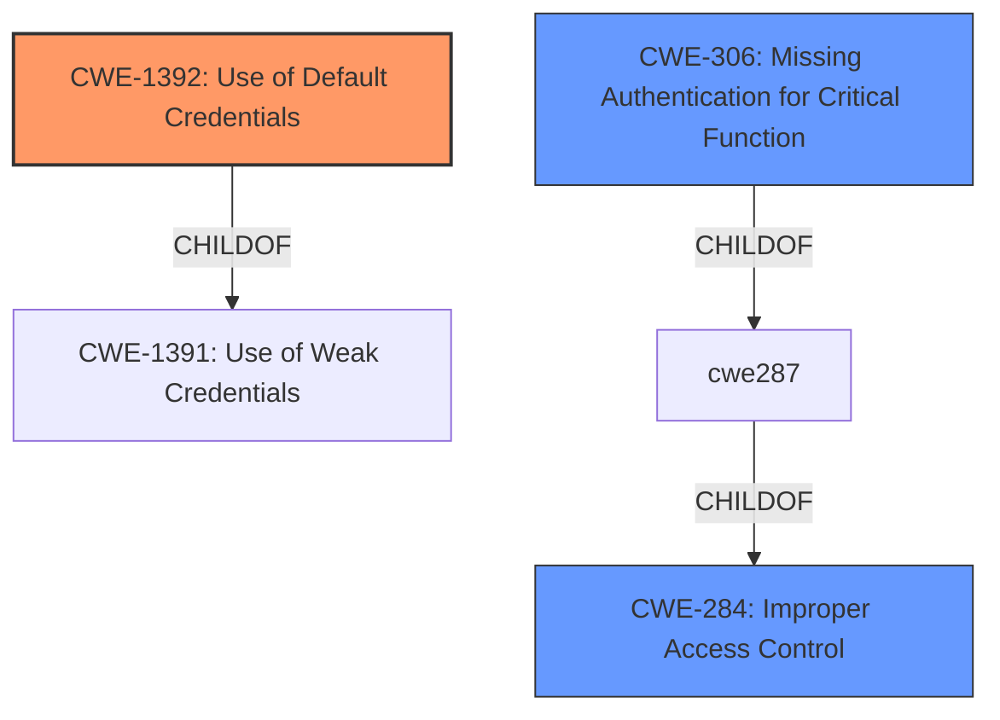

# Enhanced Analysis for CVE-2022-35203

# Summary
| CWE ID | CWE Name | Confidence | CWE Abstraction Level | CWE Vulnerability Mapping Label | CWE-Vulnerability Mapping Notes |
|---|---|---|---|---|---|
| CWE-1392 | Use of Default Credentials | 1.0 | Base | Allowed | Primary CWE |
| CWE-306 | Missing Authentication for Critical Function | 0.7 | Base | Allowed | Secondary Candidate |
| CWE-284 | Improper Access Control | 0.6 | Pillar | Discouraged | Secondary Candidate |

## Evidence and Confidence

*   **Confidence Score:** 0.9
*   **Evidence Strength:** HIGH

## Relationship Analysis
The primary CWE, CWE-1392 **Use of Default Credentials**, is a Base level CWE, making it more specific than its parent CWE-1391 **Use of Weak Credentials**. CWE-1392 directly addresses the root cause identified in the vulnerability description which is **default credentials**.

CWE-306 **Missing Authentication for Critical Function** is related to authentication bypass.

CWE-284 **Improper Access Control** is a high-level Pillar CWE, and while applicable, it's less specific than CWE-1392.



## Vulnerability Chain
The vulnerability chain starts with the **root cause**, which is the presence of **default credentials** (CWE-1392). This leads to a **lack of access control**, allowing unauthenticated attackers to access sensitive system information. The chain is as follows:

CWE-1392 (Use of Default Credentials) -> **Access Control Issue** -> Access to Sensitive System Information.

## Summary of Analysis
The initial assessment identified a clear **access control issue** stemming from **default credentials**, enabling unauthenticated attackers to access sensitive information. The primary CWE selected is CWE-1392 **Use of Default Credentials**, which directly addresses the root cause. This selection is strongly supported by the vulnerability description and the CVE Reference Links Content Summary, which explicitly mentions the "admin/admin" credentials. The **Retriever Results** also list CWE-1392 as the top candidate.

CWE-306 **Missing Authentication for Critical Function** was considered because the vulnerability allows access without proper authentication due to the **default credentials**. However, CWE-1392 is more precise as it explains how the authentication is bypassed.

CWE-284 **Improper Access Control** is a high-level category and is less specific than CWE-1392. The MITRE guidance discourages the use of CWE-284 because it is too general.

The selection of CWE-1392 is at the optimal level of specificity (Base) as it directly corresponds to the root cause described in the vulnerability report. The decision is based on the provided evidence, including the vulnerability description, the CVE Reference Links Content Summary, and the Retriever Results.

Relevant CWE Information:

# Enhanced Context (25 CWEs)

## CWE-1392: Use of Default Credentials
**Abstraction Level**: Base
**Similarity Score**: 0.74
**Source**: dense

**Description**:
The product uses default credentials (such as passwords or cryptographic keys) for potentially critical functionality.

**Mapping Guidance**:
- Usage: Allowed
- Rationale: This CWE entry is at the Base level of abstraction, which is a preferred level of abstraction for mapping to the root causes of vulnerabilities.

## CWE-306: Missing Authentication for Critical Function
**Abstraction Level**: Base
**Similarity Score**: 6270.63
**Source**: sparse

**Description**:
The product does not perform any authentication for functionality that requires a provable user identity or consumes a significant amount of resources.

**Mapping Guidance**:
- Usage: Allowed
- Rationale: This CWE entry is at the Base level of abstraction, which is a preferred level of abstraction for mapping to the root causes of vulnerabilities.

## CWE-284: Improper Access Control
**Abstraction Level**: Pillar
**Similarity Score**: 6353.32
**Source**: sparse

**Description**:
The product performs an authorization check when an actor attempts to access a resource or perform an action, but it does not correctly perform the check.

**Mapping Guidance**:
- Usage: Allowed-with-Review
- Rationale: This CWE entry is a Class and might have Base-level children that would be more appropriate


## CWE Relationship Analysis

Current CWEs represent these abstraction levels: .


### Vulnerability Chain Analysis

**Chain starting from CWE-306:**
- 306 (Missing Authentication for Critical Function) - ROOT


**Chain starting from CWE-1391:**
- 1391 (Use of Weak Credentials) - ROOT


### CWE Relationship Diagram

```mermaid
graph TD
    classDef primary fill:#f96,stroke:#333,stroke-width:2px
    classDef secondary fill:#69f,stroke:#333
    classDef tertiary fill:#9e9,stroke:#333
```