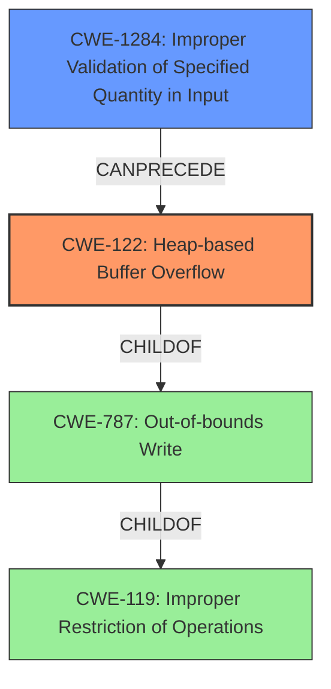

# Analysis Report for CVE-2022-35218

# Vulnerability Analysis Report: CVE-2022-35218

## Description


## Analysis (with Relationship Data)

# Summary
| CWE ID | CWE Name | Confidence | CWE Abstraction Level | CWE Vulnerability Mapping Label | CWE-Vulnerability Mapping Notes |
|---|---|---|---|---|---|
| CWE-122 | Heap-based Buffer Overflow | 1.0 | Variant | Allowed | Primary CWE |
| CWE-1284 | Improper Validation of Specified Quantity in Input | 0.9 | Base | Allowed | Secondary Candidate |

## Evidence and Confidence

*   **Confidence Score:** 0.95
*   **Evidence Strength:** HIGH

## Relationship Analysis
The primary weakness is a heap-based buffer overflow (CWE-122), a variant of the more general out-of-bounds write (CWE-787), which itself is a child of improper restriction of operations within the bounds of a memory buffer (CWE-119). The root cause is **insufficient validation**, which aligns with CWE-1284, Improper Validation of Specified Quantity in Input. The overflow occurs because the length of the packet origin parameter is not validated.



## Vulnerability Chain
The vulnerability chain starts with **insufficient validation** of the packet origin parameter length (CWE-1284), leading to a **heap-based buffer overflow** (CWE-122), and finally resulting in a denial of service (impact).

## Summary of Analysis
The vulnerability description clearly states a "**heap-based buffer overflow** vulnerability due to **insufficient validation** for packet origin parameter length." The CVE Reference Links Content Summary confirms this: "The Health Insurance Card Network Service component does not validate the length of the packet source parameters" and "Heap-based buffer overflow."

CWE-122 (Heap-based Buffer Overflow) is a Variant-level CWE that directly matches the vulnerability description, with a confidence of 1.0.

CWE-1284 (Improper Validation of Specified Quantity in Input) is a Base-level CWE and accurately describes the root cause. The vulnerability description states "**insufficient validation** for packet origin parameter length," indicating a failure to properly validate the length of the input.

Therefore, the primary CWE is CWE-122 and the secondary CWE is CWE-1284.

Other CWEs Considered:

*   CWE-119 (Improper Restriction of Operations within the Bounds of a Memory Buffer): This is a Class-level CWE and is too general. CWE-122, a child of CWE-119, is more specific.
*   CWE-190 (Integer Overflow or Wraparound): While integer overflows can sometimes lead to buffer overflows, there is no direct evidence of an integer overflow in this vulnerability description.
*   CWE-130 (Improper Handling of Length Parameter Inconsistency): This CWE is related to inconsistencies between length fields and actual data length. While related to input validation, CWE-1284 is a better fit as it focuses on the **insufficient validation** aspect.
*   CWE-20 (Improper Input Validation): This is a Class-level CWE and is too general. CWE-1284, a more specific child, is more appropriate.


## CWE Relationship Analysis

Current CWEs represent these abstraction levels: .


### Vulnerability Chain Analysis

**Chain starting from CWE-190:**
- 190 (Integer Overflow or Wraparound) - ROOT


**Chain starting from CWE-130:**
- 130 (Improper Handling of Length Parameter Inconsistency) - ROOT


### CWE Relationship Diagram

```mermaid
graph TD
    classDef primary fill:#f96,stroke:#333,stroke-width:2px
    classDef secondary fill:#69f,stroke:#333
    classDef tertiary fill:#9e9,stroke:#333
```


*Report generated on 2025-03-30 22:10:22*
