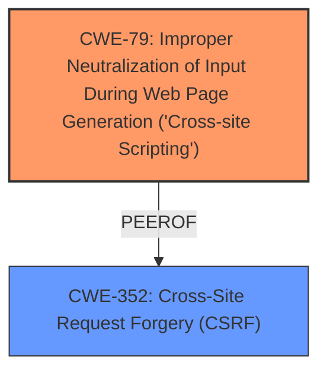

# Analysis Report for CVE-2022-35229

# Vulnerability Analysis Report: CVE-2022-35229

## Description


## Analysis (with Relationship Data)

# Summary
| CWE ID | CWE Name | Confidence | CWE Abstraction Level | CWE Vulnerability Mapping Label | CWE-Vulnerability Mapping Notes |
|---|---|---|---|---|---|
| CWE-79 | Improper Neutralization of Input During Web Page Generation ('Cross-site Scripting') | 1.0 | Base | Allowed | Primary CWE |
| CWE-352 | Cross-Site Request Forgery (CSRF) | 0.7 | Compound | Allowed | Secondary CWE |

## Evidence and Confidence

*   **Confidence Score:** 0.9
*   **Evidence Strength:** HIGH

## Relationship Analysis
The primary relationship is that of the reflected XSS vulnerability (CWE-79). The description notes that a CSRF token is required, and while it's difficult to predict, it suggests a relationship to CWE-352. CWE-79 can precede CWE-494 (Download of Code Without Integrity Check), but that's not relevant here.



## Vulnerability Chain
The vulnerability chain starts with an authenticated user creating a link with reflected Javascript code. The server **fails to neutralize or incorrectly neutralizes** this input, leading to the execution of the Javascript code in the victim's browser when the link is clicked. If the CSRF token is known, this could facilitate actions on behalf of the user.

## Summary of Analysis
The initial analysis correctly identifies **CWE-79 (Improper Neutralization of Input During Web Page Generation ('Cross-site Scripting'))** as the primary weakness. The evidence strongly supports this, citing the **lack of proper input sanitization** allowing for Javascript injection. The "CVE Reference Links Content Summary" explicitly states the vulnerability is a **Reflected Cross-Site Scripting (XSS)** due to the application **failing to properly sanitize user-supplied data**.

The description also mentions that the payload execution requires a known CSRF token value, which is difficult to predict. This suggests a potential connection to **CWE-352 (Cross-Site Request Forgery (CSRF))**. However, the difficulty in predicting the token reduces the severity of this aspect, making it a secondary concern.

The selection of **CWE-79** is at the optimal level of specificity (Base), as it directly describes the **improper neutralization of input** leading to XSS.

The evidence from the vulnerability description is: "An authenticated user can create a link with reflected Javascript code inside it for the discovery page and send it to other users... The payload can be executed only with a known CSRF token value of the victim".
The "CVE Reference Links Content Summary" states "The vulnerability stems from a **lack of proper input sanitization** when handling user-provided data within the discovery page of the Zabbix frontend. This allows an attacker to inject malicious JavaScript code via a crafted URL."

**CWE-116 (Improper Encoding or Escaping of Output)** was considered because it relates to improper handling of data for another component, but **CWE-79** is more specific to the XSS vulnerability. **CWE-20 (Improper Input Validation)** is too general, and **CWE-138 (Improper Neutralization of Special Elements)** is also less specific than **CWE-79**. **CWE-434 (Unrestricted Upload of File with Dangerous Type)** and **CWE-78 (Improper Neutralization of Special Elements used in an OS Command ('OS Command Injection'))** are not relevant to this vulnerability. **CWE-346 (Origin Validation Error)** is related to CSRF but less relevant given the difficulty of predicting the token. **CWE-1022 (Use of Web Link to Untrusted Target with window.opener Access)** is not applicable as the vulnerability doesn't involve redirection to an untrusted target via a link.


## CWE Relationship Analysis

Current CWEs represent these abstraction levels: .


### Vulnerability Chain Analysis

**Chain starting from CWE-434:**
- 434 (Unrestricted Upload of File with Dangerous Type) - ROOT


**Chain starting from CWE-20:**
- 20 (Improper Input Validation) - ROOT


### CWE Relationship Diagram

```mermaid
graph TD
    classDef primary fill:#f96,stroke:#333,stroke-width:2px
    classDef secondary fill:#69f,stroke:#333
    classDef tertiary fill:#9e9,stroke:#333
```


*Report generated on 2025-03-30 13:49:39*
