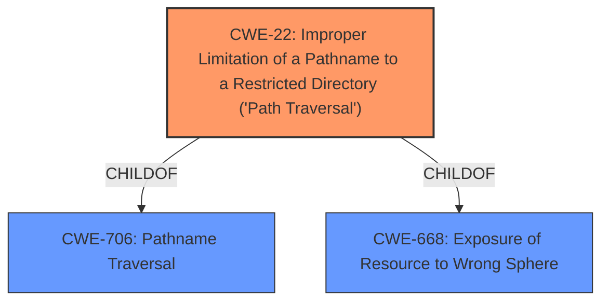

# Analysis Report for CVE-2022-35235

# Vulnerability Analysis Report: CVE-2022-35235

## Description


## Analysis (with Relationship Data)

# Summary
| CWE ID | CWE Name | Confidence | CWE Abstraction Level | CWE Vulnerability Mapping Label | CWE-Vulnerability Mapping Notes |
|---|---|---|---|---|---|
| CWE-22 | Improper Limitation of a Pathname to a Restricted Directory ('Path Traversal') | 0.9 | Base | Primary | Allowed |

## Evidence and Confidence

*   **Confidence Score:** 0.9
*   **Evidence Strength:** HIGH

## Relationship Analysis
The primary relationship influencing the decision is the hierarchical relationship where CWE-22 is a base-level weakness, providing a specific description of the **path traversal** vulnerability. The retriever results also list CWE-22 as a strong candidate.



## Vulnerability Chain
The chain of events for this vulnerability is:
1.  **Root Cause:** **Improper** sanitization of user-supplied input when handling file paths (**Directory Traversal**).
2.  **Weakness:** The plugin does not properly sanitize user-supplied input when handling file paths, allowing an attacker to navigate outside the intended directories.
3.  **Impact:** File Disclosure, Information Gathering, Further Exploitation.

## Summary of Analysis
The initial analysis strongly suggests CWE-22 due to the presence of a directory traversal vulnerability.

"**Root Cause:** The WPIDE File Manager & Code Editor plugin (versions <= 2.6) is vulnerable to a directory traversal vulnerability."

"**Weaknesses/Vulnerabilities:**
*   **Directory Traversal:** The plugin does not properly sanitize user-supplied input when handling file paths, allowing an attacker to navigate outside the intended directories."

The graph relationships show that CWE-22 is a base-level weakness, which is the preferred level of abstraction.

The selection of CWE-22 is based on direct evidence of a **directory traversal** vulnerability, making it the most specific and appropriate choice. The retriever results also support this selection.

Relevant CWE Information:

# Enhanced Context (25 CWEs)
The following CWEs were identified as potentially relevant to this vulnerability:

## CWE-22: Improper Limitation of a Pathname to a Restricted Directory ('Path Traversal')
**Abstraction Level**: Base
**Similarity Score**: 0.027
**Source**: sparse

**Description**:
The product uses external input to construct a pathname that is intended to identify a file or directory that is located underneath a restricted parent directory, but the product does not properly neutralize special elements within the pathname that can cause the pathname to resolve to a location that is outside of the restricted directory.

**Mapping Guidance**:
- Usage: Allowed
- Rationale: This CWE entry is at the Base level of abstraction, which is a preferred level of abstraction for mapping to the root causes of vulnerabilities.


## CWE Relationship Analysis

Current CWEs represent these abstraction levels: .


### Vulnerability Chain Analysis

**Chain starting from CWE-22:**
- 22 (Improper Limitation of a Pathname to a Restricted Directory ('Path Traversal')) - ROOT


**Chain starting from CWE-668:**
- 668 (Exposure of Resource to Wrong Sphere) - ROOT


### CWE Relationship Diagram

```mermaid
graph TD
    classDef primary fill:#f96,stroke:#333,stroke-width:2px
    classDef secondary fill:#69f,stroke:#333
    classDef tertiary fill:#9e9,stroke:#333
```


*Report generated on 2025-03-31 08:53:46*
