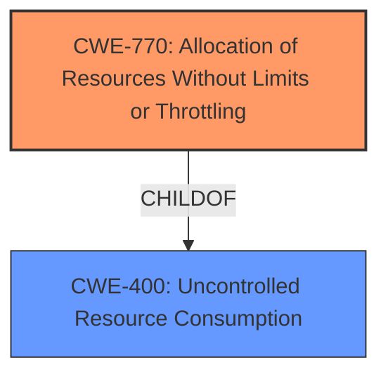

# Analysis for CVE-2022-35236

# Summary
| CWE ID | CWE Name | Confidence | CWE Abstraction Level | CWE Vulnerability Mapping Label | CWE-Vulnerability Mapping Notes |
|---|---|---|---|---|---|
| CWE-770 | Allocation of Resources Without Limits or Throttling | 0.8 | Base | Allowed | Primary CWE - Addresses the core issue of uncontrolled resource allocation. |
| CWE-400 | Uncontrolled Resource Consumption | 0.6 | Class | Discouraged | Secondary CWE - A broader category that encompasses CWE-770, but less specific. |

## Evidence and Confidence

*   **Confidence Score:** 0.8
*   **Evidence Strength:** MEDIUM

## Relationship Analysis
The primary relationship influencing the CWE selection is the hierarchical parent-child relationship. CWE-770 (Allocation of Resources Without Limits or Throttling) is a child of CWE-400 (Uncontrolled Resource Consumption). CWE-770 is more specific and accurately reflects the **root cause** of the vulnerability, which involves the allocation of memory resources without proper limits. Thus, selecting the base CWE-770 is preferred over the class CWE-400 which is too general.

## Vulnerability Chain
The vulnerability chain starts with "undisclosed traffic" triggering an increase in memory resource utilization due to **lack of limits or throttling** on resource allocation within the HTTP2 profile of the BIG-IP system.

Vulnerability Chain:
1.  Undisclosed Traffic
2.  **Missing Limits on Resource Allocation (CWE-770)**
3.  Increased Memory Resource Utilization

## Summary of Analysis
The initial analysis focused on identifying the **root cause** of the vulnerability. The description mentions that "undisclosed traffic can cause an increase in memory resource utilization." The key here is that the vulnerability occurs due to a **lack of control** over the allocation of memory resources.

The Retriever Results highlighted CWE-770 (Allocation of Resources Without Limits or Throttling) as a strong candidate due to its high-density score. This CWE aligns well with the vulnerability description, as it directly addresses the issue of allocating resources without proper limits or throttling. CWE-400 (Uncontrolled Resource Consumption) was also considered but deemed less specific.

The relationship analysis further solidified the selection of CWE-770, as it is a child of CWE-400, making it a more precise representation of the weakness.

The MITRE mapping guidance for CWE-770 indicates that it is at the Base level of abstraction and is "Allowed," reinforcing its suitability for this vulnerability.

The selected CWEs are at the optimal level of specificity because CWE-770 accurately describes the **root cause**, while CWE-400 serves as a broader classification encompassing the uncontrolled resource consumption aspect.

Relevant CWE Information:

# Enhanced Context (25 CWEs)
The following CWEs were identified as potentially relevant to this vulnerability:

## CWE-405: Asymmetric Resource Consumption (Amplification)
**Abstraction Level**: Class
**Similarity Score**: 0.77
**Source**: dense

**Description**:
The product does not properly control situations in which an adversary can cause the product to consume or produce excessive resources without requiring the adversary to invest equivalent work or otherwise prove authorization, i.e., the adversary's influence is "asymmetric."

**Mapping Guidance**:
- Usage: Allowed-with-Review
- Rationale: This CWE entry is a Class and might have Base-level children that would be more appropriate

*Not Selected*: While this vulnerability may result in asymmetric resource consumption, the description doesn't explicitly state that an adversary can cause the product to consume excessive resources without equivalent work. It's more directly related to the lack of limits on resource allocation.

## CWE-404: Improper Resource Shutdown or Release
**Abstraction Level**: Class
**Similarity Score**: 0.76
**Source**: dense

**Description**:
The product does not release or incorrectly releases a resource before it is made available for re-use.

**Mapping Guidance**:
- Usage: Allowed-with-Review
- Rationale: This CWE entry is a Class and might have Base-level children that would be more appropriate

*Not Selected*: The vulnerability description doesn't indicate any issues with resource shutdown or release. It's focused on the initial allocation of resources without limits.

## CWE-653: Improper Isolation or Compartmentalization
**Abstraction Level**: Class
**Similarity Score**: 0.76
**Source**: dense

**Description**:
The product does not properly compartmentalize or isolate functionality, processes, or resources that require different privilege levels, rights, or permissions.

**Mapping Guidance**:
- Usage: Allowed
- Rationale: This CWE entry is at the Base level of abstraction, which is a preferred level of abstraction for mapping to the root causes of vulnerabilities.

*Not Selected*: This is not relevant because the description does not describe the product not compartmentalizing or isolating any functionality.

## CWE-664: Improper Control of a Resource Through its Lifetime
**Abstraction Level**: Pillar
**Similarity Score**: 0.76
**Source**: dense

**Description**:
The product does not maintain or incorrectly maintains control over a resource throughout its lifetime of creation, use, and release.

**Mapping Guidance**:
- Usage: Discouraged
- Rationale: This CWE entry is high-level when lower-level children are available.

*Not Selected*: Too high level. CWE-770 is the more appropriate child.

## CWE-280: Improper Handling of Insufficient Permissions or Privileges 
**Abstraction Level**: Base
**Similarity Score**: 0.75
**Source**: dense

**Description**:
The product does not handle or incorrectly handles when it has insufficient privileges to access resources or functionality as specified by their permissions. This may cause it to follow unexpected code paths that may leave the product in an invalid state.

**Mapping Guidance**:
- Usage: Allowed
- Rationale: This CWE entry is at the Base level of abstraction, which is a preferred level of abstraction for mapping to the root causes of vulnerabilities.

*Not Selected*: The vulnerability does not involve handling of permissions or privileges.

## CWE-1289: Improper Validation of Unsafe Equivalence in Input
**Abstraction Level**: Base
**Similarity Score**: 0.75
**Source**: dense

**Description**:
The product receives an input value that is used as a resource identifier or other type of reference, but it does not validate or incorrectly validates that the input is equivalent to a potentially-unsafe value.

**Mapping Guidance**:
- Usage: Allowed
- Rationale: This CWE entry is at the Base level of abstraction, which is a preferred level of abstraction for mapping to the root causes of vulnerabilities.

*Not Selected*: The vulnerability does not involve an issue with validating equivalence.

## CWE-668: Exposure of Resource to Wrong Sphere
**Abstraction Level**: Class
**Similarity Score**: 0.75
**Source**: dense

**Description**:
The product exposes a resource to the wrong control sphere, providing unintended actors with inappropriate access to the resource.

**Mapping Guidance**:
- Usage: Discouraged
- Rationale: CWE-668 is high-level and is often misused as a catch-all when lower-level CWE IDs might be applicable. It is sometimes used for low-information vulnerability reports [REF-1287]. It is a level-1 Class (i.e., a child of a Pillar). It is not useful for trend analysis.

*Not Selected*: The vulnerability doesn't appear to be related to exposure of resources to the wrong control sphere. It's more related to the allocation of resources without limits.

## CWE-99: Improper Control of Resource Identifiers ('Resource Injection')
**Abstraction Level**: Class
**Similarity Score**: 0.75
**Source**: dense

**Description**:
The product receives input from an upstream component, but it does not restrict or incorrectly restricts the input before it is used as an identifier for a resource that may be outside the intended sphere of control.

**Mapping Guidance**:
- Usage: Allowed-with-Review
- Rationale: This CWE entry is a Class and might have Base-level children that would be more appropriate

*Not Selected*: The description does not include an issue of resource identifiers.

## CWE-274: Improper Handling of Insufficient Privileges
**Abstraction Level**: Base
**Similarity Score**: 0.75
**Source**: dense

**Description**:
The product does not handle or incorrectly handles when it has insufficient privileges to perform an operation, leading to resultant weaknesses.

**Mapping Guidance**:
- Usage: Discouraged
- Rationale: This CWE entry could be deprecated in a future version of CWE.

*Not Selected*: The description does not include an issue of privilege handling.

## CWE-807: Reliance on Untrusted Inputs in a Security Decision