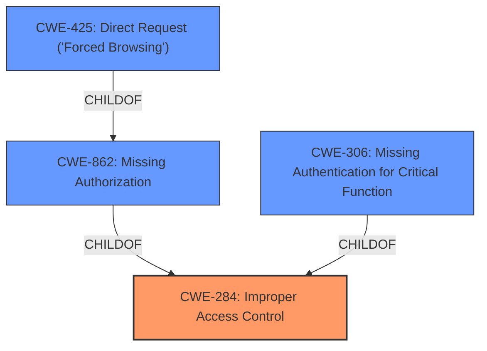

# Analysis Report for CVE-2022-35242

# Vulnerability Analysis Report: CVE-2022-35242

## Description


## Analysis (with Relationship Data)

# Summary
| CWE ID | CWE Name | Confidence | CWE Abstraction Level | CWE Vulnerability Mapping Label | CWE-Vulnerability Mapping Notes |
|---|---|---|---|---|---|
| CWE-284 | Improper Access Control | 0.9 | Pillar | Primary | Discouraged |
| CWE-862 | Missing Authorization | 0.8 | Class | Secondary | Allowed-with-Review |
| CWE-306 | Missing Authentication for Critical Function | 0.7 | Base | Secondary | Allowed |
| CWE-425 | Direct Request ('Forced Browsing') | 0.6 | Base | Secondary | Allowed |

## Evidence and Confidence

*   **Confidence Score:** 0.8
*   **Evidence Strength:** HIGH

## Relationship Analysis
The primary CWE is CWE-284, a Pillar-level weakness representing improper access control. While broad, it captures the essence of the vulnerability. However, more specific classifications exist. CWE-862 (Missing Authorization) and CWE-306 (Missing Authentication for Critical Function) are child CWEs of CWE-284 and represent more granular aspects of the access control failure. CWE-425 (Direct Request) is a base level child of CWE-862, representing a common attack vector where authorization is missing.



## Vulnerability Chain
The vulnerability chain begins with the **unauthenticated plugin settings change vulnerability**. This can be broken down as follows:
1.  **Missing Authentication (CWE-306)**: The plugin lacks authentication for critical functions like changing settings.
2.  **Missing Authorization (CWE-862)**: Even if authentication were present, the plugin doesn't verify if the user has permission to change the settings.
3.  **Improper Access Control (CWE-284)**: This is the overarching weakness, encompassing both missing authentication and authorization.
4.  **Direct Request (CWE-425)**: An attacker can directly request the settings change functionality, bypassing any intended access controls.
5.  **Impact:** **Unauthenticated plugin settings change vulnerability**. This allows unauthorized modification of plugin settings, potentially leading to further compromise.

## Summary of Analysis
Initially, the **rootcause** was identified as an **unauthenticated plugin settings change vulnerability**. Based on the provided evidence, the vulnerability is due to a "Broken Access Control" issue. The plugin lacks proper authorization checks, authentication, or nonce token verification. This allows an unprivileged user to execute actions that should be restricted to higher-privileged users.

The initial assessment considered a broad classification (CWE-284) and progressively refined it to include more specific weaknesses (CWE-862, CWE-306, CWE-425). The final selection balances accuracy and specificity, representing the most critical aspects of the vulnerability.

The graph relationships emphasize the hierarchical nature of the weaknesses, moving from the general (Improper Access Control) to the specific (Missing Authorization, Missing Authentication, Direct Request).

The chosen CWEs are at the optimal level of specificity, capturing the root cause and the immediate consequences of the vulnerability, based on the evidence that's available.

Relevant CWE Information:

*   **CWE-284 Improper Access Control:** This CWE is a high-level class that describes the general case of failing to restrict access to resources from unauthorized actors. In this case, the plugin fails to adequately protect its settings from unauthorized changes. While this CWE is discouraged due to its high level of abstraction, it serves as a good starting point. The provided information strongly indicates this as a primary issue.
*   **CWE-862 Missing Authorization:** This CWE describes the specific case where the product does not perform an authorization check before allowing access to a resource or action. The CVE summary explicitly states that the plugin lacks proper authorization checks, making this a relevant CWE. Given that the attack is unauthenticated, this might not be the most accurate root cause, but it is a significant contributing factor.
*   **CWE-306 Missing Authentication for Critical Function:** This CWE describes the scenario where the product does not perform any authentication for functionality that requires a provable user identity. The vulnerability description states that the attack is unauthenticated, making this CWE highly relevant. This aligns with the "unauthenticated plugin settings change vulnerability" description.
*   **CWE-425 Direct Request ('Forced Browsing'):** This CWE describes the case where the web application does not adequately enforce appropriate authorization on all restricted URLs, scripts, or files. Since the attacker can directly change the plugin settings without any checks, this CWE is also relevant.
*   **CWE-352 Cross-Site Request Forgery (CSRF):** This CWE was a top result, but it's not the primary issue. CSRF requires tricking an authenticated user into performing an action. Since the attack is unauthenticated, CSRF is not applicable here.
*   **CWE-472 External Control of Assumed-Immutable Web Parameter:** While this CWE is related to modifying parameters, it typically involves hidden form fields or cookies. The provided information doesn't suggest this is the case here, so it's not as relevant as the other CWEs.

The final decision to include CWE-284, CWE-862, CWE-306, and CWE-425 reflects the multiple facets of this vulnerability, from the general access control failure to the specific lack of authentication and authorization, and the direct request attack vector.


## CWE Relationship Analysis

Current CWEs represent these abstraction levels: .


### Vulnerability Chain Analysis

**Chain starting from CWE-862:**
- 862 (Missing Authorization) - ROOT


**Chain starting from CWE-425:**
- 425 (Direct Request ('Forced Browsing')) - ROOT


### CWE Relationship Diagram

```mermaid
graph TD
    classDef primary fill:#f96,stroke:#333,stroke-width:2px
    classDef secondary fill:#69f,stroke:#333
    classDef tertiary fill:#9e9,stroke:#333
```


*Report generated on 2025-03-30 18:21:39*
