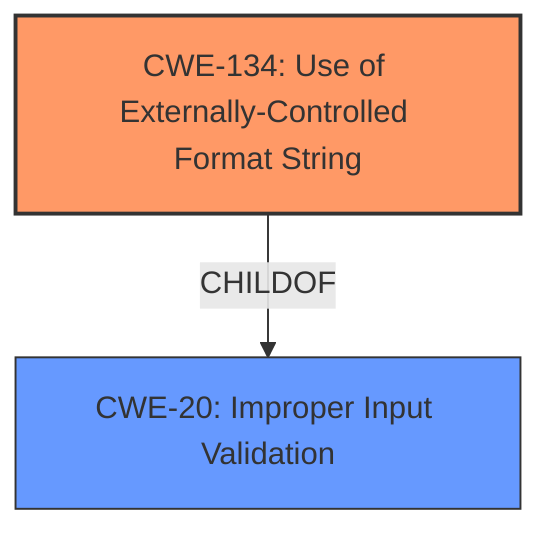

# Analysis Report for CVE-2022-35244

# Vulnerability Analysis Report: CVE-2022-35244

## Description


## Analysis (with Relationship Data)

# Summary
| CWE ID | CWE Name | Confidence | CWE Abstraction Level | CWE Vulnerability Mapping Label | CWE-Vulnerability Mapping Notes |
|---|---|---|---|---|---|
| CWE-134 | Use of Externally-Controlled Format String | 1.0 | Base | Allowed | Primary CWE |

## Evidence and Confidence

*   **Confidence Score:** 1.0
*   **Evidence Strength:** HIGH

## Relationship Analysis
The primary relationship that influenced my decision was the ChildOf relationship between CWE-134 and CWE-20 (Improper Input Validation). While CWE-20 is a broader category, the vulnerability description specifically points to a **format string injection**, making CWE-134 the more precise and appropriate choice. There are no other strong relationships that appear to be relevant in this case.



## Vulnerability Chain
The vulnerability chain starts with the attacker providing a malicious XML payload containing a crafted variable name to the `setVarHA` XCMD. This attacker-controlled string is then used as a format string in the `xvsprintfcat` function within `xml_construct_response`, leading to **format string injection** (CWE-134). This can result in memory corruption, information disclosure, or denial of service.

## Summary of Analysis
The initial analysis identified a **format string injection** vulnerability, which aligns perfectly with CWE-134. The "CVE Reference Links Content Summary" explicitly states that the root cause is the use of an attacker-controlled string as a format string in `xvsprintfcat`.

> **Evidence:** "Root cause of vulnerability: The `getVarHA` XCMD handler in the Abode iota All-In-One Security Kit uses an attacker-controlled string (HA variable name set via `setVarHA` XCMD) as the format string in `xvsprintfcat`."

The retriever results also listed CWE-134 as the top candidate, further supporting this choice. The MITRE mapping guidance for CWE-134 allows its usage and emphasizes that it is a Base level of abstraction, which is preferred.

> **Evidence:** "Weaknesses/vulnerabilities present: Format string injection vulnerability (CWE-134)."

I considered other CWEs from the Retriever Results, such as CWE-78 (Improper Neutralization of Special Elements used in an OS Command) and CWE-91 (XML Injection), but these were less relevant because the core issue is the **improper use of a format string**, not OS command construction or XML syntax manipulation. CWE-190 (Integer Overflow or Wraparound), CWE-798 (Use of Hard-coded Credentials), CWE-259 (Use of Hard-coded Password), CWE-321 (Use of Hard-coded Cryptographic Key), and CWE-125 (Out-of-bounds Read) are not relevant given the details of the **format string injection** vulnerability.

The selected CWE is at the optimal level of specificity because it directly addresses the root cause of the vulnerability - the **use of an externally-controlled format string**.


## CWE Relationship Analysis

Current CWEs represent these abstraction levels: .


### Vulnerability Chain Analysis

**Chain starting from CWE-190:**
- 190 (Integer Overflow or Wraparound) - ROOT


**Chain starting from CWE-321:**
- 321 (Use of Hard-coded Cryptographic Key) - ROOT


### CWE Relationship Diagram

```mermaid
graph TD
    classDef primary fill:#f96,stroke:#333,stroke-width:2px
    classDef secondary fill:#69f,stroke:#333
    classDef tertiary fill:#9e9,stroke:#333
```


*Report generated on 2025-03-31 11:52:31*
