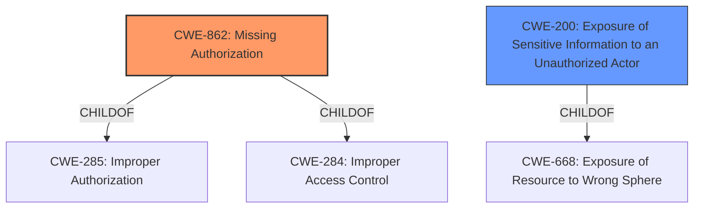

# Analysis Report for CVE-2022-35247

# Vulnerability Analysis Report: CVE-2022-35247

## Description


## Analysis (with Relationship Data)

# Summary
| CWE ID | CWE Name | Confidence | CWE Abstraction Level | CWE Vulnerability Mapping Label | CWE-Vulnerability Mapping Notes |
|---|---|---|---|---|---|
| CWE-862 | Missing Authorization | 1.0 | Class | Allowed-with-Review | Primary CWE. The product does not perform an authorization check when an actor attempts to access a resource or perform an action. |
| CWE-200 | Exposure of Sensitive Information to an Unauthorized Actor | 0.7 | Class | Discouraged | Secondary CWE. The product exposes sensitive information to an actor that is not explicitly authorized to have access to that information. |

## Evidence and Confidence

*   **Confidence Score:** 0.9
*   **Evidence Strength:** HIGH

## Relationship Analysis
The primary CWE is CWE-862 **Missing Authorization**, which is a Class-level CWE. It is a child of CWE-285 and CWE-284, both of which are related to improper authorization and access control. The vulnerability description clearly states a "**lack of ACL checks**," indicating that the system does not perform authorization checks. CWE-200 **Exposure of Sensitive Information to an Unauthorized Actor** is a secondary concern, describing the impact of the missing authorization. It is a Class-level CWE and a child of CWE-668.



## Vulnerability Chain
The vulnerability chain starts with the **lack of ACL checks** (CWE-862), which leads to channel members with special roles being leaked to unauthorized clients (CWE-200).

## Summary of Analysis
The initial analysis focused on the **lack of ACL checks** in the `getRoomRoles` Meteor method, leading to the exposure of channel members with special roles to unauthorized clients. The evidence directly supports CWE-862 **Missing Authorization** as the primary weakness because the vulnerability description key phrases state that the **rootcause** is a "**lack of ACL checks**". The impact of this **missing authorization** is the exposure of sensitive information, which aligns with CWE-200 **Exposure of Sensitive Information to an Unauthorized Actor**.

CWE-862 is chosen because the core issue is the absence of authorization checks, allowing unauthorized access to sensitive data. The abstraction level of Class is appropriate as there isn't enough information to pinpoint a more specific Base or Variant CWE.

CWE-200 is a secondary consideration because it represents the impact of the primary weakness. While the vulnerability results in information exposure, the underlying cause is the **lack of authorization checks**, not an explicit mishandling of sensitive information.

Several other CWEs were considered but deemed less appropriate:

*   CWE-943, CWE-790, CWE-138: These CWEs focus on improper neutralization of special elements. The vulnerability doesn't involve any special elements, so these are not appropriate.
*   CWE-208, CWE-385: These CWEs focus on timing discrepancies and covert channels. These do not align with the vulnerability description.
*   CWE-359: This CWE focuses on the exposure of private personal information. While this vulnerability does involve the exposure of information, it is not specifically private personal information.
*   CWE-863: This CWE focuses on incorrect authorization. Since the issue is a **lack of authorization** rather than an incorrect one, CWE-862 is more appropriate.
*   CWE-284: This CWE is a high-level pillar that is discouraged from use.
*   CWE-1220, CWE-653, CWE-668, CWE-274, CWE-639, CWE-807, CWE-552, CWE-280, CWE-538, CWE-1263: These CWEs don't directly align with the **lack of authorization** checks.

The final selection of CWE-862 as the primary weakness and CWE-200 as a secondary impact is based on the evidence provided in the vulnerability description, the CWE specifications, and the mapping guidance.


## CWE Relationship Analysis

Current CWEs represent these abstraction levels: .


### Vulnerability Chain Analysis

**Chain starting from CWE-208:**
- 208 (Observable Timing Discrepancy) - ROOT


**Chain starting from CWE-807:**
- 807 (Reliance on Untrusted Inputs in a Security Decision) - ROOT


### CWE Relationship Diagram

```mermaid
graph TD
    classDef primary fill:#f96,stroke:#333,stroke-width:2px
    classDef secondary fill:#69f,stroke:#333
    classDef tertiary fill:#9e9,stroke:#333
```


*Report generated on 2025-03-31 13:40:13*
