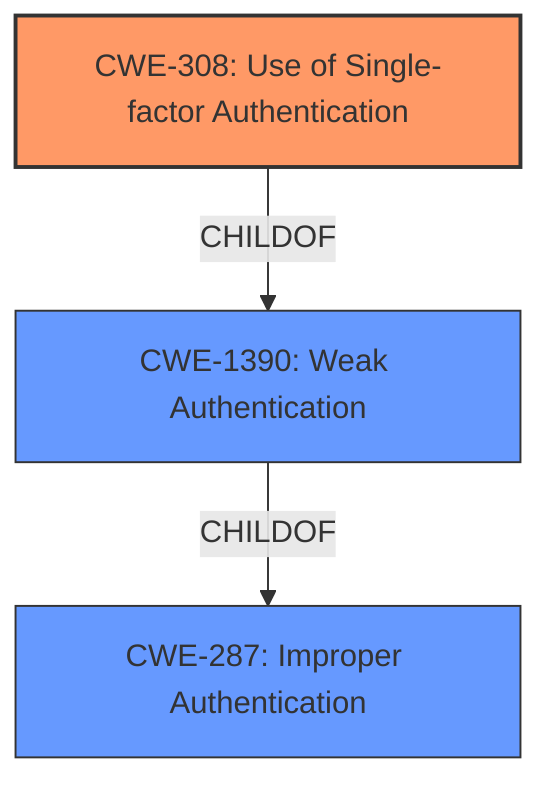

# Analysis for CVE-2022-35248

# Summary

| CWE ID | CWE Name | Confidence | CWE Abstraction Level | CWE Vulnerability Mapping Label | CWE-Vulnerability Mapping Notes |
|---|---|---|---|---|---|
| CWE-308 | Use of Single-factor Authentication | 0.9 | Base | Allowed | Primary CWE |
| CWE-1390 | Weak Authentication | 0.7 | Class | Allowed-with-Review | Secondary Candidate |
| CWE-287 | Improper Authentication | 0.6 | Class | Discouraged | Secondary Candidate |

## Evidence and Confidence

*   **Confidence Score:** 0.9
*   **Evidence Strength:** HIGH

## Relationship Analysis

The primary CWE, CWE-308 (Use of Single-factor Authentication), is a child of CWE-1390 (Weak Authentication), which in turn is a child of CWE-287 (Improper Authentication). This indicates a hierarchical relationship where CWE-308 is the most specific and appropriate choice, as the vulnerability involves bypassing the second factor of authentication, effectively reducing the authentication to a single factor. The other two candidate CWEs are therefore less precise.

## Vulnerability Chain

The vulnerability chain involves the **improper authentication** mechanism that allows bypassing the two-factor authentication when CAS is enabled. The root cause is the failure to properly validate the authentication process, leading to the impact of bypassing the intended security measure.

## Summary of Analysis

The initial assessment focused on identifying the root cause of the vulnerability, which is the **improper authentication** in Rocket.Chat that allows bypassing two-factor authentication. The vulnerability description clearly states that the two-factor authentication can be bypassed when telling the server to use CAS during login.

Based on the provided evidence and relationship analysis, the final decision is to classify this vulnerability as CWE-308 (Use of Single-factor Authentication). This is because the vulnerability specifically leads to a bypass of the second factor of authentication, effectively reducing the authentication process to a single factor.

The selection is based on the following evidence:

*   **Vulnerability Description Key Phrases:** "**improper authentication**", "two factor authentication bypass"
*   **Retriever Results:** CWE-308 is the top result with a "Base" abstraction level, which is the preferred level.
*   **CWE Specifications:** CWE-308 description directly aligns with the vulnerability, "The use of single-factor authentication can lead to unnecessary risk of compromise when compared with the benefits of a dual-factor authentication scheme."
*   **CWE-308 Observed Examples:** "CVE-2022-35248: Chat application skips validation when Central Authentication Service (CAS) is enabled, effectively removing the second factor from two-factor authentication"

The alternative CWEs considered but not used are:

*   CWE-1390 (Weak Authentication): While relevant, it's a more general classification. CWE-308 is a more specific child of CWE-1390, making it a better fit.
*   CWE-287 (Improper Authentication): This is a discouraged CWE due to its broad nature. CWE-308 and CWE-1390 are more specific and therefore preferred.

The selected CWE is at the optimal level of specificity because it directly describes the weakness of using single-factor authentication when a dual-factor scheme is expected.