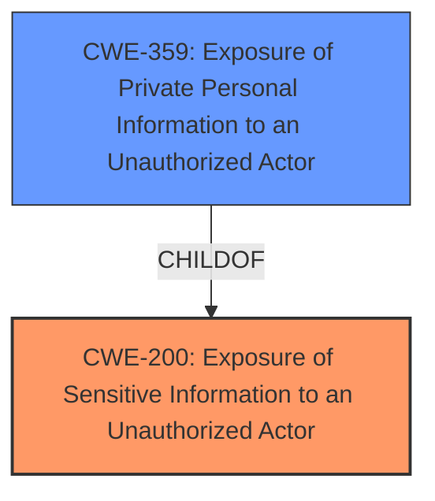

# Analysis Report for CVE-2022-35249

# Vulnerability Analysis Report: CVE-2022-35249

## Description


## Analysis (with Relationship Data)

# Summary
| CWE ID | CWE Name | Confidence | CWE Abstraction Level | CWE Vulnerability Mapping Label | CWE-Vulnerability Mapping Notes |
|---|---|---|---|---|---|
| CWE-200 | Exposure of Sensitive Information to an Unauthorized Actor | 0.9 | Class | Primary | Discouraged, but the most appropriate based on the description. |
| CWE-359 | Exposure of Private Personal Information to an Unauthorized Actor | 0.7 | Base | Secondary | Allowed, as a more specific child of CWE-200 but less descriptive. |

## Evidence and Confidence

*   **Confidence Score:** 0.9
*   **Evidence Strength:** MEDIUM

## Relationship Analysis
The primary relationship influencing the CWE selection is the ChildOf relationship, specifically CWE-359 being a child of CWE-200. Although CWE-200 is discouraged, it's the most fitting high-level classification, with CWE-359 offering a more specific, though not entirely representative, alternative. There are no applicable chain relationships.



## Vulnerability Chain
The vulnerability chain starts with the **weakness** in the `getUserMentionsByChannel` meteor server method which leads to **information disclosure** of messages from private channels and direct messages.

## Summary of Analysis
The initial analysis focused on identifying the root cause of the **information disclosure** vulnerability. The vulnerability description clearly indicates that the `getUserMentionsByChannel` meteor server method discloses messages from private channels and direct messages regardless of the users access permission to the room. This points to a **weakness** related to exposing sensitive information.

The **Retriever Results** highlight CWE-200 (Exposure of Sensitive Information to an Unauthorized Actor) as the top candidate. While CWE-200 is discouraged due to its generality, the vulnerability description aligns with its core definition: "The product exposes sensitive information to an actor that is not explicitly authorized to have access to that information." The description also matches CWE-359 (Exposure of Private Personal Information to an Unauthorized Actor), which is a child of CWE-200, but that's less applicable since it is just messages and not necessarily private personal information.

The decision to select CWE-200 is based on the following evidence:

*   **Vulnerability Description Key Phrases:** "information disclosure"
*   **Vulnerability Description:** "discloses messages from private channels and direct messages regardless of the users access permission to the room."

While a more specific CWE would be ideal, the provided information doesn't give enough specifics to choose a more specific **authorization** or **permissions** issue.

Relevant CWE Information:

# Enhanced Context (25 CWEs)

## CWE-200: Exposure of Sensitive Information to an Unauthorized Actor
**Abstraction:** Class
**Similarity Score**: 1.00
**Source**: alternate_terms

**Description**:
The product exposes sensitive information to an actor that is not explicitly authorized to have access to that information.

**Mapping Guidance**:
- Usage: Discouraged
- Rationale: CWE-200 is commonly misused to represent the loss of confidentiality in a vulnerability, but confidentiality loss is a technical impact - not a root cause error. As of CWE 4.9, over 400 CWE entries can lead to a loss of confidentiality. Other options are often available. [REF-1287].

## CWE-359: Exposure of Private Personal Information to an Unauthorized Actor
**Abstraction:** Base
**Similarity Score**: 0.535
**Source**: dense

**Description**:
The product does not properly prevent a person's private, personal information from being accessed by actors who either (1) are not explicitly authorized to access the information or (2) do not have the implicit consent of the person about whom the information is collected.

**Mapping Guidance**:
- Usage: Allowed
- Rationale: This CWE entry is at the Base level of abstraction, which is a preferred level of abstraction for mapping to the root causes of vulnerabilities.


## CWE Relationship Analysis

Current CWEs represent these abstraction levels: .


### Vulnerability Chain Analysis

**Chain starting from CWE-200:**
- 200 (Exposure of Sensitive Information to an Unauthorized Actor) - ROOT


**Chain starting from CWE-359:**
- 359 (Exposure of Private Personal Information to an Unauthorized Actor) - ROOT


### CWE Relationship Diagram

```mermaid
graph TD
    classDef primary fill:#f96,stroke:#333,stroke-width:2px
    classDef secondary fill:#69f,stroke:#333
    classDef tertiary fill:#9e9,stroke:#333
```


*Report generated on 2025-03-31 11:21:00*
