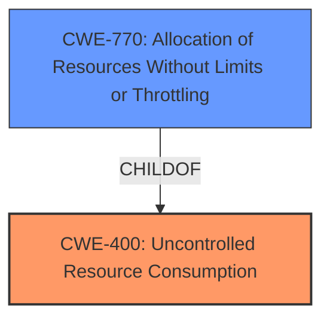

# Analysis for CVE-2022-35254

# Summary
| CWE ID | CWE Name | Confidence | CWE Abstraction Level | CWE Vulnerability Mapping Label | CWE-Vulnerability Mapping Notes |
|---|---|---|---|---|---|
| CWE-400 | Uncontrolled Resource Consumption | 0.75 | Class | Discouraged | The product does not properly control the allocation and maintenance of a limited resource, thereby enabling an actor to influence the amount of resources consumed, eventually leading to the exhaustion of available resources. |
| CWE-770 | Allocation of Resources Without Limits or Throttling | 0.6 | Base | Allowed | The product allocates a reusable resource or group of resources on behalf of an actor without imposing any restrictions on the size or number of resources that can be allocated, in violation of the intended security policy for that actor. |

## Evidence and Confidence

*   **Confidence Score:** 0.7
*   **Evidence Strength:** MEDIUM

## Relationship Analysis
The primary relationship influencing the decision is the parent-child relationship between CWE-400 and CWE-770. CWE-400 is a Class-level CWE representing a general case of uncontrolled resource consumption, while CWE-770 is a Base-level CWE describing the specific scenario of allocating resources without limits or throttling. The vulnerability description suggests a denial-of-service due to an unauthenticated attacker, which aligns with resource consumption issues.

## Vulnerability Chain
The vulnerability chain starts with the **lack of resource control** in the Ivanti product. This leads to the ability of an unauthenticated attacker to consume excessive resources, ultimately causing a denial-of-service.
  - **Root Cause:** Lack of Resource Control/Throttling
  - **Weakness:** Uncontrolled Resource Consumption
  - **Impact:** Denial of Service

## Summary of Analysis
Initially, CWE-682 (Incorrect Calculation) was considered due to its high ranking in similar CVE descriptions. However, the description focuses on the impact (denial-of-service) and the attack vector (unauthenticated attacker) rather than an error in calculation.

The selection of CWE-400 is based on the vulnerability description indicating a denial-of-service caused by uncontrolled resource consumption. The description states "An unauthenticated attacker can cause a denial-of-service," which directly aligns with the impact of CWE-400. However, CWE-400 is a Class-level CWE and the guidance suggests looking at its children.

CWE-770 (Allocation of Resources Without Limits or Throttling) is a child of CWE-400 and provides a more specific description of the weakness. It describes a scenario where a product allocates resources without imposing restrictions, which can lead to resource exhaustion and denial-of-service. While the description doesn't explicitly mention allocation without limits, the DoS impact from an unauthenticated attacker strongly suggests this mechanism.

The Retriever Results also list CWE-770 as a candidate, further supporting this selection. Other candidates such as CWE-23, CWE-20, CWE-287, CWE-269, and CWE-613 were considered but deemed less relevant as they focus on different aspects such as path traversal, input validation, authentication, privilege management, and session expiration, respectively. While related, they don't directly address the root cause of uncontrolled resource consumption leading to DoS.

The final decision leans towards CWE-400 as the primary weakness with CWE-770 as a secondary candidate, acknowledging the lack of explicit evidence but inferring the likely mechanism based on the attack vector and impact. CWE-400 is selected as the primary because there is not enough root cause evidence to determine the specific type of resource consumption.

Relevant CWE Information:
# Enhanced Context (25 CWEs)
The following CWEs were identified as potentially relevant to this vulnerability:

## CWE-274: Improper Handling of Insufficient Privileges
**Abstraction Level**: Base
**Similarity Score**: 0.77
**Source**: dense

**Description**:
The product does not handle or incorrectly handles when it has insufficient privileges to perform an operation, leading to resultant weaknesses.

**Mapping Guidance**:
- Usage: Discouraged
- Rationale: This CWE entry could be deprecated in a future version of CWE.

## CWE-653: Improper Isolation or Compartmentalization
**Abstraction Level**: Class
**Similarity Score**: 0.76
**Source**: dense

**Description**:
The product does not properly compartmentalize or isolate functionality, processes, or resources that require different privilege levels, rights, or permissions.

**Mapping Guidance**:
- Usage: Allowed
- Rationale: This CWE entry is at the Base level of abstraction, which is a preferred level of abstraction for mapping to the root causes of vulnerabilities.

## CWE-266: Incorrect Privilege Assignment
**Abstraction Level**: Base
**Similarity Score**: 0.76
**Source**: dense

**Description**:
A product incorrectly assigns a privilege to a particular actor, creating an unintended sphere of control for that actor.

**Mapping Guidance**:
- Usage: Allowed
- Rationale: This CWE entry is at the Base level of abstraction, which is a preferred level of abstraction for mapping to the root causes of vulnerabilities.

## CWE-664: Improper Control of a Resource Through its Lifetime
**Abstraction Level**: Pillar
**Similarity Score**: 0.76
**Source**: dense

**Description**:
The product does not maintain or incorrectly maintains control over a resource throughout its lifetime of creation, use, and release.

**Mapping Guidance**:
- Usage: Discouraged
- Rationale: This CWE entry is high-level when lower-level children are available.

## CWE-280: Improper Handling of Insufficient Permissions or Privileges 
**Abstraction Level**: Base
**Similarity Score**: 0.76
**Source**: dense

**Description**:
The product does not handle or incorrectly handles when it has insufficient privileges to access resources or functionality as specified by their permissions. This may cause it to follow unexpected code paths that may leave the product in an invalid state.

**Mapping Guidance**:
- Usage: Allowed
- Rationale: This CWE entry is at the Base level of abstraction, which is a preferred level of abstraction for mapping to the root causes of vulnerabilities.

## CWE-405: Asymmetric Resource Consumption (Amplification)
**Abstraction Level**: Class
**Similarity Score**: 0.75
**Source**: dense

**Description**:
The product does not properly control situations in which an adversary can cause the product to consume or produce excessive resources without requiring the adversary to invest equivalent work or otherwise prove authorization, i.e., the adversary's influence is "asymmetric."

**Mapping Guidance**:
- Usage: Allowed-with-Review
- Rationale: This CWE entry is a Class and might have Base-level children that would be more appropriate

## CWE-668: Exposure of Resource to Wrong Sphere
**Abstraction Level**: Class
**Similarity Score**: 0.75
**Source**: dense

**Description**:
The product exposes a resource to the wrong control sphere, providing unintended actors with inappropriate access to the resource.

**Mapping Guidance**:
- Usage: Discouraged
- Rationale: CWE-668 is high-level and is often misused as a catch-all when lower-level CWE IDs might be applicable. It is sometimes used for low-information vulnerability reports [REF-1287]. It is a level-1 Class (i.e., a child of a Pillar). It is not useful for trend analysis.

## CWE-1220: Insufficient Granularity of Access Control
**Abstraction Level**: Base
**Similarity Score**: 0.74
**Source**: dense

**Description**:
The product implements access controls via a policy or other feature with the intention to disable or restrict accesses (reads and/or writes) to assets in a system from untrusted agents. However, implemented access controls lack required granularity, which renders the control policy too broad because it allows accesses from unauthorized agents to the security-sensitive assets.

**Mapping Guidance**:
- Usage: Allowed
- Rationale: This CWE entry is at the Base level of abstraction, which is a preferred level of abstraction for mapping to the root causes of vulnerabilities.

## CWE-404: Improper Resource Shutdown or Release
**Abstraction Level**: Class
**Similarity Score**: 0.74
**Source**: dense

**Description**:
The product does not release or incorrectly releases a resource before it is made available for re-use.

**Mapping Guidance**:
- Usage: Allowed-with-Review
- Rationale: This CWE entry is a Class and might have Base-level children that would be more appropriate

## CWE-807: Reliance on Untrusted Inputs in a Security Decision
**Abstraction Level**: Base
**Similarity Score**: 0.74
**Source**: dense

**Description**:
The product uses a protection mechanism that relies on