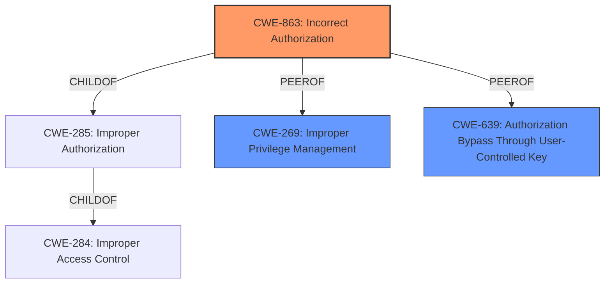

# Raw Analyzer Response for CVE-2022-35291

# Summary
| CWE ID | CWE Name | Confidence | CWE Abstraction Level | CWE Vulnerability Mapping Label | CWE-Vulnerability Mapping Notes |
|---|---|---|---|---|---|
| CWE-863 | Incorrect Authorization | 0.8 | Class | Primary | Allowed-with-Review |
| CWE-269 | Improper Privilege Management | 0.6 | Class | Secondary | Discouraged |
| CWE-639 | Authorization Bypass Through User-Controlled Key | 0.5 | Base | Secondary | Allowed |

## Evidence and Confidence

*   **Confidence Score:** 0.7
*   **Evidence Strength:** MEDIUM

## Relationship Analysis
The primary CWE selected is CWE-863, "Incorrect Authorization," due to the **misconfigured application endpoints** that allow attackers with user privileges to perform activities with admin privileges. CWE-863 is a child of CWE-285 (Improper Authorization), which, in turn, is a child of CWE-284 (Improper Access Control). While CWE-863 is a class-level CWE and the mapping guidance suggests examining its children for a better fit, none of the child CWEs appear to be a more precise match for the provided vulnerability description. CWE-269 (Improper Privilege Management) was considered but deemed less appropriate as it is often misused and the root cause seems more directly related to incorrect authorization checks. CWE-639 (Authorization Bypass Through User-Controlled Key) was also considered as it relates to authorization bypass, but it's less specific to the **misconfigured endpoints**.

## Vulnerability Chain
The vulnerability chain starts with **misconfigured application endpoints**, leading to **incorrect authorization**, which allows attackers with user privileges to perform activities with admin privileges, ultimately compromising the confidentiality and integrity of the application.

## Summary of Analysis
The initial assessment identified CWE-863 as the primary candidate due to the **misconfigured application endpoints** that enable attackers to perform activities with admin privileges. The retriever results and vulnerability description key phrases support this classification. The relationships among CWEs, particularly the parent-child relationship between CWE-863, CWE-285, and CWE-284, were considered to ensure that the chosen CWE was at the appropriate level of specificity. While CWE-863 is a class-level CWE, its description closely aligns with the vulnerability details, making it the most suitable option. The evidence is "Due to **misconfigured application endpoints**, SAP SuccessFactors attachment APIs allow attackers with user privileges to perform activities with admin privileges over the network." The other possible CWEs such as CWE-269, CWE-639 are secondary in nature or less specific.

Relevant CWE Information:

# Enhanced Context (25 CWEs)

## CWE-807: Reliance on Untrusted Inputs in a Security Decision
This CWE was not selected because the vulnerability is related to **misconfigured application endpoints** that allowed users to perform activities with admin privileges. There is no evidence that the vulnerability is caused by relying on untrusted inputs.

## CWE-303: Incorrect Implementation of Authentication Algorithm
This CWE was not selected because the vulnerability is related to **misconfigured application endpoints** that allowed users to perform activities with admin privileges. There is no evidence that the vulnerability is caused by an incorrect implementation of the authentication algorithm.

## CWE-1289: Improper Validation of Unsafe Equivalence in Input
This CWE was not selected because the vulnerability is related to **misconfigured application endpoints** that allowed users to perform activities with admin privileges. There is no evidence that the vulnerability is caused by the improper validation of unsafe equivalence in input.

## CWE-639: Authorization Bypass Through User-Controlled Key
This CWE was selected as a secondary candidate because the vulnerability allows attackers with user privileges to perform activities with admin privileges over the network. This could be viewed as an authorization bypass.

## CWE-1390: Weak Authentication
This CWE was not selected because the vulnerability is related to **misconfigured application endpoints** that allowed users to perform activities with admin privileges. There is no evidence that the vulnerability is caused by a weak authentication mechanism.

## CWE-345: Insufficient Verification of Data Authenticity
This CWE was not selected because the vulnerability is related to **misconfigured application endpoints** that allowed users to perform activities with admin privileges. There is no evidence that the vulnerability is caused by insufficient verification of data authenticity.

## CWE-274: Improper Handling of Insufficient Privileges
This CWE was not selected because the vulnerability is related to **misconfigured application endpoints** that allowed users to perform activities with admin privileges. There is no evidence that the vulnerability is caused by improper handling of insufficient privileges.

## CWE-668: Exposure of Resource to Wrong Sphere
This CWE was not selected because the vulnerability is related to **misconfigured application endpoints** that allowed users to perform activities with admin privileges. There is no evidence that the vulnerability is caused by exposure of a resource to the wrong sphere.

## CWE-653: Improper Isolation or Compartmentalization
This CWE was not selected because the vulnerability is related to **misconfigured application endpoints** that allowed users to perform activities with admin privileges. There is no evidence that the vulnerability is caused by improper isolation or compartmentalization.

## CWE-280: Improper Handling of Insufficient Permissions or Privileges
This CWE was not selected because the vulnerability is related to **misconfigured application endpoints** that allowed users to perform activities with admin privileges. There is no evidence that the vulnerability is caused by improper handling of insufficient permissions or privileges.

## CWE-863: Incorrect Authorization
This CWE was selected as the primary candidate because the vulnerability is related to **misconfigured application endpoints** that allowed users to perform activities with admin privileges.

## CWE-285: Improper Authorization
This CWE was not selected because CWE-863 is a child of CWE-285 and is more specific.

## CWE-200: Exposure of Sensitive Information to an Unauthorized Actor
This CWE was not selected because the vulnerability is related to **misconfigured application endpoints** that allowed users to perform activities with admin privileges. The exposure of sensitive information is a consequence of the vulnerability but is not the root cause.

## CWE-367: Time-of-check Time-of-use (TOCTOU) Race Condition
This CWE was not selected because the vulnerability is related to **misconfigured application endpoints** that allowed users to perform activities with admin privileges. There is no evidence that the vulnerability is caused by a TOCTOU race condition.

## CWE-41: Improper Resolution of Path Equivalence
This CWE was not selected because the vulnerability is related to **misconfigured application endpoints** that allowed users to perform activities with admin privileges. There is no evidence that the vulnerability is caused by improper resolution of path equivalence.

## CWE-190: Integer Overflow or Wraparound
This CWE was not selected because the vulnerability is related to **misconfigured application endpoints** that allowed users to perform activities with admin privileges. There is no evidence that the vulnerability is caused by integer overflow or wraparound.

## CWE-770: Allocation of Resources Without Limits or Throttling
This CWE was not selected because the vulnerability is related to **misconfigured application endpoints** that allowed users to perform activities with admin privileges. There is no evidence that the vulnerability is caused by the allocation of resources without limits or throttling.

## CWE-73: External Control of File Name or Path
This CWE was not selected because the vulnerability is related to **misconfigured application endpoints** that allowed users to perform activities with admin privileges. There is no evidence that the vulnerability is caused by external control of file name or path.

## CWE-434: Unrestricted Upload of File with Dangerous Type
This CWE was not selected because the vulnerability is related to **misconfigured application endpoints** that allowed users to perform activities with admin privileges. There is no evidence that the vulnerability is caused by the unrestricted upload of file with a dangerous type.

## CWE-59: Improper Link Resolution Before File Access ('Link Following')
This CWE was not selected because the vulnerability is related to **misconfigured application endpoints** that allowed users to perform activities with admin privileges. There is no evidence that the vulnerability is caused by improper link resolution before file access.

## CWE-22: Improper Limitation of a Pathname to a Restricted Directory ('Path Traversal')
This CWE was not selected because the vulnerability is related to **misconfigured application endpoints** that allowed users to perform activities with